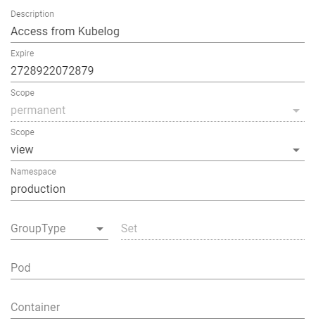

# API Keys explained
An API key requires the following information to be created:

- **Description**. For obvious reasons it is important to write down what an API key has been created for.
- **Lease time**. This is the number of days that the key will be valid. Beyond that date, it will be rejected by Kwirth Core.
- **Type**. There exist 3 types of keys, but only 1 of them can be created in the UI: 'permanent'. Permanent API keys are stored in a secure site and keep alive even if Kwirth crashes. Other types like 'volatile' or 'bearer' are explained below, right now you only need to know that 'volatile' and 'bearer' key types are expected to be used by applications, not by people.
- **Resource list** (we will explain later the details), it is a list of the resources that this key gives access to.

The idea is simple, an API key allows the holder of the key to perform an action (scope) over a set of resources (namespace/group/pod/container).

The resources list is a little bit tricky to setup, but the idea is pretty simple: it consists of a set of resources and its corresponding scope. For example, you can create an API key for a user to be able to (**at the same time**):

  - Performing operations over namespace 'dev'.
  - Just viewing log and metrics on namespace 'prod'.

For creating a resource list you must use the bottom-right buttons 'NEW', 'SAVE' and 'REMOVE'. All the resources (and its scopes) you add to the key will be shown (and selectable) on the 'Resources list' combo field.

When you create a resource you must provide this data:

  - **Scope**. As explained in other parts of this documentation, the scope is used to decide what actions an API Key owner can perform with the resources declared in the key. These are some sample scopes and their meaning (not a complete list):
    - *cluster*: this scope means you can perform any Kwirth action on the cluster.
    - *api*: this scope allows you to manage api keys.
    - *restart*: this scope allows the owner of the key restarting pods or deployments in the cluster where the key has been created.
    - *filter*: this scope allows searching for information on Kubernetes objects.
    - *view*: this scope allows viewing logs (is the more basic scope).
  - **Namespace**. It's **a comma separated list** of namespaces (or just a single one, or nothing).
  - **Deployments**, **ReplicaSets**, **DaemonSets**, **StatefulSets**, are **comma separated lists** of group names (or just a single one, or nothing).
  - **Pods**. A comma separated list of pods.
  - **Containers**. A comma separated list of containers inside a pod that an API key owner can access.

Once you fill up all the fields, just click 'SAVE' to add the resource. You can then add new resources (NEW), remove a resource (REMOVE) or just edit an existing resource, that is, select it, modify it and SAVE it.

!> Important: once you finished editing the resources list don't forget to click 'SAVE' on the left side for saving the API key.

On the 'API Key Management' dialog you can create, review, modify or delete all the existing API keys in your Kwirth except the 'bearer' type ones. For this purpose, the dialog shows an exhaustive list on the left side of the card, and the details of each selected API key on the right.

## Example
If you want to give permissions to an external application like Kubelog or KwirthLog to view all logs in your 'production' namespace you should create an API key like this:



Which would take this aspect:

```code
93df417c-e124-7d66-12a1-277d3f246bf7|permanent|view:production:::
```

As we shown when we talked about API Keys, you can add more than one resource to the resources list in the API key. In that case the API key would look something like this:

```code
26f2c1e3-b414-41bc-b67c-4525e6e33725|permanent|snapshot:pro:::;shell,view,filter:pro:::
```

As you may see the API Key contains 3 parts:

 - The API key id
 - The API key type
 - The resource list (semicolon-separated list)

These are sample API keys you should configure in your client (Kubelog, KwirthLog or whatever) application.
