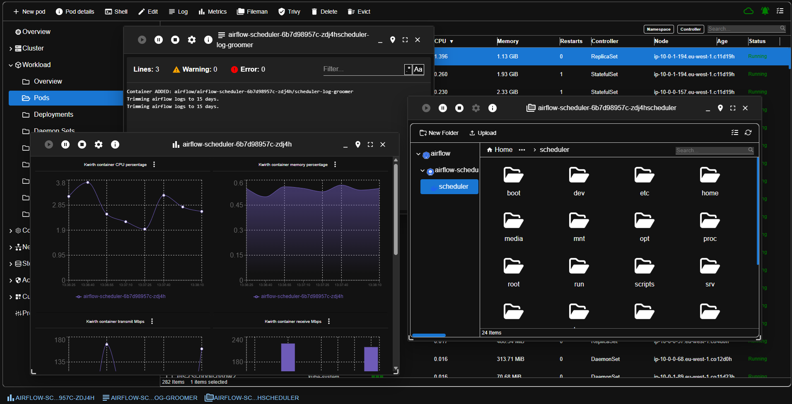
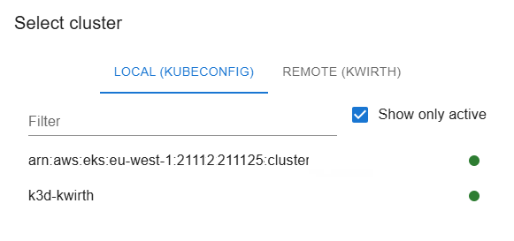
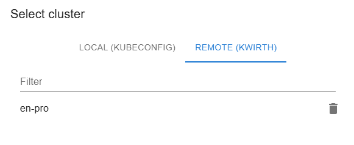

# Magnify
Magnify is **the most incredible thing** that happened inside and outside Kwirth in the last two years. It is not just a Kwirth channel, it is a really complete *Kubernetes Management Tool*. What do we mean?

We typically build Kwirth channels for providing a specific data stream for a specific type of information: logs, alerts, metrics, files, events... Magnify has been developed as a new Kwirth channel; in fact, it has a lot to do with data streaming as well as other Kwirth channels, but, what kind of data does Magnify stream to users?

Magnify is concerned about providing users with two main data streams:
  - Kubernetes artifacts
  - Kubernetes events

!> Yeah! **All the activity** happening inside Kubernetes is being streamed to you by means of the Magnify channel.

Is that all? Of course not!!

Magnify integrates all the data that is received from Kubernetes via the data-stream with other stuff like:

  - An upwards command stream, for sending commands to Kubernetes.
  - An extension mechanism for **adding other Kwirth channels to Magnify**. This means you can do logging or observing directly from the Magnify channel.
  - Editors for working with Kubernetes objects.
  - Full Kubernetes object search.
  - Validation processes for **detecting inconsistencies in your Kubernetes** cluster.
  - A lot of fun stuff.

## What for
With Magnify channel you can:
  - Manage your Kubernetes cluster(s) (not just connect to a specific cluster, you can manage all your clusters from a central point).
  - Work with all types of Kubernetes objects: browse, check, edit, create, delete...
  - Have real-time information, synced with your Magnify installation as quickly as it happens inside Kubernetes.

## Features
These are key features of Magnify channel:

  - Connect to your Kubernetes clusters and browse/edit all your Kubernetes artifacts (and apply changes) online.
  - Launch log streams in a multi-windowed system, mixing different log sources.
  - Launch metrics streams (mixing sources as you need) without the need of Prometheus.
  - Launch a Trivy channel for analyzing your workload. With Magnify you can also deploy Trivy Operator to your cluster if you have not deployed it previously.
  - Launch Fileman for working visually with the filesystems of your living images.
  - Launch shell sessions against your living containers (part of the Ops channel).
  - **LogSearch** — full text search across pod logs directly from the Magnify channel (see [LogSearch](#logsearch) below).
  - In addition to these basic and not-so-basic features you can:
    - Work with nodes and review images.
    - Get information for specific resources like CSI objects (driver, node, etc.) and volume attachments.
    - Decide what information you want to stream.
    - Perform **full text search** in your Kubernetes artifacts.
    - Manage your CRDs and your CRD instances.

## Use
Starting Magnify is **really simple**. Once you have configured your resource selector with **any existing resource (no matter which)** and added the new channel to the tabs, just go to the tab "Settings" icon and start the channel. *No configuration is needed*.

When the channel starts the **cluster overview** shows up, and in just some milliseconds the content will start arriving. You will see some cluster information, some global metrics, a magnificent cluster validation ribbon (showing you errors or warnings detected on your cluster artifacts), and the last cluster events:

You can navigate on the left side of the channel to the aspect of the cluster you want to manage: nodes, workload, network, storage, CRDs, security...

Every time you select an item or a set of items you'll see the action toolbar on top for performing actions:

Magnify is a **windowed tool**, so every time you perform an action a window may show up, and you can manage it (inside your browser or your KwirthMagnify desktop tool) as a regular window: minimize, full-screen, move, resize, pin...

## LogSearch

LogSearch is a Magnify sub-feature that lets you search for text patterns across the logs of any pod or container visible in the current Magnify session, without having to open individual log streams.

### How it works

Open the LogSearch panel from the Magnify toolbar. Enter a search term (plain text or regex), choose the target scope (namespace, group, pod, or individual container), set the number of lines to retrieve per container, and press **Search**. Magnify fans out the query to all matching containers in the backend, collects results, and displays them in a unified result list grouped by container.

### Configuration options

| Option | Default | Notes |
|---|---|---|
| Search term | — | Plain text or JavaScript regex |
| Lines per container | **100** | Maximum **500** per container |
| Scope | all containers in view | Can be narrowed to namespace / group / pod / container |

?> Keeping the default at 100 lines makes searches fast even across large clusters. Raise it when you need deeper history, but bear in mind the 500-line cap exists to keep memory and latency under control.

### Stopping a search

A **Stop** button (red stop icon) is shown in the LogSearch panel toolbar whenever a search is in progress. Clicking it cancels the search immediately on both the frontend and the backend — no further log lines will be retrieved from any container.

Technical detail: each search is assigned a unique UUID at the moment it starts. The Stop command sends that UUID to the backend, which marks it as cancelled and skips any pending work for that specific search. This design supports **concurrent searches**: if you open multiple LogSearch panels, each one has an independent UUID and can be stopped without affecting the others.

If you close the LogSearch panel while a search is still running, the search is automatically stopped — the panel sends the stop command as part of its cleanup so no orphan work is left running in the backend.

## User preferences and extension managers

The Magnify channel has a **User Preferences** panel (accessible from the gear icon in the Magnify toolbar) where you can adjust display and behaviour settings for the channel. In addition to those settings, the panel provides shortcut buttons to open the extension manager dialogs:

  - **Plugins** — install, update, or remove Kwirth plugins
  - **Providers** — configure available data providers
  - **Senders** — manage outbound notification adapters
  - **Daemons** — manage background headless workers

This means you can manage extensions without leaving the Magnify channel or navigating to the global Kwirth settings menu.

### Specifics for Kwirth Magnify (Desktop versions)
Kwirth Desktop is an Electron application whose login page is specifically designed for local work (the same you would do with Lens, K9s, or Headlamp). Therefore, Kwirth Desktop does not connect to a specific Kubernetes cluster by default; instead, it shows the user all the contexts available in their local `kubeconfig` file. Cluster status and availability will be refreshed automatically, as shown in the following image:

If you want to connect to a cluster using any other type of Kwirth installation (like Docker, External or Kubernetes), you can add as many clusters as you want in the 'Remote cluster' selection.

