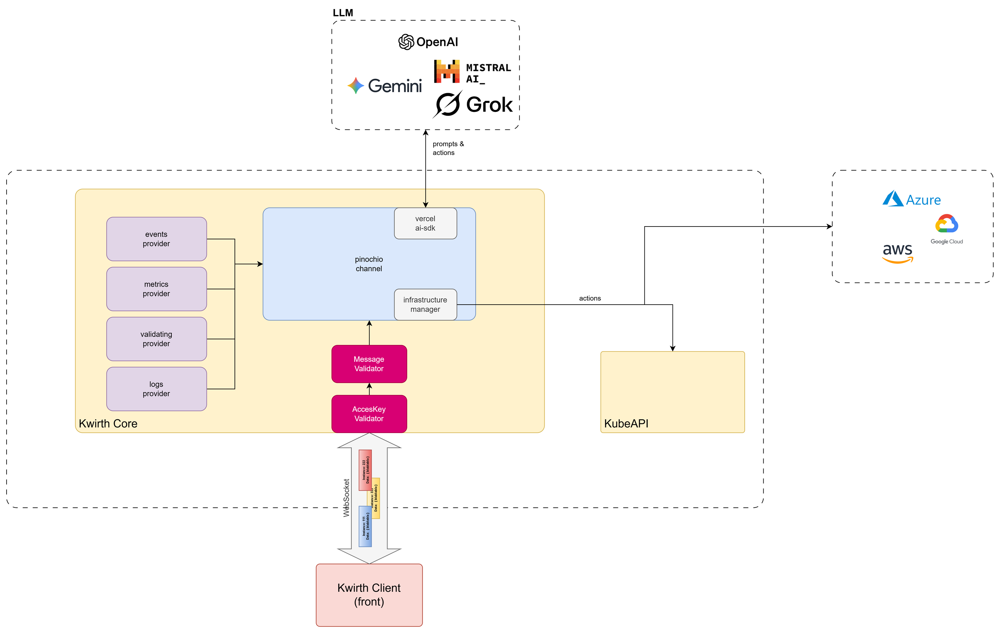

# Pinocchio
Pinocchio channel extends Kwirth capabilities by providing an integration with AI LLMs in order to perform any activity you need depending on the providers you choose or the logic you implement. The architecture for `pinocchio` is easy to understand by simply reading the following diagram:

Components:
  - On the left side, providers, data source for real-time data.
  - Inside `pinocchio` channel:
    - `ai-sdk` for integrating with external LLMs
    - 'infrastructure manager', for integrating into your infrastructure manager in order to take actions.

The rest of the parts are common to any other Kwirth channel.

## What for
The initial implementation receives events from `events` and `validating` providers, sends object information to an LLM and establishes a risk level associated to the fact of deploying the object to Kubernetes.

## Features
Minimal capabilities include:

  - Receiving events
  - Passing them to an LLM
  - Informing about cyber-risk level.

## Use
After configuring the back channel and activating the front channel, the only thing you can do is watch Pinocchio taking actions.
