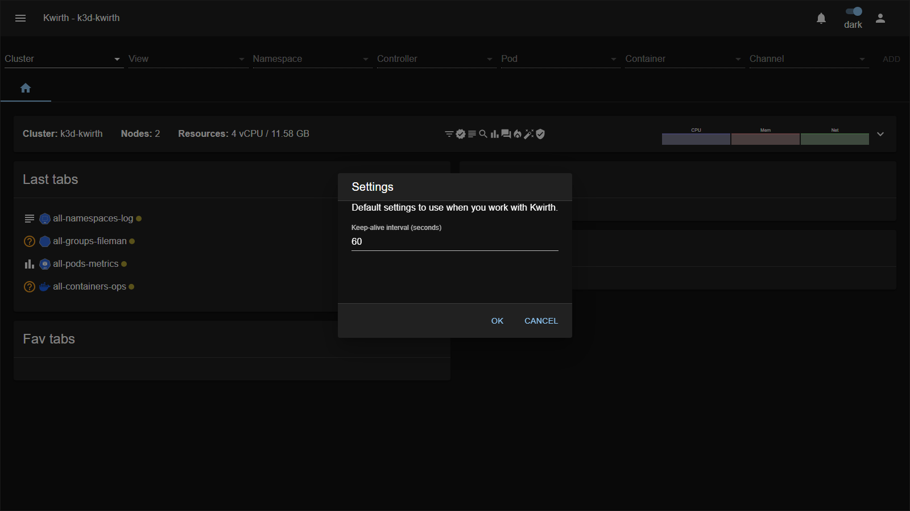
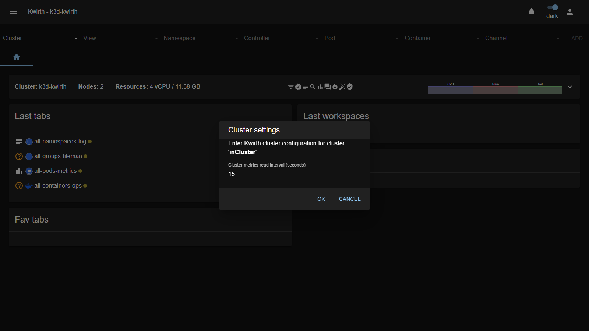

# 2. Initial configuration

Once Kwirth is [deployed](01-deployment), a few things need attention before you hand it to users: the **admin account**, the **master key**, and a couple of **base settings**.

## First login and the admin account

Kwirth ships with a single built-in **admin** account:

- **User:** `admin`
- **Password:** `password`

The **first time** you log in, Kwirth **forces you to change this password** — you cannot proceed until you do. Do it immediately.

> **Example — first boot.**
> 1. Open Kwirth and log in as `admin` / `password`.
> 2. Kwirth refuses to continue and asks for a new password.
> 3. Set a strong password and confirm. You are now in, and the default credentials no longer work.

The built-in admin account is special mainly because it exists from the start: it carries the **`admin` scope** (which unlocks all the security menus — user, API and IdP management) plus the **`cluster` scope** (which some channels require). "Admin" is a **scope**, though — you can grant it to other users too, so you can have **several administrators** (see [User management](03-user-management)). Users without the `admin` scope never see the security menus.

## The master key

The **master key** is the secret Kwirth uses to **sign the access keys** it issues to clients. Anyone who knows it could forge access keys, so it matters.

- Its default value is **`Kwirth4Ever`** — fine for a quick test, **never** for anything real.
- Set your own at deploy time: Helm `masterkey`, External `--masterkey`, or the corresponding environment variable.

> **Security:** treat the master key like a signing secret. Set a strong, unique value **before** exposing Kwirth to users, and store it somewhere safe (a Kubernetes secret / your secrets manager). Changing it later invalidates access keys already issued.

## Base settings from the UI

Two small settings are worth knowing, both reached from the **☰ main menu**.

### User settings (personal)

**☰ → User settings** holds *your own* preferences — currently the **keep-alive interval** used while you work with Kwirth:

### Cluster settings

**☰ → Cluster Settings** configures the **selected cluster**. The main option is the **metrics read interval** — how often (in seconds) Kwirth samples cluster metrics:

> The metrics interval can also be set at deploy time (Helm / `--metricsinterval`); this dialog lets you adjust it per cluster afterwards.

## What to configure next

With the admin account secured and the master key set, continue with:

1. [User management](03-user-management) — create accounts for your team.
2. [Security & permissions](04-security-and-permissions) — understand scopes and what each user can do.
3. [API management](05-api-management) — issue keys for external tools and cross-cluster access.
4. [Cluster management](06-cluster-management) — add more clusters.
5. [Identity Provider integration](07-idp-integration) — enable SSO.
6. [Extending Kwirth](08-extending-kwirth) — install the channels and other extensions you need.

Next: [User management →](03-user-management)
