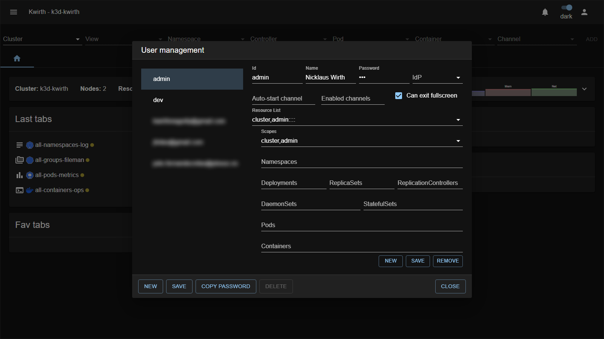
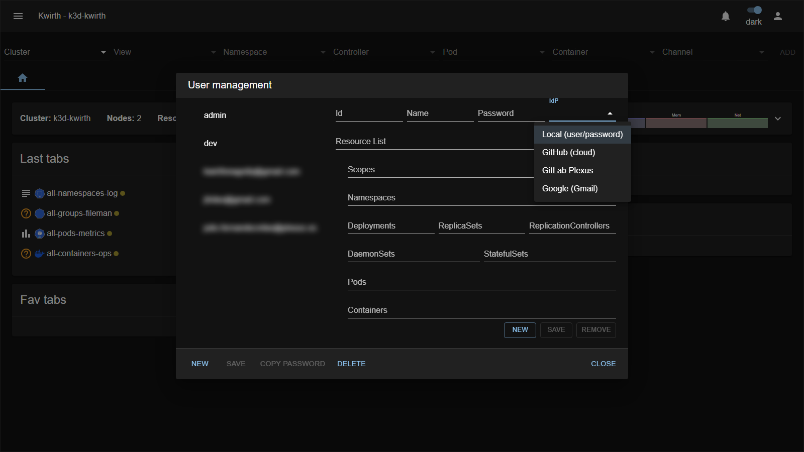

# 3. User management

Kwirth users are managed by the **admin** account from **☰ → User security**. If you are not an admin you won't see this option.



The dialog has two areas: the **list of users** on the left, and the **editor** on the right. There is always a built-in **`admin`** user (the one you first logged in with).

> **Being an administrator is a scope, not a fixed single account.** Kwirth ships with a built-in `admin` user, but "admin" is really the **`admin` scope** — you can grant it to **any user**, so you can have **as many administrators as you want**. What every user (admin or not) can do is controlled entirely by the **scopes and resources** you assign (see [Security & permissions](04-security-and-permissions)).

## User fields

| Field | Meaning |
|---|---|
| **Id** | The identifier used to **log in**. For IdP-bound users this is the **email**. |
| **Name** | A display name, for your reference. |
| **Password** | The login password (local users). Left unused for IdP-bound users. |
| **IdP** | If set, the user authenticates through that **Identity Provider** instead of a password (see [IdP integration](07-idp-integration)). |
| **Auto-start channel** | If set, the named channel (e.g. `magnify`, `ops`) is launched automatically in **fullscreen mode** immediately after the user logs in. Leave empty to disable. |
| **Enabled channels** | Comma-separated list of channel IDs the user is allowed to open (e.g. `magnify,ops`). Leave empty to allow **all** channels. |
| **Can exit fullscreen** | When unchecked, the user cannot leave fullscreen mode once it starts — useful for kiosk-style deployments. Checked by default. |

## Create a user

1. Open **☰ → User security**.
2. Click **NEW** (bottom-left).
3. Fill **Id**, **Name** and **Password**.
4. Add one or more **resources** (what the user may access) — this is the permissions part, detailed in [Security & permissions](04-security-and-permissions):
   - Click **NEW** on the right side.
   - Pick one or more **Scopes**.
   - Optionally restrict by **Namespaces**, controllers (**Deployments/ReplicaSets/…**), **Pods** and **Containers**. Leave a field **blank to mean "all"**; you can list several values or regexes separated by commas.
   - Click **SAVE** (right side) to add the resource to the list.
5. Repeat step 4 for as many resources as you need.
6. Click **SAVE** (bottom-left) to persist the user.

The **bottom-left buttons** act on the **whole user**: **NEW** (start a new user), **SAVE** (persist the user and all its resources), **COPY PASSWORD** (copy the user's password to share it), **DELETE** (delete the selected user — disabled for the built-in `admin`). **CLOSE** is on the far right. *(The **NEW / SAVE / REMOVE** buttons on the **right**, inside the resource editor, act on a single **resource** — not the user; see below.)*

## Working with resources and scopes

The right-hand side of the editor is where you build what a user may do. A user's permissions are a **list of resources**, and each **resource** couples a set of **scopes** (actions) with **object filters** (which Kubernetes objects). This is the same model described in full in [Security & permissions](04-security-and-permissions); here is how to *operate the editor*.

The controls, top to bottom:

| Control | What it does |
|---|---|
| **Resource List** | Dropdown listing the resources already added to this user. Selecting one **loads it into the fields below** so you can review or edit it. |
| **Scopes** | A **searchable multi-select** of the actions to allow (see picture below). Open it to get a **filter box** and a checkbox per scope; hover a scope for a **tooltip describing it**. You must tick **at least one** scope. |
| **Namespaces / Deployments / ReplicaSets / ReplicationControllers / DaemonSets / StatefulSets / Pods / Containers** | The **object filters**. Each takes a comma-separated list of names or regexes; **blank means "all"**. |
| **NEW** (right) | Clears the fields to start a **brand-new** resource. |
| **SAVE** (right) | Adds the current resource to the list — or, if you loaded one from *Resource List*, **updates** it. Disabled until at least one scope is selected. |
| **REMOVE** (right) | Deletes the currently selected resource from the list. |

Picking scopes:


Open the **Scopes** field and you get a **filter box** at the top — start typing to narrow a long catalog — over a **checkbox list**. Tick every action this resource should allow. Each scope shows a readable **label**, and hovering it reveals a **tooltip with its description**, so you don't have to memorize the raw scope ids.

> **The scope catalog is dynamic.** The list isn't hard-coded in the front end — the Kwirth core **serves it at runtime** (built-in scopes like `cluster`, `admin`, `api`, `view`, `filter`, `stream`, plus the classic `ops$…` / `trivy$…` actions). **Installed plugins can contribute their own RBAC scopes**, so after installing a channel/plugin you may see **new scopes appear here automatically** — no upgrade of Kwirth needed. What each scope means is detailed in [Security & permissions](04-security-and-permissions).

### Create a scope/resource

1. Click **NEW** (right side) to start with empty fields.
2. Open **Scopes** and tick the actions you want (e.g. `view`, `stream`). *(What each scope means → [Security & permissions](04-security-and-permissions).)*
3. Fill the object filters you need; leave the rest blank for "all".
4. Click **SAVE** (right side). The resource now appears in **Resource List**.

### Edit an existing scope/resource

1. Select it from **Resource List** — its scopes and filters load into the fields.
2. Change the **Scopes** ticks and/or the filters.
3. Click **SAVE** (right side) to update it in place.

### Remove a scope/resource

Select it in **Resource List** and click **REMOVE**.

> **Two SAVE buttons, two meanings.** The **right-side SAVE** commits a *resource* into the user's list. The **bottom-left SAVE** commits the *whole user* (including all its resources) to Kwirth. Always finish with the bottom-left **SAVE**, or your changes are lost.

## Local users vs IdP-bound users

Every user authenticates in one of two ways, selected with the **IdP** field of the editor:

- **Local user** — the **IdP** field is `Local (user/password)`. They log in with the Id + Password you set here.
- **IdP-bound user** — the **IdP** field points to an Identity Provider connector; they log in through that provider and **no password is used**.

## IdP-bound users

If your organization uses Single Sign-On, you bind a user to an [Identity Provider](07-idp-integration) instead of giving them a password. The **IdP** dropdown in the user editor lists `Local (user/password)` plus every **enabled** IdP connector:



Rules that make an IdP user work (all must hold):

- The **Id must be the user's verified email** — this is what the provider will return and what Kwirth matches against.
- The user must be **bound to the exact connector** they will use to sign in. A verified email arriving from a *different* provider is rejected.
- **No password** is stored for IdP users; the Password field is irrelevant for them.
- **No auto-provisioning** — you must create the user here first. Signing in with Google/GitLab/GitHub never creates an account by itself.

### Create an IdP-bound user (example)

To let `alice@example.com` sign in with Google:

1. First make sure the **Google** connector is installed and **enabled** (see [IdP integration](07-idp-integration)).
2. **☰ → User security → NEW**.
3. **Id** = `alice@example.com` (her verified Google email). **Name** = `Alice`. Leave **Password** empty.
4. Set the **IdP** field to **`Google (Gmail)`**.
5. Add her **resources** (scopes + object filters) exactly as for any user — SSO changes only *how she logs in*, not *what she can do*.
6. **SAVE**.

Alice can now click *"Login with Google"* on the login screen; once Google verifies her, Kwirth lets her in with the permissions you assigned.

> The prerequisite is the connector: the **IdP** dropdown only offers providers that are installed **and enabled** in [Manage extensions → Identity providers](07-idp-integration). If Google isn't in the list, enable it there first.

## Login behaviour settings

These three fields control what happens when the user logs in:

### Auto-start channel

Set this to a channel ID (e.g. `magnify`, `ops`, `trivy`) to have Kwirth open that channel **automatically in fullscreen** as soon as the user authenticates. This is useful for operators who always work in one channel and do not need the full Kwirth UI.

- The channel ID must match one of the installed channels.
- If the channel is not available (not installed, or not in the user's **Enabled channels** list), the auto-start is silently skipped.

### Enabled channels

Leave empty to let the user open **any** installed channel. Fill in a comma-separated list to **restrict** them to only those channels:

```
magnify,ops
```

Channels not in the list will not appear in the **Add** menu for that user.

### Can exit fullscreen

Uncheck this to prevent the user from leaving fullscreen mode. Combined with **Auto-start channel**, this creates a **kiosk mode**: the user logs in and is immediately locked to one channel view with no way to navigate away.

> **Tip — kiosk setup:** set **Auto-start channel** = `magnify`, uncheck **Can exit fullscreen**, and assign only the `stream` scope to the user. They will see the log stream from the moment they log in, with no access to the rest of the UI.

## Worked example — a read-only user for one namespace

Create a user who may only *watch* logs and metrics in the `production` namespace:

1. **NEW** user → Id `alice`, Name `Alice`, Password `<set one>`.
2. Add a resource:
   - **Scopes**: `view`, `stream` (watch and receive live streams — no ops, no admin).
   - **Namespaces**: `production`
   - Leave Deployments/Pods/Containers **blank** (= all objects within `production`).
   - **SAVE** the resource.
3. **SAVE** the user.

Alice can now open Log/Metrics channels scoped to `production`, but cannot operate workloads or reach other namespaces. To let her also **restart/delete** workloads you would add the `ops$restart` scope; to make her an administrator, you would add the `admin` scope — both explained next.

Next: [Security & permissions →](04-security-and-permissions)
