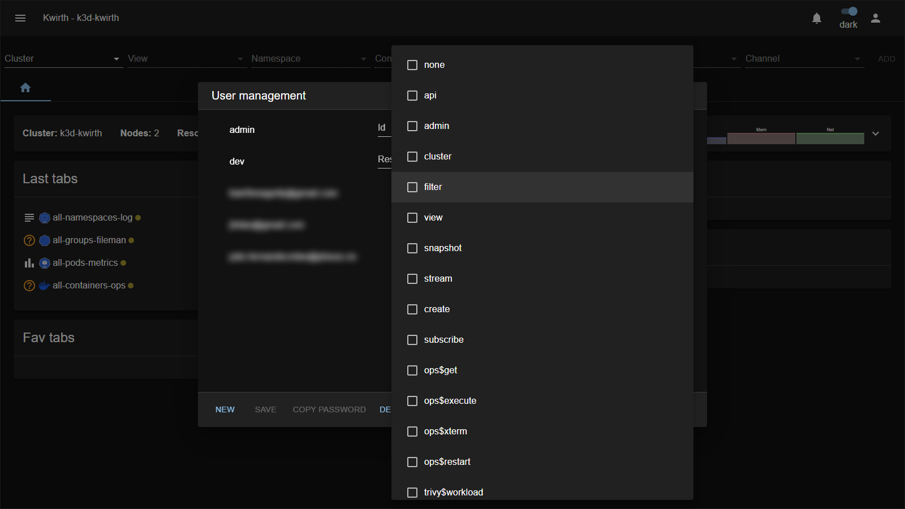

# 4. Security & permissions

Kwirth has three security layers:

1. **Administrator security** — the `admin` account and the `admin` scope (manage users, keys, IdPs).
2. **User security** — what each user may see and do, expressed as **scopes** on **resources**.
3. **API security** — keys for external tools and cross-cluster access (see [API management](05-api-management)).

This chapter explains the **permission model** you use when creating users.

## The model: resources = scopes + object filters

Every user carries a **list of resources**. Each **resource** is one permission entry made of two parts:

- **Scopes** — *what actions* are allowed (view, stream, operate, administer…).
- **Object filters** — *on which Kubernetes objects*: Namespaces, Deployments, ReplicaSets, ReplicationControllers, DaemonSets, StatefulSets, Pods and Containers.

A user is allowed to do something if **any** of their resources grants it. Within a resource, the scopes apply **only** to the objects that match the filters.

### Object filters

Each filter field takes a **comma-separated** list of names — **regular expressions are allowed** — and a **blank field means "all"**:

| Field value | Meaning |
|---|---|
| *(blank)* | all objects of that kind |
| `production` | exactly that namespace |
| `production,staging` | either namespace |
| `web-.*` | every object whose name matches the regex |

So a resource with **Namespaces = `production`** and everything else blank means *"these scopes, on all objects inside `production`"*.

## The scopes

When you edit a resource, **Scopes** is a checklist:

| Scope | Grants |
|---|---|
| `admin` | **Administrative access** — manage users, API keys and identity providers (unlocks the security menus). |
| `cluster` | **Cluster-wide** access; required by some channels to work at the cluster level. |
| `api` | Use of the **API Security** features (issuing / holding API keys). |
| `view` | **View** data from a channel. |
| `stream` | Receive a **live stream** of data. |
| `snapshot` | Get an **instant snapshot** (no continuous streaming). |
| `filter` | Apply **filtering** on the stream. |
| `create` | **Create** things a channel supports (e.g. alerts). |
| `subscribe` | **Subscribe** to a channel's output (e.g. alerts). |
| `ops$get` | Ops: **read/inspect** resources. |
| `ops$execute` | Ops: **execute** a command. |
| `ops$xterm` | Ops: open an **interactive terminal (shell)**. |
| `ops$restart` | Ops: **restart** workloads. |
| `trivy$workload` | Trivy: scan **workloads**. |
| `trivy$kubernetes` | Trivy: scan **Kubernetes / cluster** objects. |
| `none` | Placeholder — no capability. |

> **The `admin` scope is powerful.** It grants the whole security surface (users, keys, IdPs). Give it only to real administrators. The built-in `admin` account already carries it (plus `cluster`).

## How to think about it (grant least privilege)

Start from *what the person needs to do*, pick the **matching scopes**, then **narrow the objects** with filters. Leaving filters blank grants the scopes cluster-wide — deliberate for admins, usually too broad for everyone else.

## Worked examples

**A) A full administrator**

- One resource: **Scopes** `admin`, `cluster` · all filters blank.

**B) A production log/metrics viewer**

- **Scopes** `view`, `stream` · **Namespaces** `production` · rest blank.
- Can watch logs and metrics in `production`; cannot operate anything or see other namespaces.

**C) An operator for one app**

- **Scopes** `ops$get`, `ops$xterm`, `ops$restart` · **Namespaces** `payments` · **Deployments** `checkout` · rest blank.
- Can inspect, open a shell into, and restart the `checkout` Deployment in `payments` — and nothing else.

**D) A security auditor**

- **Scopes** `trivy$workload`, `trivy$kubernetes` · filters blank.
- Can run vulnerability scans across the cluster, but has no log/ops access.

**E) An external integration (API)**

- **Scopes** `api` (plus the streaming scopes the integration needs, e.g. `view`, `stream`) · filters narrowed to what it should reach.
- Pair this with an **API key** — see [API management](05-api-management).

## A note on IdP users

Scopes and resources define **authorization** — *what a user can do*. For **authentication** — *proving who they are* — a user can use a Kwirth password or an external Identity Provider. The permission model above is identical either way; IdP only changes how they log in. See [IdP integration](07-idp-integration).

Next: [API management →](05-api-management)
