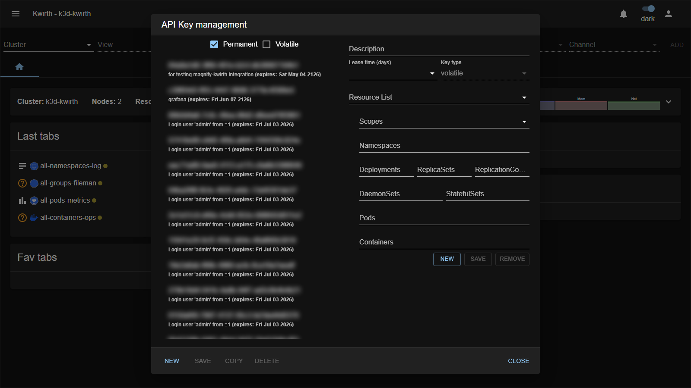

# 5. API management

Everything in Kwirth is reached through a secured API, and every call must carry an **access key**. When you use the web UI, Kwirth issues one for you automatically. But you will often want to hand a key to **something else** — an external tool (Backstage Kubelog, KwirthMetrics, Grafana…) or **another Kwirth** that consolidates your cluster. That's what **API management** is for.

Open it from **☰ → API Security**. It is visible only to admins and to users holding the **`api`** scope.



## Access keys vs API keys

Two closely related concepts:

- An **access key** is the credential itself: a unique **id**, a **type**, and a **resource list** (scopes + object filters — the same model as in [Security & permissions](04-security-and-permissions)).
- An **API key** is *an access key plus expiry information* (a description and a validity in days).

```
API key   = access key + description + expiry
access key = id + type + resources (scopes:namespaces:groups:pods:containers)
```

A key is a single string with three parts — **id | type | resource-list** — for example:

```
93df417c-e124-7d66-12a1-277d3f246bf7|permanent|view:production:::
```

The resource list is **semicolon-separated**, so one key can grant several different things at once:

```
26f2c1e3-b414-41bc-b67c-4525e6e33725|permanent|snapshot:pro:::;view,filter:pro:::
```

### What an access key is used for

An access key is the credential Kwirth checks on **every** request, so it is what you hand to anything that needs to talk to this Kwirth:

- **External applications** — tools like Backstage Kubelog, KwirthMetrics or a Grafana data source present the key on each call to read the streams you allowed.
- **Another Kwirth (cluster consolidation)** — this is how you **add a remote cluster to your cluster list**. You create a key on the *remote* Kwirth and paste it into **☰ → Manage cluster list → API Key** (together with the remote's URL). From then on, selecting that cluster in the resource selector makes Kwirth authenticate with this key automatically. See [Cluster management](06-cluster-management).
- **Scripts / automation** — anything hitting the Kwirth API directly presents the key (as a bearer token in the `Authorization` header for bearer keys).

In every case the key carries its own **scopes and object filters**, so it can only do what you granted when you created it — no more.

## Key types

| Type | Persisted? | Use |
|---|---|---|
| **permanent** | Yes — stored in the Kubernetes control plane; survives restarts. | Keys you create for people/tools. **The only type the UI creates.** |
| **volatile** | No — lives only in the memory of the Kwirth instance that created it. | Machine-to-machine, single replica, disposable. |
| **bearer** | No — signed and handed to the client at login (OAuth-style). | Issued to clients automatically; presented in an `Authorization: Bearer …` header. |

The permanent/volatile filter at the top of the dialog lets you list keys by type; the left column shows all keys (except bearer) with their description and expiry.

## Create an API key

1. Open **☰ → API Security** and click **NEW**.
2. Fill:
   - **Description** — *why* the key exists (you'll thank yourself later).
   - **Lease time (days)** — how long it stays valid.
   - **Key type** — leave **permanent** for the usual case.
3. Build the **resource list** (bottom-right **NEW / SAVE / REMOVE**), exactly like a user's resources:
   - Pick **Scopes** (e.g. `view`, `stream`).
   - Narrow with **Namespaces / Deployments / … / Pods / Containers** (comma-separated, regex allowed, blank = all).
   - **SAVE** the resource; add as many as needed.
4. Click **SAVE** (bottom-left) to persist the key.
5. Select the key and use **COPY** to copy its string, then paste it into the external tool.

> **Don't forget the outer SAVE.** After editing the resource list, you must still **SAVE** the key itself (left side) or your changes are lost.

## Worked example — a read-only key for an external log viewer

Give Kubelog/KwirthMetrics read access to logs in `production`:

1. **NEW** → Description `kubelog-prod`, Lease time `365`, Key type `permanent`.
2. Resource: **Scopes** `view` · **Namespaces** `production` · rest blank · **SAVE**.
3. **SAVE** the key, then **COPY**. The string looks like:
   ```
   93df417c-e124-7d66-12a1-277d3f246bf7|permanent|view:production:::
   ```
4. Configure that string in the external application.

## Using a key to reach another cluster

API keys are also how one Kwirth reaches **another**: create a key on the *remote* Kwirth here, then register the remote cluster in **your** profile with that key. That is covered next in [Cluster management](06-cluster-management).

> **Treat keys as secrets.** A key grants exactly the scopes it carries — anyone holding it can act with them until it expires. Scope keys tightly, set a sensible lease time, and delete keys you no longer need.

Next: [Cluster management →](06-cluster-management)
