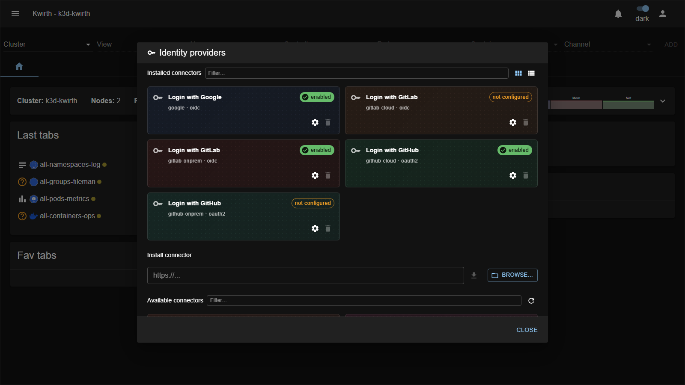
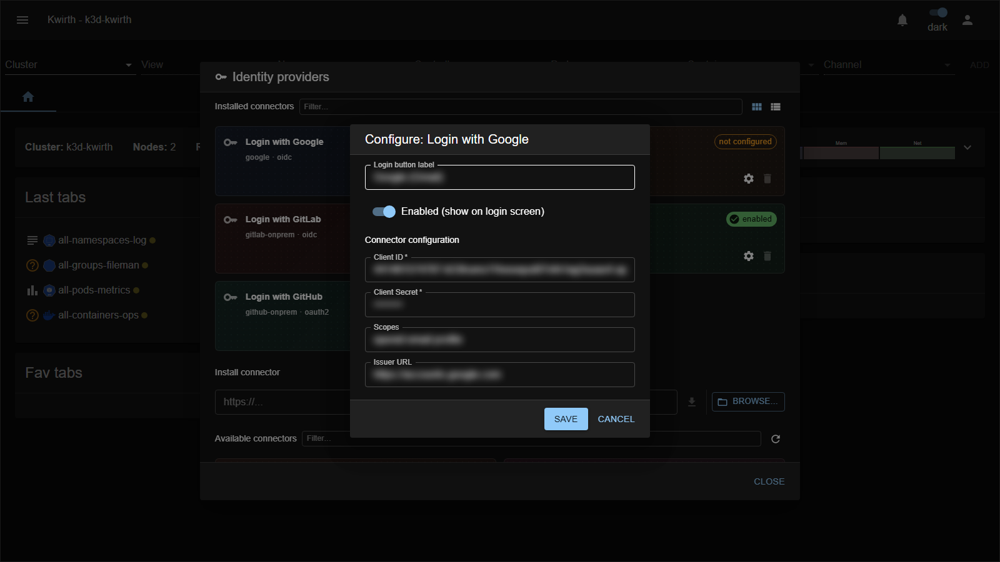

# 7. Identity Provider integration

Kwirth can delegate **authentication** to an external Identity Provider (IdP) so people sign in with their corporate or personal accounts (Single Sign-On) instead of a Kwirth password.

## Authentication vs authorization

The key idea is the split:

- **Authentication** is done by the **IdP** — it only proves *"this really is `someone@example.com`, and we verified it"*.
- **Authorization** stays in **Kwirth** — the person must already exist as a user and be bound to that IdP, and their [scopes/resources](04-security-and-permissions) decide what they can do.

The IdP says *who*; Kwirth decides *whether* and *what*.

## How access is granted

For an IdP user to log in, **all** of these must hold:

1. The IdP reports the email as **verified**.
2. A Kwirth **user exists whose Id is that email** (created in [User management](03-user-management)).
3. That user is **bound to the exact IdP** being used.

There is **no auto-provisioning** — signing in with Google (or any IdP) never creates an account by itself. A verified email arriving from a *different* provider than the one assigned to the user is rejected. The built-in `admin` and any local user/password accounts keep working alongside SSO.

## Enabling an IdP

IdP connectors are **extensions** — no environment variables or restarts. Open **☰ → Manage extensions → Identity providers**:

- **Installed connectors** shows each connector with its state — **enabled** or **not configured** — plus a **Settings** (⚙) button and a delete button.
- **Available connectors** lists connectors you can install; **Install connector** takes a URL or **BROWSE…** for a local package. Toggle **Card / List view** with the buttons top-right.

Click a connector's **⚙ Settings** to configure it:

Typical fields:

| Field | Meaning |
|---|---|
| **Login button label** | Text shown on the login screen (e.g. *"Login with Google"*). |
| **Enabled (show on login screen)** | Turns the connector on and makes its button appear. |
| **Client ID / Client Secret** | The OAuth/OIDC credentials from the provider. Secrets are **write-only** and shown masked. |
| **Scopes** | The scopes requested from the provider. |
| **Issuer URL** | The provider's endpoint (needed especially for on-prem/self-managed connectors). |

Configuration for all connectors is stored in a single Kubernetes secret (`kwirth-idps`), and secrets are never shown back in clear.

## Supported connectors

Each provider is shipped as its **own connector** — cloud and on-prem variants are **separate** installable connectors:

| Connector | Protocol | Manual |
|---|---|---|
| **Google** (Google / Gmail) | OIDC | [Google](../extensions/idps/google) |
| **GitLab Cloud** (GitLab.com SaaS) | OIDC | [GitLab Cloud](../extensions/idps/gitlab-cloud) |
| **GitLab Self-Managed** (on-prem) | OIDC | [GitLab Self-Managed](../extensions/idps/gitlab-onprem) |
| **GitHub Cloud** (GitHub.com SaaS) | OAuth2 | [GitHub Cloud](../extensions/idps/github-cloud) |
| **GitHub Enterprise Server** (on-prem) | OAuth2 | [GitHub Enterprise Server](../extensions/idps/github-onprem) |

More connectors are packaged independently, so third parties can ship their own.

## Binding a user to the IdP

Enabling a connector is only half the job — each person still needs a Kwirth user **bound** to it. That's done in [User management](03-user-management): create a user whose **Id is their verified email** and set the **IdP** field to the connector. See the section [IdP-bound users](03-user-management#idp-bound-users) there.

## Security

The SSO flow is protected with **PKCE + `state`**, a **back-channel** token exchange (the browser never sees provider tokens), a **single-use** login handoff, anti open-redirect checks, masked secret storage, and **admin-only** management. For the full details see the reference [IdP security notes](../../idp/security).

Next: [Extending Kwirth →](08-extending-kwirth)
