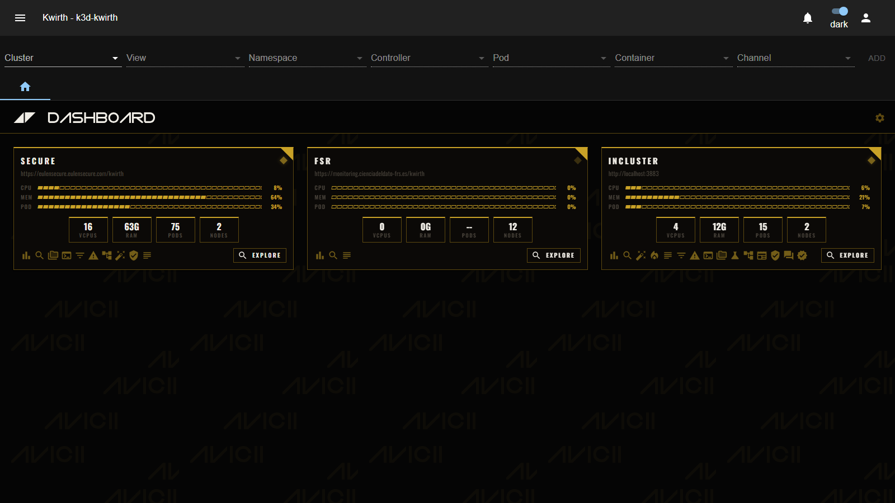
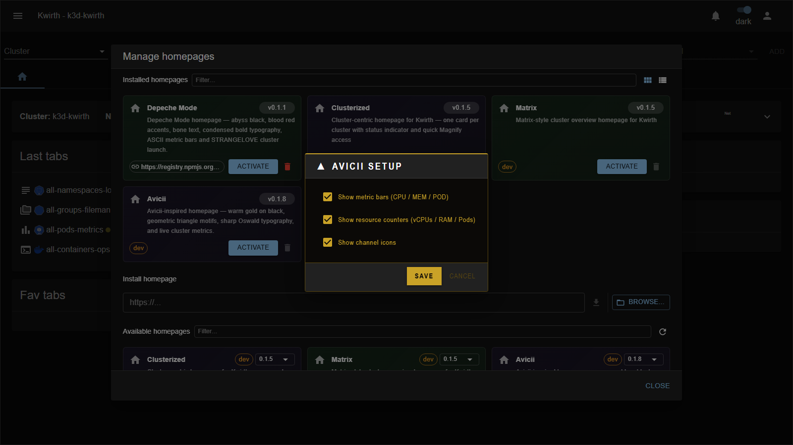

# Avicii (homepage)

> **Type:** Homepage · **Look:** warm gold, live metrics

## What it shows

The **Avicii** homepage is a striking **gold-on-black** landing dashboard with the AVICII watermark, **metric bars**, **resource counters** (vCPUs / RAM / Pods / Nodes) per cluster and an **Explore** shortcut — matching the **[Avicii theme](../themes/avicii)**:

## Configuration

Activating it opens an **AVICII SETUP** dialog:

| Option | What it does |
|---|---|
| **Show metric bars (CPU / MEM / POD)** | Show the animated metric bars. |
| **Show resource counters (vCPUs / RAM / Pods)** | Show the numeric resource counters. |
| **Show channel icons** | Show the quick channel-launch icons. |

**Save** applies and activates it (deactivating the previous homepage); reconfigure later via the **⚙️ gear** on the home.

## Applying it

1. **☰ → Manage extensions → Homepages** — **Deactivate** the active one, then **Activate** *Avicii*.
2. Tune its **setup** and **Save**.
3. **Deactivate** to return to the default home.

## Notes

- Use together with the **[Avicii theme](../themes/avicii)** for a fully consistent gold look.

---

← Back to [Homepages](index)
