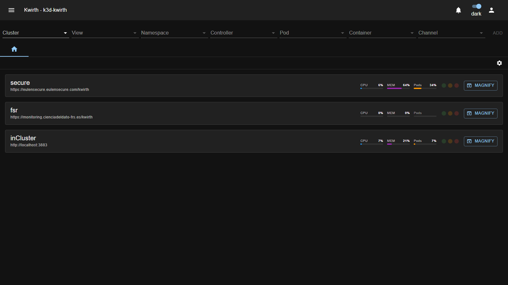
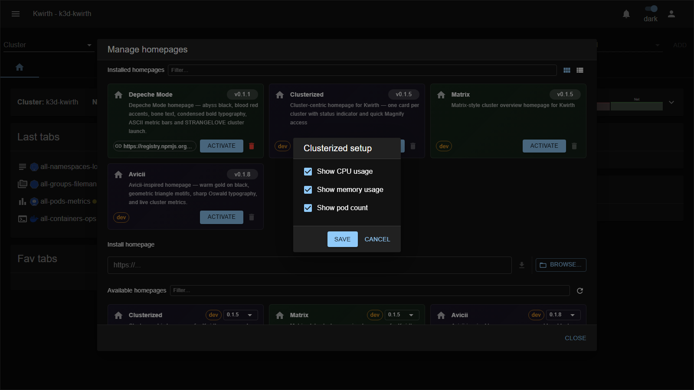

# Clusterized (homepage)

> **Type:** Homepage · **Look:** one row per cluster

## What it shows

**Clusterized** is a **cluster-centric** landing dashboard: **one row per cluster**, each with live **CPU / Memory / Pods** bars, a status indicator, and a **Magnify** shortcut. The most practical homepage for **multi-cluster** operators — every cluster's health at a glance:

## Configuration

When you activate it, a **Clusterized setup** dialog opens:

| Option | What it does |
|---|---|
| **Show CPU usage** | Show the per-cluster CPU bar. |
| **Show memory usage** | Show the per-cluster memory bar. |
| **Show pod count** | Show the per-cluster pod count. |

**Save** applies the config **and activates** the homepage (deactivating the previously-active one). Reconfigure later via the **⚙️ gear** on the home (top-right).

## Applying it

1. **☰ → Manage extensions → Homepages** — **Deactivate** the active homepage, then **Activate** *Clusterized*.
2. Adjust its **setup** and **Save**.
3. **Deactivate** to return to Kwirth's default home.

## Notes

- Best paired with **multi-cluster** setups — see [Cluster management](../../admin/06-cluster-management).

---

← Back to [Homepages](index)
