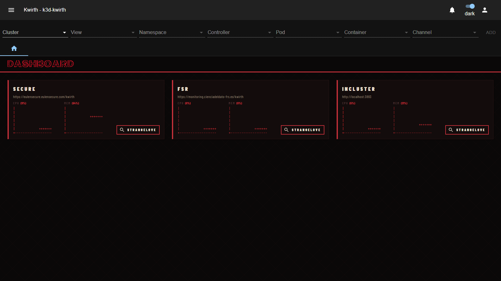

# Depeche Mode (homepage)

> **Type:** Homepage · **Look:** abyss black, blood red, ASCII bars

## What it shows

The **Depeche Mode** homepage is a dramatic landing dashboard: **abyss black**, **blood-red** accents, bone text, condensed bold typography, **ASCII metric bars** per cluster and a **STRANGELOVE** cluster launcher. Matches the **[Depeche Mode theme](../themes/depeche-mode)**:

## Configuration

**Depeche Mode has no setup** — activating it applies immediately (no config dialog). Just **Activate** it and it becomes your home.

## Applying it

1. **☰ → Manage extensions → Homepages** — **Deactivate** the active one, then **Activate** *Depeche Mode*.
2. **Deactivate** to return to the default home.

## Notes

- Pairs with the **[Depeche Mode theme](../themes/depeche-mode)** for a fully consistent look.
- Unlike the other homepages (Clusterized / Avicii / Matrix), it exposes **no configuration options**.

---

← Back to [Homepages](index)
