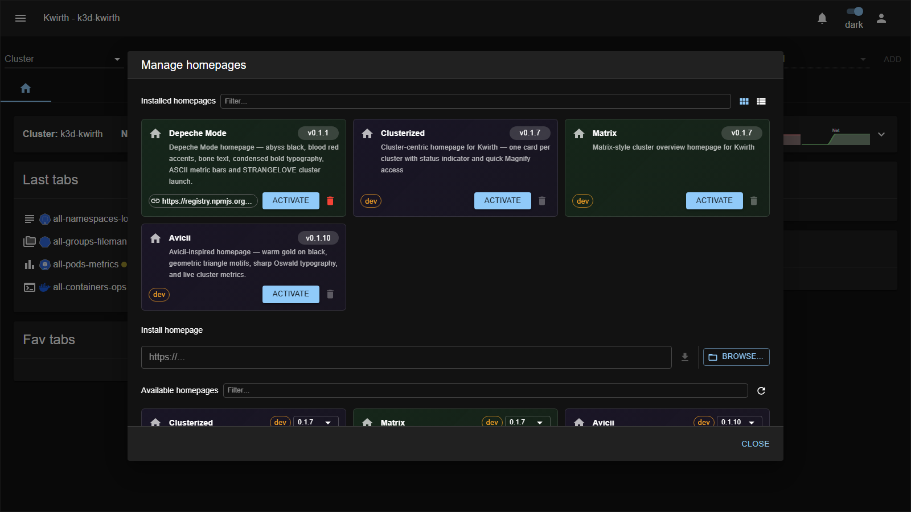

# Homepages (landing dashboards)

> **Type:** Homepages · **Managed from:** ☰ → Manage extensions → Homepages

## What a homepage is

A **homepage** is the **landing dashboard** you see on the Kwirth home screen — the cluster/overview panel with your recent and favourite workspaces. Homepages are **installable extensions**, so you can swap the default landing experience for one that suits how you work (a per-cluster card wall, a live-metrics dashboard, a themed overview…).

Each homepage is a **card** with a description, **version**, an **Activate** button and **🗑️ delete**. Install more from the **Install homepage** URL field (or **Browse**); the **Available homepages** list shows what's in the registry.

## The bundled homepages

| Homepage | What it shows |
|---|---|
| **[Clusterized](clusterized)** | Cluster-centric — **one card per cluster** with a status indicator and quick **Magnify** launch. Great for multi-cluster operators. |
| **[Avicii](avicii)** | Warm **gold-on-black**, triangle motifs, sharp Oswald typography and **live cluster metrics**. |
| **[Matrix](matrix)** | A Matrix-style **cluster overview** landing page. |
| **[Depeche Mode](depeche-mode)** | Abyss black / blood-red / bone theme, **ASCII metric bars**, and a *STRANGELOVE* cluster launcher. |

## Configuring a homepage

When you **activate** a homepage, its **setup** may open so you can configure it; afterwards, its **card in the manager shows a ⚙️ gear** you can use to **reconfigure** it at any time (things like refresh interval, endpoints or which clusters to show). **Some homepages have no configuration** — then there's no gear. Use **Deactivate** on the active card to return to Kwirth's default home.

## Applying a homepage

1. Open **☰ → Manage extensions → Homepages**.
2. **Install** it if needed (URL or Browse → download).
3. Click **Activate** on its card — the home screen adopts it right away.

## Admin guide

- **Install / activate / remove:** all from **☰ → Manage extensions → Homepages**, using the common flow in [Extending Kwirth](../../admin/08-extending-kwirth).
- **Scope:** a homepage changes the **landing dashboard** only; it doesn't alter cluster data or permissions.

## Notes

- Homepages pair naturally with **[themes](../themes/index)** — several share a visual identity (Avicii, Matrix, Depeche Mode).
- The **Clusterized** homepage is the most practical for day-to-day multi-cluster work.

---

← Back to [Extension manuals](../index)
