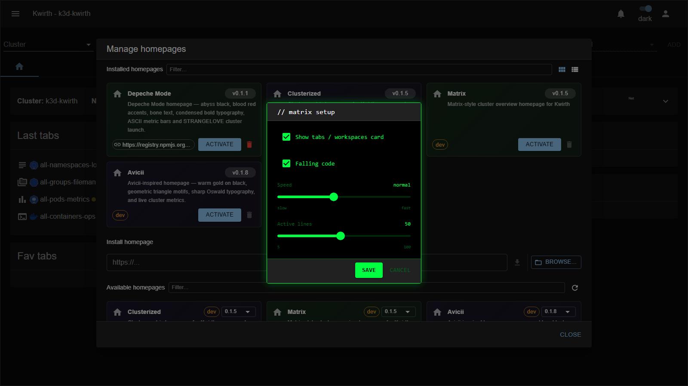

# Matrix (homepage)

> **Type:** Homepage 
> **Look:** Matrix-style cluster overview

## What it shows

The **Matrix** homepage turns the landing screen into a **Matrix-style cluster overview** — black background, **falling green code**, monospace terminal cards per cluster with live logs, and TOPOLOGY / MAGNIFY shortcuts. Matches the **[Matrix theme](../themes/matrix)**:

## Configuration

Activating it opens a **matrix setup** dialog:

| Option | What it does |
|---|---|
| **Show tabs / workspaces card** | Show the recent tabs & workspaces panel. |
| **Falling code** | Toggle the animated Matrix "rain". |
| **Speed** | Rain speed — **slow / normal / fast**. |
| **Active lines** | How many rain columns animate at once. |

**Save** applies and activates it (deactivating the previous homepage); reconfigure later via the **⚙️ gear** on the home.

## Applying it

1. **☰ → Manage extensions → Homepages** — **Deactivate** the active one, then **Activate** *Matrix*.
2. Tune its **setup** and **Save**.
3. **Deactivate** to return to the default home.

## Notes

- Pairs with the **[Matrix theme](../themes/matrix)**.

---

← Back to [Homepages](index)
