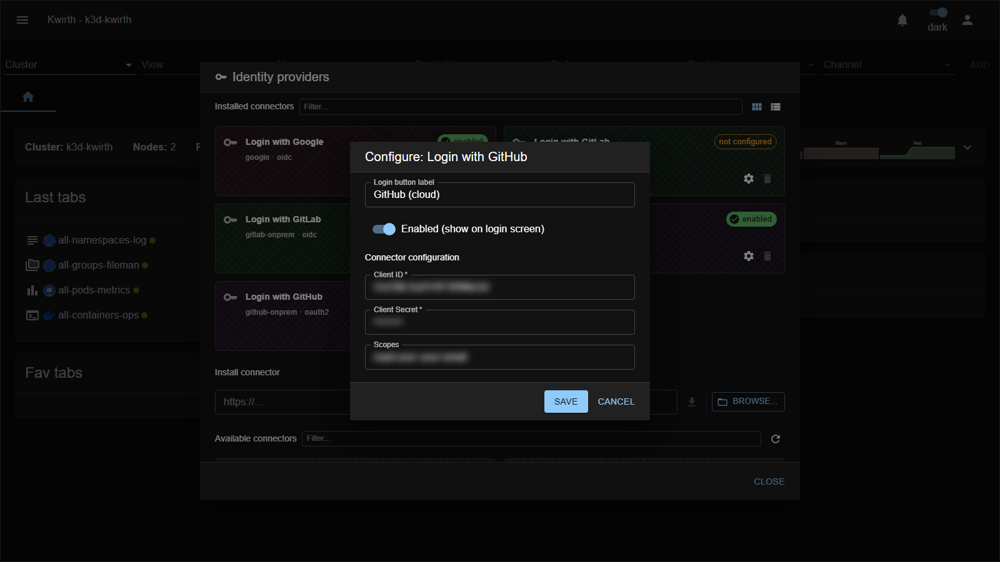

# GitHub Cloud (IdP connector)

> **Type:** Identity provider connector · **Protocol:** OAuth2 · **Provider id:** `github-cloud`

## What it does

Lets users **sign in with a GitHub.com account** via **OAuth2**. Adds a **"Login with GitHub"** button to the sign-in screen.

## Configuration

Open **☰ → Manage extensions → Identity providers → Login with GitHub (github-cloud) → ⚙️**:

| Field | What it does |
|---|---|
| **Login button label** | Text on the login-screen button. |
| **Enabled (show on login screen)** | Toggle the connector on/off. |
| **Client ID** * | The GitHub OAuth App **client ID**. |
| **Client Secret** * | The OAuth App **client secret**. |
| **Scopes** | OAuth scopes (e.g. `read:user user:email`). |

## Setup

Register an **OAuth App** in GitHub (Settings → Developer settings → OAuth Apps), set Kwirth's **Authorization callback URL**, and paste the client id/secret here. See **[Identity Provider integration](../../admin/07-idp-integration)**.

## Notes

- For **GitHub Enterprise Server** use the **[GitHub Enterprise Server](github-onprem)** connector (it adds base/API URLs).
- The client secret is a credential — protect it.

---

← Back to [Identity providers](index)
