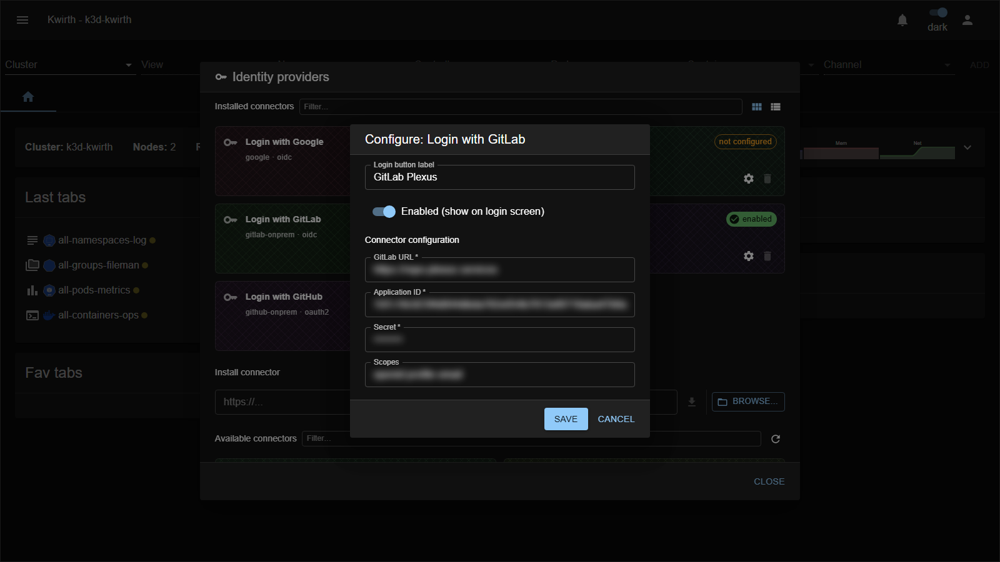

# GitLab Self-Managed (IdP connector)

> **Type:** Identity provider connector · **Protocol:** OIDC · **Provider id:** `gitlab-onprem`

## What it does

Lets users **sign in with a self-managed (on-prem) GitLab** instance via **OpenID Connect** — same as the cloud connector, but pointed at **your** GitLab URL.

## Configuration

Open **☰ → Manage extensions → Identity providers → Login with GitLab (gitlab-onprem) → ⚙️**:

| Field | What it does |
|---|---|
| **Login button label** | Text on the login-screen button. |
| **Enabled (show on login screen)** | Toggle the connector on/off. |
| **GitLab URL** * | Base URL of your self-managed GitLab (e.g. `https://gitlab.example.com`). |
| **Application ID** * | The OAuth application's **Application ID**. |
| **Secret** * | The application **secret**. |
| **Scopes** | OIDC scopes. |

## Setup

Create an **OAuth Application** in your GitLab instance's admin/user settings, set Kwirth's **redirect URI**, and fill in the URL + Application ID/Secret. See **[Identity Provider integration](../../admin/07-idp-integration)**.

## Notes

- The only difference from **[GitLab Cloud](gitlab-cloud)** is the **GitLab URL** field.
- The application secret is a credential — protect it.

---

← Back to [Identity providers](index)
