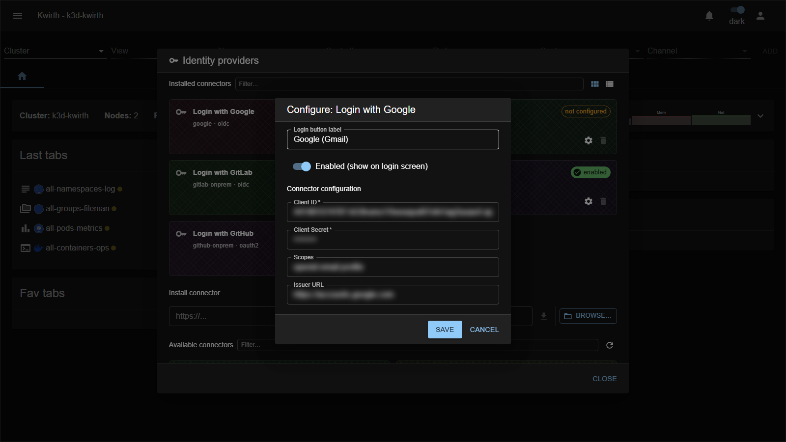

# Google (IdP connector)

> **Type:** Identity provider connector · **Protocol:** OIDC · **Provider id:** `google`

## What it does

Lets users **sign in to Kwirth with a Google / Google Workspace account** via **OpenID Connect**. Once configured and enabled, a **"Login with Google"** button appears on the sign-in screen.

## Configuration

Open **☰ → Manage extensions → Identity providers → Login with Google → ⚙️**:

| Field | What it does |
|---|---|
| **Login button label** | Text shown on the login-screen button (e.g. *Google (Gmail)*). |
| **Enabled (show on login screen)** | Toggle the connector on/off for users. |
| **Client ID** * | The OAuth **client ID** from your Google Cloud OAuth credentials. |
| **Client Secret** * | The corresponding **client secret**. |
| **Scopes** | OIDC scopes to request (e.g. `openid email profile`). |
| **Issuer URL** | The OIDC issuer (Google's discovery URL). |

## Setup

Register an **OAuth 2.0 Client** in Google Cloud, set Kwirth's **redirect URI**, and copy the client id/secret here. Full step-by-step (redirect URIs, consent screen, mapping the identity to a Kwirth user/role) is in **[Identity Provider integration](../../admin/07-idp-integration)**.

## Notes

- **Client Secret** is a credential — protect the connector configuration.
- The login only grants access once the external identity **maps to a Kwirth user/role** with scopes — see [User management](../../admin/03-user-management).

---

← Back to [Identity providers](index)
