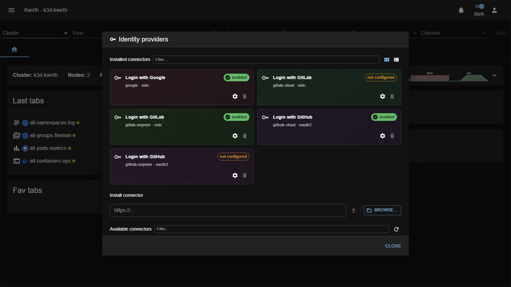

# Identity Providers (SSO connectors)

> **Type:** Identity providers · **Managed from:** ☰ → Manage extensions → Identity providers

## What an IdP connector is

An **Identity Provider (IdP) connector** lets users **sign in to Kwirth with an external identity** — Google, GitLab or GitHub — instead of (or alongside) a local Kwirth account. Each connector is an **installable extension** implementing an SSO protocol (**OIDC** or **OAuth2**) against a specific provider.

Each connector is a **card** showing the provider, the **protocol**, a status badge (**enabled** / **not configured**), and a **⚙️ gear** (configure) + **🗑️ delete**. You configure a connector's client id/secret and callback behind its **gear**; once configured and enabled it appears as a **"Login with …"** button on the sign-in screen.

## The bundled connectors

| Connector | Provider · protocol | For |
|---|---|---|
| **Login with Google** | `google` · **OIDC** | Google / Google Workspace accounts. |
| **Login with GitLab** | `gitlab-cloud` · **OIDC** | GitLab.com (SaaS). |
| **Login with GitLab** | `gitlab-onprem` · **OIDC** | Self-managed GitLab. |
| **Login with GitHub** | `github-cloud` · **OAuth2** | GitHub.com (SaaS). |
| **Login with GitHub** | `github-onprem` · **OAuth2** | GitHub Enterprise Server. |

## Configuring & using a connector

1. Open **☰ → Manage extensions → Identity providers** (install the connector first if it isn't listed).
2. Click its **⚙️ gear** and fill in the provider's **client id / secret** and settings; save. The badge flips from **not configured** to **enabled**.
3. Users now get a **"Login with …"** button on the login screen.

The **full step-by-step setup** for each provider (registering the OAuth app, redirect URIs, scopes, mapping identities to Kwirth users) lives in the admin guide — see **[Identity Provider integration](../../admin/07-idp-integration)**.

## Admin guide

- **Install / configure / enable / remove:** all from **☰ → Manage extensions → Identity providers**, using the common flow in [Extending Kwirth](../../admin/08-extending-kwirth).
- **Security:** IdP client secrets are credentials — protect them. Review the SSO **security notes** in [IdP integration](../../admin/07-idp-integration).
- **Identity mapping:** an external login must map to a Kwirth user/role to get scopes — see [User management](../../admin/03-user-management) and [Security & permissions](../../admin/04-security-and-permissions).

## Notes

- **OIDC** connectors (Google, GitLab) and **OAuth2** connectors (GitHub) differ in protocol but are configured and enabled the same way here.
- A connector shown as **not configured** is installed but not yet usable — add its credentials via the gear.

---

← Back to [Extension manuals](../index)
