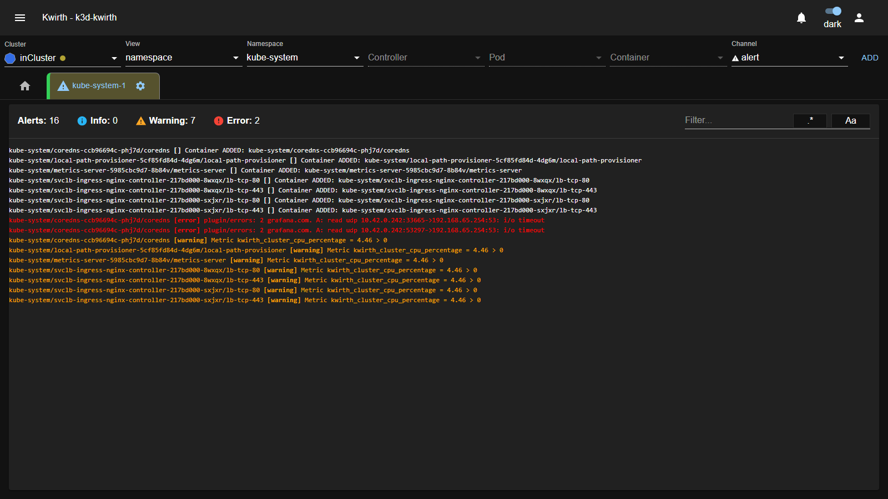
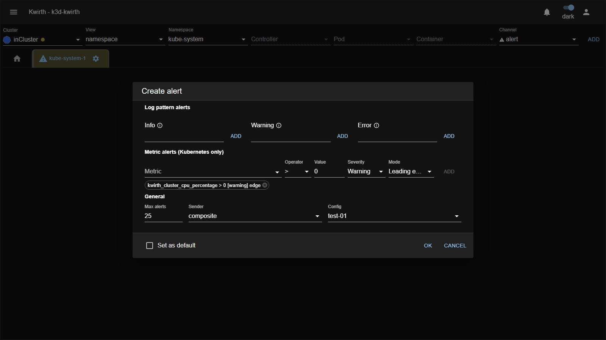

# ⚠️ Alert (plugin)

> **Type:** Plugin (channel) 
> **Package:** `@kwirthmagnify/kwirth-plugin-alert` 
> **Icon:** ⚠️

## Overview

The **Alert** channel raises **alerts in real time** when something you care about happens. It watches two kinds of triggers:

- **Log-pattern alerts** — a log line matches a regex/text you defined.
- **Metric alerts** — a metric crosses a threshold you set (Kubernetes only).

Detection runs **on the backend**, so your browser only receives the alerts that match your setup. Alerts carry a **severity** — **INFO**, **WARNING** or **ERROR** — and are colour-coded on screen. As with any channel, the **tab changes colour** when a new alert arrives, so an idle alert tab turns from green to yellow the moment something fires. Alerts can also be **routed to a [Sender](../senders/index)** for external delivery.

## When to use it

- Get told the instant an **ERROR** appears anywhere in a namespace or the whole cluster.
- Fire a **WARNING** when CPU/memory crosses a threshold.
- Route those alerts to Teams/email/etc. via a Sender.

## User guide

1. Select your scope, set **Channel = `alert`**, **ADD**.
2. Tab **gear ⚙ → Start** and define your triggers (below), then **OK**.
3. Watch the alert stream; the counters and colours tell you what's firing.

The running view shows **Alerts / Info / Warning / Error** counters, a **Filter** box (with `.*` regex and `Aa` case toggles), and each alert **colour-coded** by severity (white = info, yellow = warning, red = error).

## Configuration

### Log pattern alerts

Three lists — **Info**, **Warning**, **Error** — of regex/text to match against log lines. Type an expression and click **ADD**. Examples:

| Expression | Matches |
|---|---|
| `error` | any line containing "error" |
| `^ERR` | lines starting with `ERR` |
| `OK$` | lines ending in `OK` |
| `5[0-9][0-9]` | a 5xx status code (500–599) |
| `.` | any character — i.e. **every** line |

### Metric alerts (Kubernetes only)

Alert when a **metric** crosses a threshold:

| Field | Meaning |
|---|---|
| **Metric** | The metric to watch (e.g. `kwirth_cluster_cpu_percentage`). |
| **Operator** | Comparison (`>`, `<`, …). |
| **Value** | The threshold. |
| **Severity** | Info / Warning / Error for this rule. |
| **Mode** | *When* the rule fires while the condition holds — see below. |

Click **ADD** to add the rule; it appears as a chip (e.g. `kwirth_cluster_cpu_percentage > 0 [warning] edge`).

#### Metric trigger modes

The **Mode** controls how often a rule fires once its condition is true — the difference between one alert and a flood:

| Mode | Behaviour |
|---|---|
| **Leading edge** | Fires **once**, the moment the condition becomes true. It won't fire again until the condition clears and then becomes true again. (chip: `edge`) |
| **Cooldown** | Fires, then stays quiet for a **Cooldown (s)** period before it can fire again while still true. Selecting this mode shows a **Cooldown (s)** field. (chip: `Ns`) |
| **Continuous** | Fires on **every evaluation** while the condition holds — noisiest, use with care. (chip: `cont`) |

> **Example:** `kwirth_cluster_cpu_percentage > 80` with **Leading edge** gives you one alert when CPU first crosses 80%; with **Cooldown 300** you get at most one every 5 minutes while it stays high; with **Continuous** you get one on every sample.

### General

| Option | Meaning |
|---|---|
| **Max alerts** | How many alerts to keep on screen; oldest drop off when full. |
| **Sender** | Optional [Sender](../senders/index) to **deliver** alerts externally (console, file, email, Teams…). |
| **Config** | A named alert configuration you can reuse. |
| **Set as default** | Remember this setup for next time. |

## Delivering alerts to a Sender

By default alerts appear **in the tab**. But you'll often want them to leave Kwirth — a Teams message, an email, a line in a file, a webhook. That's what the **Sender** field is for: pick an installed **Sender** and every alert this channel raises is also **delivered through it**.

- The **Sender** dropdown lists the senders installed under **☰ → Manage extensions → Senders**.
- The **Config** field selects a **named configuration** of that sender (e.g. a specific Teams webhook or SMTP account) — so the same alert channel can target different destinations by switching config.
- Senders can be simple (console, file) or composed (the **composite** sender fans out to several at once; **timed**/**ratelimit** shape delivery).

See the **[Senders](../senders/index)** family for what each sender does and how to configure it. In short: **Alert decides *what* fires; the Sender decides *where it goes*.**

## Tab behaviour & controls

- **Colour signalling.** Like every channel, the Alert tab changes colour when new data arrives. An idle alert tab is green; the moment an alert fires it turns yellow, so you can leave a cluster-wide alert tab open and notice trouble out of the corner of your eye.
- **Counters.** The header keeps live totals of **Info / Warning / Error** so you can gauge severity at a glance.
- **Filter.** Narrow the on-screen alerts with the **Filter** box (`.*` for regex, `Aa` for case). This filters the *display* only — the underlying detection rules are unchanged.
- **Pause / Stop.** From the tab's **gear ⚙** you can **Pause** (freeze the view while the stream keeps running) or **Stop** the channel.

## Worked examples

**1) Catch every error across a whole namespace**

1. **View** `namespace` · **Namespace** `production` · **Channel** `alert` · **ADD**.
2. Gear ⚙ → **Start**. In **Error**, type `error` and **ADD**; add `^E` or `5[0-9][0-9]` too if you like. **OK**.
3. Leave the tab open — it turns yellow/red and the **Error** counter climbs the instant a matching line appears anywhere in `production`.

**2) Warn when cluster CPU is high, and notify Teams**

1. Open an `alert` tab on the cluster (**View** `cluster`).
2. Gear ⚙ → **Start** → **Metric alerts**: **Metric** `kwirth_cluster_cpu_percentage`, **Operator** `>`, **Value** `80`, **Severity** `Warning`, **Mode** `Cooldown` with **Cooldown (s)** `300`. **ADD**.
3. In **General**, set **Sender** to your Teams sender and **Config** to the right webhook. **OK**.
4. You now get at most one Teams message every 5 minutes while cluster CPU stays above 80%.

**3) Detect HTTP 5xx in one Deployment**

1. **View** `controller` · **Namespace** `web` · **Controller** `checkout` · **Channel** `alert` · **ADD**.
2. Start → **Error** pattern `5[0-9][0-9]` → **OK**. Any `500`–`599` in the `checkout` Deployment's logs raises an ERROR alert.

## Admin guide

- **Install / remove:** **☰ → Manage extensions → Plugins** → install **Alert**.
- **Permissions:** users need the streaming scopes on the target objects; delivering to a Sender additionally requires that Sender to be configured (see [Extending Kwirth](../../admin/08-extending-kwirth) and [Senders](../senders/index)).

## Notes

- Matching happens **server-side** — you only receive alerts you asked for, keeping the browser light even on busy namespaces.
- A broad pattern like `.` matches every line and turns Alert into a firehose — scope your expressions.

---

← Back to [Plugins (channels)](index)
