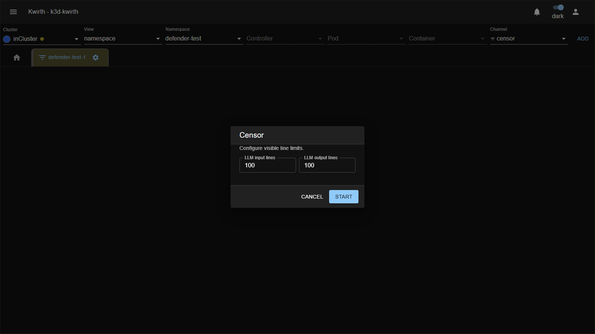
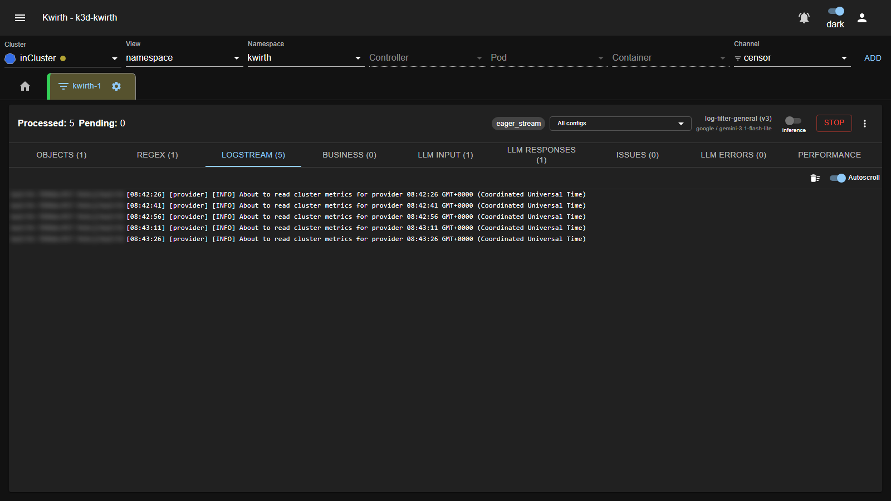
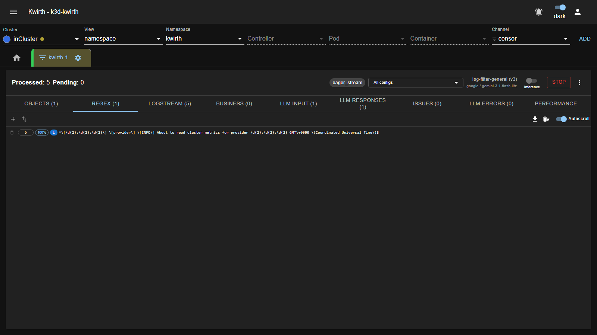
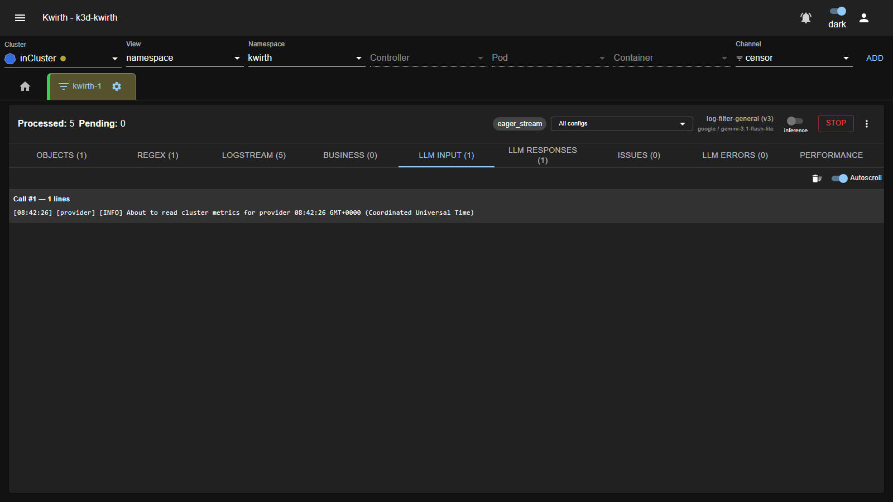
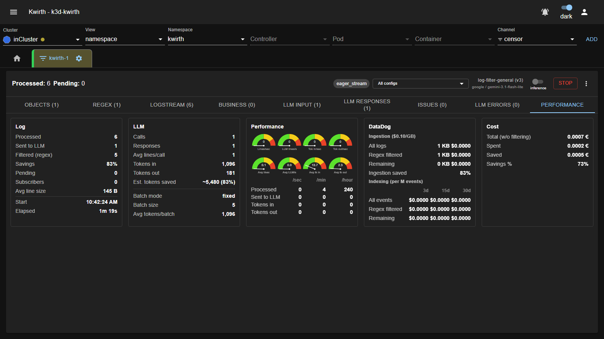
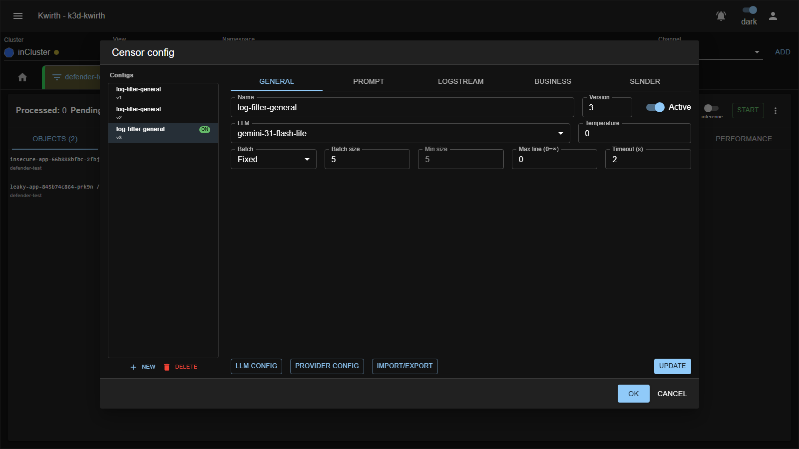
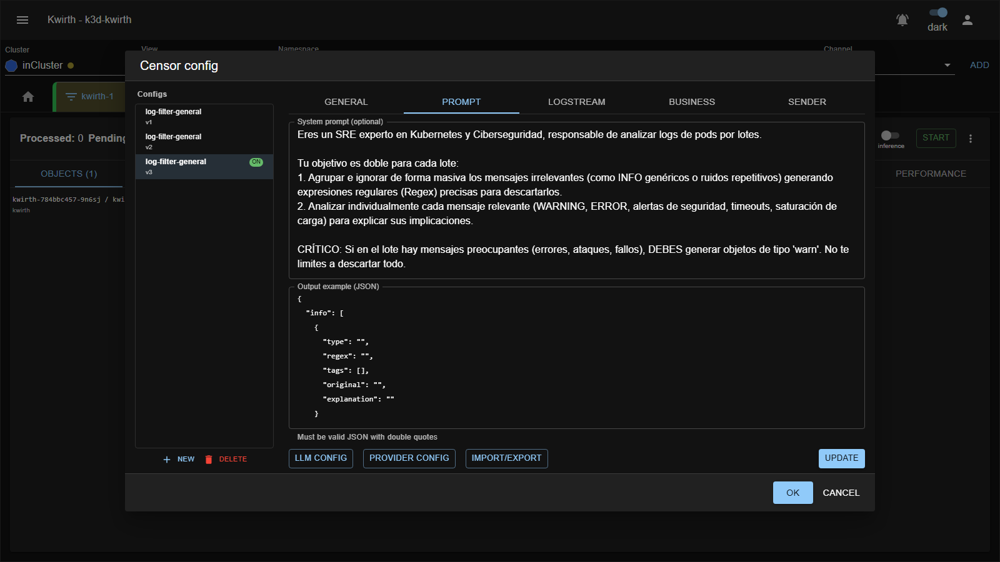
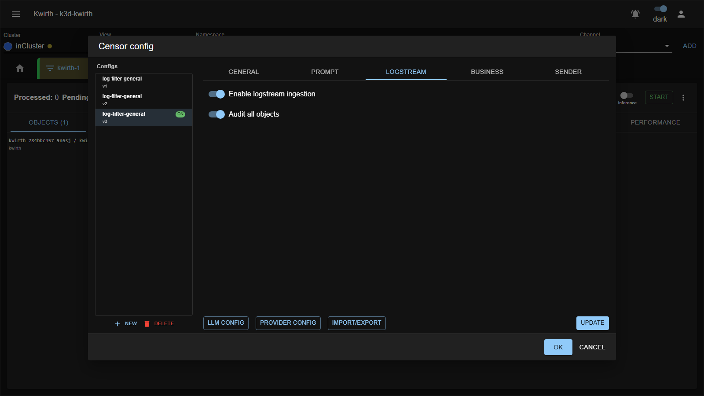
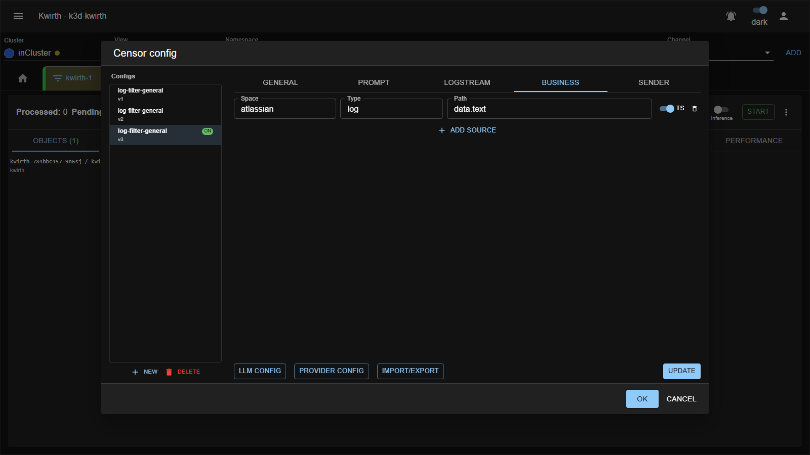
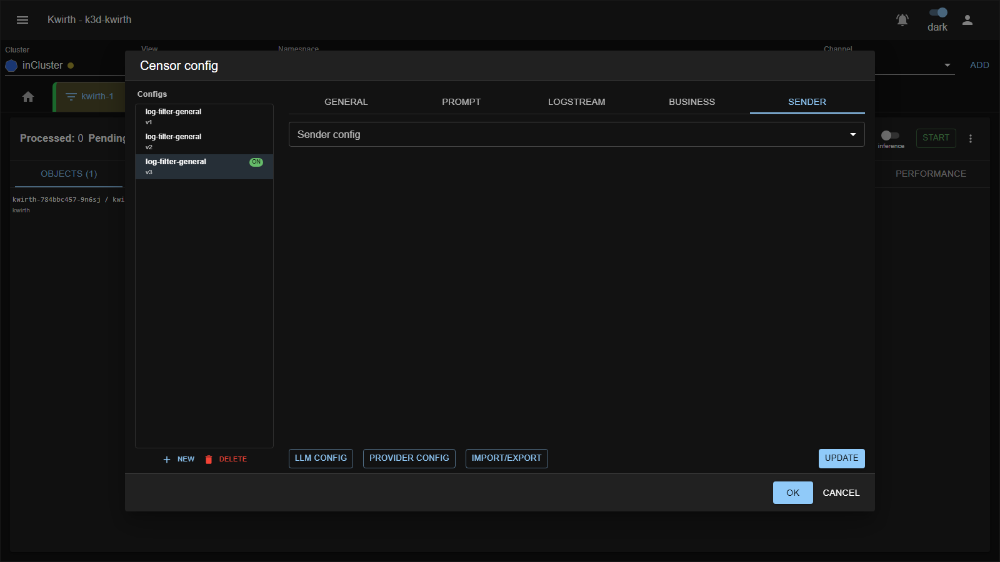

# 🖍️ Censor (plugin)

> **Type:** Plugin (channel) 
> **Package:** `@kwirthmagnify/kwirth-plugin-censor` 
> **Icon:** 🖍️

## Overview

The **Censor** channel is an **LLM-powered log noise-filter and redactor**. It watches a stream (container **logs** and/or **business** events), sends batches of lines to a Large Language Model, and asks it to produce **regular expressions** that match **noise** (repetitive, low-value lines) and **sensitive data** (secrets, tokens, PII). Those regexes are then applied **locally** to every subsequent line — so the vast majority of traffic is filtered **without** ever reaching the LLM again.

The result is twofold:

- **Massively less log volume** forwarded downstream (with a live estimate of the **cost saved**, e.g. on DataDog ingestion/indexing).
- **Sensitive/among noisy data caught** and flagged before it leaves the cluster.

> Censor uses the **LLM providers configured in Kwirth** (see [AI configuration](#ai-configuration-shared-across-plugins)); you choose which model to use per config.

## When to use it

- **Cut logging cost** — drop repetitive noise before it hits a paid log platform, and *measure* the savings.
- **Redact secrets/PII** — detect leaked credentials, tokens and personal data in log lines.
- **Auto-derive filters** — let the LLM propose the regexes you'd otherwise hand-write, then keep or tune them.
- **Audit a noisy app** — point Censor at a workload and see what it's actually emitting.

## Getting started

1. Select your scope. Censor is **resourced**, so pick **one or more pods/containers that actually write to stdout** — for a quick demo, **Kwirth's own pod** (namespace `kwirth`) is a reliable, chatty source. Choose the **censor** channel and click **ADD**.
2. Open the tab's **⚙️ → Start**. A small **Censor** dialog asks for **visible line limits** (how many LLM input/output lines to keep in the UI); press **Start**.

3. Open **⋮ → Config**, pick or create a **configuration** (which LLM, prompt, what to ingest — see [Configuration](#configuration-the-config-dialog)), make one **Active**, then press **Start** in the header to begin **analysis**.

## The topbar

Once started, the topbar drives everything:

| Element | What it is |
|---|---|
| **Processed / Pending** | Lines processed so far and lines waiting to be handled. |
| **Session chip** (e.g. `eager_stream`) | The name of this **ephemeral analysis session**. |
| **Config selector** (`All configs` ▾) | When several configs are active, each runs as its own **runner**; pick **All configs** to see the aggregate, or a single runner to focus on it. |
| **Active config info** | Next to the selector: the active config's **name (version)** and the **provider / model** it uses (e.g. `log-filter-general (v3)` · `google / gemini-3.1-flash-lite`). |
| **inference / audit switch** | **inference** = apply the filters to the live stream (redact/drop). **audit** = observe and flag only, without filtering — use it to *see what would be caught* before committing. *(Locked while analyzing.)* |
| **Start / Stop** | Start or stop the **analysis**. |
| **⋮ → Config** | Open the configuration dialog. |

## The analysis view (tabs)

The tabs break the pipeline apart. Counts update live.

### Objects

The pods/containers currently being analyzed.

### Regex — the filters in force

Each row is a filter with its **match count**, its **% of total matches**, and an **origin** badge: **L** (LLM-generated), **M** (manual) or **H** (hybrid). Here the model spotted a repetitive Kwirth log line and generated a regex that filters it — 5 matches, 100%, origin **L**:

The toolbar lets you **＋ add a regex by hand**, **sort by matches**, **download CSV**, **clear**, and toggle **Autoscroll**. Delete a rule with its bin icon (when a single runner is selected).

### Logstream / Business

**Logstream** shows the raw log lines received (pod/container + text); **Business** shows received business events. (The topbar screenshot above is on the Logstream tab.)

### LLM Input / LLM Responses

**LLM Input** shows the exact **batches** sent to the model — one block per call (`Call #1 — N lines`):

**LLM Responses** shows the model's raw responses.

### Issues

Lines the model **flagged** (e.g. detected secrets/PII or worrying errors), each with **tags** and an explanation. Filter by tag (**Any / All**), export CSV, and hit **＋** on any issue to turn it into a regex.

### LLM Errors

Any errors returned by the model, with the offending input.

### Performance & cost

The payoff, quantified: lines **processed vs. sent to LLM vs. filtered**, the **savings %**, **tokens in/out** and **est. tokens saved**, live **rate gauges**, an estimated **cost** (from the model's price per million tokens), and a **DataDog** ingestion/indexing projection for *all logs vs. filtered vs. remaining*. Here, **5 of 6 lines filtered = 83 % savings** after a single LLM call:

## Configuration (the config dialog)

Open **⋮ → Config**. The left panel is your **library of configs**; the right panel edits the selected one across five tabs.

### Configs list & activation

- Each config has a **Name** and a **Version**; the **Active** ones show an **ON** chip.
- **Activation is per-config** via the **Active** switch (General tab). **Several configs can be active at once** — each active config runs as an independent **runner** (see the topbar's **All configs** selector), so you can, say, run a cheap fast filter and a thorough one side by side.
- **New** starts a blank config; **Delete** removes the selected one; **Add/Update** saves your edits into the list; **OK** persists everything and restarts the runners atomically.

### General tab

| Field | Meaning |
|---|---|
| **Name / Version** | Identify the config; you can keep multiple versions. |
| **Active** | Whether this config runs as a runner. |
| **LLM** | Which model to use (from the shared [AI configuration](#ai-configuration-shared-across-plugins)). |
| **Temperature** | Model temperature (0–2). Lower = more deterministic. |
| **Batch** | **Fixed** or **Auto** batch sizing. |
| **Batch size** | Lines per LLM call (the *initial* size in Auto mode). |
| **Min size** | *(Auto only)* smallest batch the auto-sizer will use. |
| **Max line (0=∞)** | Truncate lines longer than this before sending (0 = no limit). |
| **Timeout (s)** | How long to wait filling a batch before sending it anyway. |

### Prompt tab

- **System prompt (optional)** — leave empty to use Kwirth's default noise-filtering prompt, or supply your own (e.g. an "SRE + security" analyst persona).
- **Output example (JSON)** — pins the **shape** of the model's response so Censor can parse it reliably. It **must be valid JSON with double quotes** (the editor validates as you type).

### Logstream tab

- **Enable logstream ingestion** — turn on log ingestion for this config. *(Until at least one active config enables this — or has business sources — the header **Start** stays disabled.)*
- **Audit all objects** — ingest **every** object's logs. Turn it **off** to add specific **sources** instead, each by **Namespace**, **Pod regex** and/or **Label selector** (**Add source**).

### Business tab

Ingest **business** events instead of / alongside logs. Each source is matched by **Space**, **Type** and a **Path** (dot-notation into the event payload), with an optional **TS** (add-timestamp) toggle. **Add source** for more.

### Sender tab

Optionally route the censored output to a configured **[sender](../senders/index)** — pick a `senderId::configName` from the **Sender config** dropdown.

### AI configuration (shared across plugins)

The **LLM config** and **Provider config** buttons at the bottom of the dialog open Kwirth's **AI configuration** — and this is **shared by every plugin that uses AI** (Censor, **[Pinocchio](pinocchio)**, …). A provider/model you set up here is immediately available to all of them.

- **Provider config** — register an **AI provider** and its **API key/token**.
- **LLM config** — define the **models** (LLM id, provider, model, temperature, cost per million tokens) you then pick in the **General** tab.

See the walkthrough (with screenshots) in **[Pinocchio → AI configuration](pinocchio#ai-configuration-providers--llms)**.

### Import / Export

The **Import/Export** button moves your **censor configs** as JSON — back them up, or promote a tuned filter set from a test cluster to production. *(AI providers/LLMs have their own import/export inside their dialogs, since they're shared.)*

## Admin guide

- **Install / remove:** **☰ → Manage extensions → Plugins** → install **Censor**.
- **LLM required:** configure a **Provider/LLM** (via the config dialog's **Provider config / LLM config**). Costs accrue against that provider — tune **batch size** and **temperature** accordingly.
- **Permissions (scopes):** standard resource scopes — **`view`**, **`filter`**, **`cluster`**. See [Security & permissions](../../admin/04-security-and-permissions).
- **Source:** Kubernetes.

## Notes

- Only the lines the regexes **don't** already match are sent to the LLM, so cost **drops over time** as the filter set matures — the Performance tab shows this directly.
- Treat flagged **Issues** as real findings: a detected secret is a leaked secret. Rotate it and add a filter.
- Configs are **portable** — use **Import/Export** to move a tuned filter set between clusters.

---

← Back to [Plugins (channels)](index)
