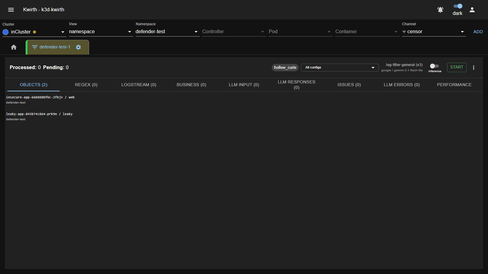

# 🖍️ Censor (plugin)

> **Type:** Plugin (channel) 
> **Package:** `@kwirthmagnify/kwirth-plugin-censor` 
> **Icon:** 🖍️

## Overview

The **Censor** channel is an **LLM-powered log noise-filter and redactor**. It watches a stream (container **logs** and/or **business** events), sends batches of lines to a Large Language Model, and asks it to produce **regular expressions** that match **noise** (repetitive, low-value lines) and **sensitive data** (secrets, tokens, PII). Those regexes are then applied **locally** to every subsequent line — so the vast majority of traffic is filtered **without** ever reaching the LLM again.

The result is twofold:

- **Massively less log volume** forwarded to your downstream sink (and a live estimate of the **cost saved**, e.g. on DataDog ingestion/indexing).
- **Sensitive data caught** and flagged/redacted before it leaves the cluster.

> Censor uses the **LLM providers configured in Kwirth** (see [Extending Kwirth → AI](../../admin/08-extending-kwirth)); you choose which model to use per config.

## When to use it

- **Cut logging cost** — drop repetitive noise before it hits a paid log platform, and *measure* the savings.
- **Redact secrets/PII** — detect leaked credentials, tokens and personal data in log lines.
- **Auto-derive filters** — let the LLM propose the regexes you'd otherwise hand-write, then keep or tune them.
- **Audit a noisy app** — point Censor at a workload and see what it's actually emitting.

## Getting started

1. Select your **Cluster / View / Namespace** (Censor is resourced — it attaches to the containers in scope) and choose the **censor** channel; click **ADD**.
2. Open the tab's **⚙️ → Start**. A small **Censor** dialog asks for **visible line limits** (how many LLM input/output lines to keep in the UI); press **Start**.

3. Open **⋮ → Config** to pick or create a **configuration** (which LLM, prompt, what to ingest — see below), make one **Active**, then press **Start** in the header to begin **analysis**.

## Configuration

Censor keeps a **library of named, versioned configs**; one is **Active** at a time. Manage them in the **Censor config** dialog:

The left list holds your configs (the active one is marked **ON**); the right side edits the selected one across five tabs:

| Tab | What you set |
|---|---|
| **General** | **Name / Version / Active**, the **LLM** to use, **Temperature**, and batching: **Batch** mode (*Fixed* or *Auto*), **Batch size** (+ **Min size** for auto), **Max line** length (0 = ∞) and **Timeout**. |
| **Prompt** | An optional **System prompt** (leave empty for the default noise-filter prompt) and an **Output example (JSON)** that pins the shape of the model's response. |
| **Logstream** | **Enable logstream ingestion** and either **Audit all objects** or add specific **sources** (namespace / pod regex / label selector). *This is what feeds container logs to Censor.* |
| **Business** | Ingest **business** events instead of/alongside logs, by **space / type / path** (with optional timestamp). |
| **Sender** | Optionally route the censored output to a **[sender](../senders/index)** configuration. |

The buttons at the bottom open **LLM config** and **Provider config** (manage models/keys), and **Import/Export** (share configs as JSON). **Add/Update** saves the config into the list; **OK** persists everything and restarts the runner.

> To actually process logs, the **Active** config must have **Logstream ingestion enabled** (or business sources). Until then the header **Start** stays disabled.

## The analysis view

Once started, the tab shows a live dashboard:

The **header** shows **Processed / Pending** counters, the ephemeral **session** name, a **config selector** (*All configs* or one runner), the **active config + LLM** (provider/model), an **inference / audit** mode switch, the **Start/Stop** analysis button and **⋮ → Config**.

Below it, a row of tabs breaks the pipeline apart:

| Tab | Shows |
|---|---|
| **Objects** | The pods/containers currently being analyzed. |
| **Regex** | The **filters in force** — each with its **match count**, **% of total matches**, and **origin** (**L** = LLM-generated, **M** = manual, **H** = hybrid). You can **add** a regex by hand, **sort** by matches, **download CSV**, or **delete** one. |
| **Logstream** | The raw log lines received (pod/container + text). |
| **Business** | Received business events. |
| **LLM Input** | The exact **batches** sent to the model (one block per call). |
| **LLM Responses** | The model's raw responses. |
| **Issues** | Lines the model **flagged** (e.g. detected secrets/PII), each with **tags** and an explanation; hit **＋** to turn any into a regex. Filter by tag (Any/All). |
| **LLM Errors** | Any errors from the model, with the offending input. |
| **Performance** | The savings & cost dashboard (below). |

### Modes: inference vs audit

The header switch toggles **inference** (apply filters to reduce/redact the live stream) versus **audit** (observe and flag without filtering) — useful to *see what would be caught* before you commit to filtering.

### Performance & cost

The **Performance** tab quantifies the value: lines **processed vs. sent to LLM vs. filtered**, the **savings %**, **tokens in/out**, live **rate gauges** (per sec/min/hour), an estimated **cost** (from the model's price per million tokens) and even a **DataDog** ingestion/indexing cost projection for *all logs vs. filtered vs. remaining*:

## Admin guide

- **Install / remove:** **☰ → Manage extensions → Plugins** → install **Censor**.
- **LLM required:** Censor needs at least one **LLM provider/model** configured in Kwirth (set it in the config dialog's **LLM config / Provider config**). Costs accrue against that provider — tune **batch size** and **temperature** accordingly.
- **Permissions (scopes):** standard resource scopes — **`view`**, **`filter`**, **`cluster`**. See [Security & permissions](../../admin/04-security-and-permissions).
- **Source:** Kubernetes.

## Notes

- Only the lines the regexes **don't** already match are sent to the LLM, so cost **drops over time** as the filter set matures — the Performance tab shows this directly.
- Treat flagged **Issues** as real findings: a detected secret is a leaked secret. Rotate it and add a filter.
- Configs are **portable** — use **Import/Export** to move a tuned filter set between clusters.

---

← Back to [Plugins (channels)](index)
