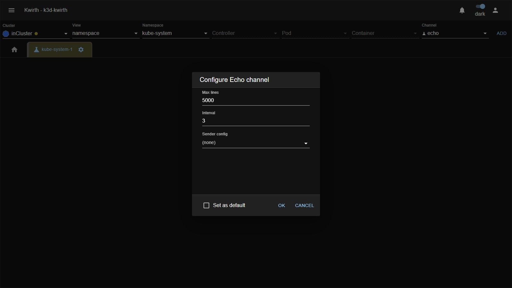
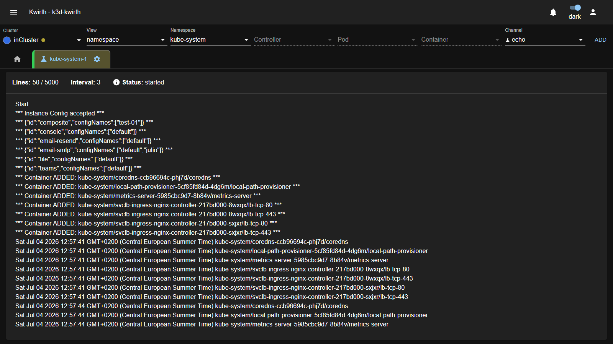

# 🧪 Echo (plugin)

> **Type:** Plugin (channel) 
> **Package:** `@kwirthmagnify/kwirth-plugin-echo` 
> **Icon:** 🧪

## Overview

The **Echo** channel is a **diagnostic / test generator**. It attaches to the resources in your scope and, on a fixed **interval**, emits a synthetic line per resource — a **heartbeat** you can watch. Along the way it echoes back useful plumbing information: that the instance config was accepted, the list of **senders** available in the backend, and every **container discovered** in scope.

It's the simplest way to prove the whole Kwirth pipeline works end-to-end — resource discovery, live streaming to the UI, and (optionally) forwarding to a **sender** — without depending on a real workload emitting logs.

## When to use it

- **Smoke-test a new deployment** of Kwirth — confirm streaming reaches the UI.
- **Test a sender** — point Echo at a sender config and verify messages arrive at the destination (console/file/email/Teams…).
- **Verify scope & discovery** — see exactly which containers Kwirth resolves for a given selection.
- **Generate steady traffic** for demos or for exercising other components.

## Getting started

1. Select a **Cluster / Namespace** (Echo is resourced — it attaches to the containers in scope), choose the **echo** channel and click **ADD**.
2. Open the tab's **⚙️ → Start** and configure it (below).

## Configuration

| Control | What it does |
|---|---|
| **Max lines** | How many lines to keep in the view. |
| **Interval** | Seconds between heartbeat emissions. |
| **Sender config** | Optionally forward Echo's output to a configured **[sender](../senders/index)** (leave *(none)* to only show it in the UI). |
| **Set as default** | Remember this configuration. |

## The output

Once started, Echo streams its diagnostics:

You'll see, in order:

- **`Start`** and **`Instance Config accepted`** — the channel came up.
- The **senders available** in the backend (id + config names) — handy to know what you can route to.
- **`Container ADDED: …`** for every container resolved in your scope.
- Then, every **interval**, a **timestamped line per resource** — the ongoing heartbeat.

The header tracks **Lines / Max**, the **Interval**, and the **Status**.

## Admin guide

- **Install / remove:** **☰ → Manage extensions → Plugins** → install **Echo**.
- **Permissions (scopes):** **`none`** and **`cluster`**. See [Security & permissions](../../admin/04-security-and-permissions).
- **Sources:** Kubernetes and Docker.
- **Senders:** if you set a **Sender config**, Echo's lines are forwarded there — the perfect way to validate a sender without a real log source.

## Notes

- Echo generates **synthetic** data only — it never reads real container logs, so it's safe to run anywhere.
- Pair it with the **[senders](../senders/index)** manuals: start Echo with a sender selected to confirm the destination end-to-end.

---

← Back to [Plugins (channels)](index)
