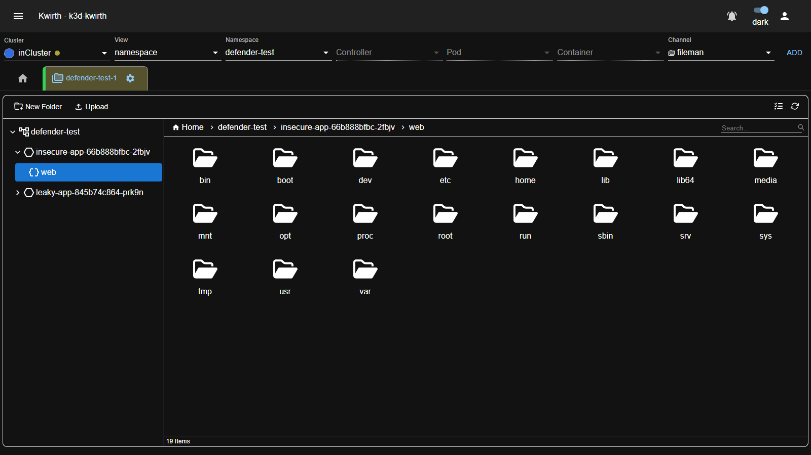
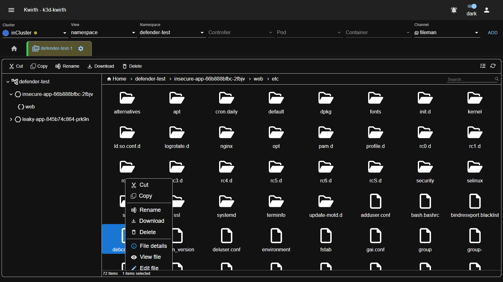
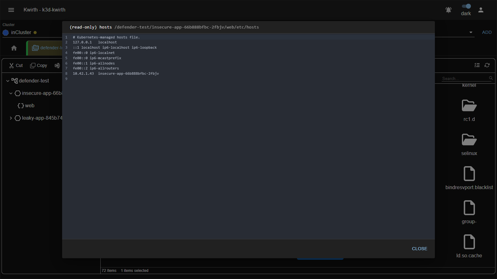

# 🗂️ Fileman (plugin)

> **Type:** Plugin (channel) 
> **Package:** `@kwirthmagnify/kwirth-plugin-fileman` 
> **Icon:** 🗂️

## Overview

The **Fileman** channel turns any running container into a **remote file manager**, right inside Kwirth. It lets you **browse the container's filesystem**, **view and edit** text/config files in place, and **upload, download, copy, move, rename, create and delete** files and folders — all without `kubectl cp`, `kubectl exec` or shelling in.

It works entirely over the cluster's **exec API** (the same channel a `kubectl exec` uses), so there's nothing to install inside the container. It is available for both **Kubernetes** and **Docker** sources.

> Because Fileman drives standard shell commands (`ls`, `cat`, `mv`, `cp`, `rm`, `mkdir`, `tar`) inside the target, the container must have a **shell and coreutils**. Minimal/**distroless** images (no `sh`, no `ls`) won't expose a filesystem here.

## When to use it

- **Inspect a config file** a pod is actually running with (e.g. `/etc/nginx/nginx.conf`), without redeploying.
- **Hot-fix** a file in a running container to test a change before baking it into the image.
- **Pull logs or artifacts** out of a container (download a file, or a whole folder as a `.tar.gz`).
- **Push a file in** (drag-and-drop upload) to reproduce an issue or drop a patched asset.

## Getting started

Fileman has **no setup options** — just point it at what you want to manage:

1. In the resource selector pick your **Cluster**, then a **View / Namespace** (and optionally drill down to a **Pod** / **Container**), and choose the **fileman** channel.
2. Click **ADD**, then open the tab's **⚙️** and press **Start**.

Kwirth expands your scope into one entry per **container**. The file manager opens on a **Home** that contains a navigable tree of every **Namespace → Pod → Container** in scope.

## The file browser

Navigate down to a container and Fileman lists its **root filesystem**:

The layout has four parts:

| Area | What it is |
|---|---|
| **Navigation tree** (left) | The **Namespace → Pod → Container** hierarchy. Expand it to jump straight to a container. |
| **Breadcrumb** (top) | Your current location, e.g. `Home › namespace › pod › container › etc`. Click any segment to go back up. |
| **Files area** (center) | The folders and files of the current directory, as a **grid** (icons) or **list**. |
| **Toolbar & status bar** | Actions on the current folder plus a **grid/list toggle**, a **refresh** button, a **Search** box, and an item counter. |

The navigation model has **three levels above the filesystem**: `Namespace`, `Pod`, `Container`. **File operations are only enabled once you're inside a container** (i.e. below the container level) — above that, the tree is read-only navigation, so you can't accidentally "delete a pod" from the file manager.

At the container level and below, the toolbar exposes **New Folder** and **Upload**, and drag-and-drop upload is enabled.

## File & folder actions

**Right-click** any file or folder for its context menu:

| Action | What it does |
|---|---|
| **Cut** / **Copy** + paste | Move or copy files/folders (including across pods/containers in scope). |
| **Rename** | Rename in place. |
| **Download** | Download the file; **folders download as a `.tar.gz`** archive. |
| **Delete** | Remove the file/folder (`rm -r`). |
| **File details** | Show name, full path, last-modified time and size. |
| **View file** | Open the file **read-only** (see below). |
| **Edit file** | Open the file in an **editable** viewer (see below). |

## Transferring, copying and moving

Fileman moves data in every direction — in, out, and between containers.

**Download (files and folders).** Use **Download** on any item:

- A **file** downloads as-is.
- A **folder** downloads as a **`.tar.gz`** archive — Kwirth `tar`s it up inside the container and streams it to your browser, so you can pull a whole directory tree out in one click.

**Upload (into a container).** At the container level, use the **Upload** button (or **drag-and-drop** files onto the files area). Files land in the folder you're currently viewing. To recreate a directory structure, make the folders first with **New Folder** and upload into each.

**Copy / Move — within a container.** Select one or more items, **Copy** (or **Cut** to move), navigate to the destination folder, and **paste**. Kwirth runs the corresponding `cp -r` / `mv` inside the container. This works for **files and whole folders**.

**Copy / Move — from one container to another.** The clipboard isn't limited to a single container: **Cut/Copy** in one container's tree, switch to a **different pod/container** in the navigation tree, and **paste**. Because containers don't share a filesystem, Kwirth bridges them transparently — it **downloads** the item from the source and **uploads** it into the destination (recursively, for folders), and on a **Move** it removes the source afterwards.

> Cross-container transfers stream through Kwirth, so very large trees take longer than a same-container copy. The source and destination must both be in your current scope (added to the tab).

## Viewing files

**View file** opens the content **read-only** in a code viewer — the title bar shows `(read-only)` and the full in-container path. It's a proper code viewer (with a built-in **search**, `Ctrl`/`Cmd`+`F`), so it stays comfortable on large files:

## Editing files

**Edit file** opens the same viewer in **write mode**. It's a real code editor (CodeMirror) with **YAML syntax highlighting** for `.yaml`/`.yml` files and in-editor search. The **Save** button stays **disabled until you actually change something**, and writing the file back into the container happens on **Save**:

> **Edits are live.** Saving overwrites the file **inside the running container**. As with any in-container change, it lasts until the pod restarts — treat it as a diagnostic/hot-fix tool, and put permanent changes in your image or config.

## Admin guide

- **Install / remove:** **☰ → Manage extensions → Plugins** → install **Fileman**.
- **Sources:** works on **Kubernetes** and **Docker** targets.
- **Permissions (scopes):** grant on the target objects —
  - **`fileman$read`** — browse, view, download.
  - **`fileman$write`** — everything read can do, **plus** edit/save, upload, create, rename, move/copy and delete.
  - **`cluster`** — full access.

  See [Security & permissions](../../admin/04-security-and-permissions).

## Notes

- Fileman needs a **shell + coreutils** in the container (`sh`, `ls`, `cat`, `mv`, `cp`, `rm`, `mkdir`, `tar`). Distroless images won't work.
- All operations run as the **container's own identity**, so they're subject to the container's filesystem permissions (a read-only root filesystem will reject writes).
- Deleting is **recursive** and immediate — there's no trash. Double-check the path in the breadcrumb before deleting.

---

← Back to [Plugins (channels)](index)
