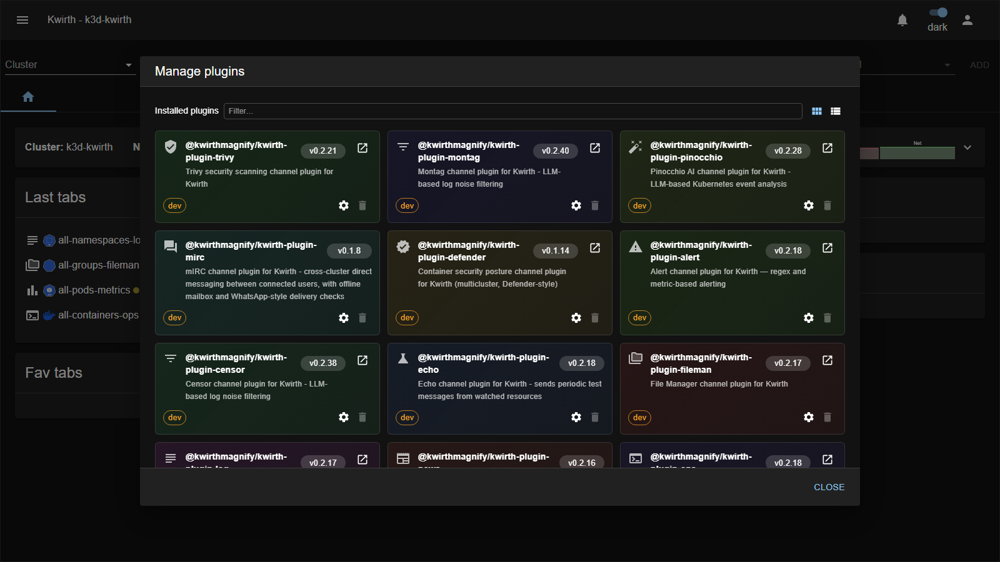

# Plugins (channels)

**Channels** are the features users open in the [resource selector](../../user/04-selecting-resources) to observe and operate their clusters — Log, Metrics, Alert, Ops and so on. Most channels are **plugins** you install or remove; two (**Metrics** and **Magnify**) are **built-in** and ship with the Kwirth core.

## Managing channel plugins

Install, update and remove channel plugins from **☰ → Manage extensions → Plugins**:

Each card shows the plugin's **name**, **version**, a short **description** and its **source** (an npm/registry URL, or a **`dev`** badge for a local build). Use the per-card icons to open its website, open its **⚙ Settings** (a JSON **installation-config** editor for that plugin) or **delete** it, the **Card / List** toggle and **Filter** to browse, and **Install plugin** (URL or **BROWSE…**) to add one. Installing a plugin makes its channel appear in the resource selector; removing it hides it. See [Extending Kwirth](../../admin/08-extending-kwirth) for the full manager reference.

## The channels

| Channel | What it does | Packaging |
|---|---|---|
| 📄 [Log](log) | Real-time log streaming | plugin |
| 📊 [Metrics](metrics) | Live CPU / memory / network / I/O metrics | built-in |
| ⚠️ [Alert](alert) | Alerts on matching log lines | plugin |
| 🖥️ [Ops](ops) | Operations: shell, restart, inspect | plugin |
| 📁 [Fileman](fileman) | Browse container filesystems and volumes | plugin |
| 🛡️ [Trivy](trivy) | Vulnerability scanning | plugin |
| 🔍 [Magnify](magnify) | Full cluster management (Lens/K9s-style) | built-in |
| 🌳 [Topology](topology) | Interactive 3D cluster topology | plugin |
| ✨ [Pinocchio](pinocchio) | AI/LLM analysis of Kubernetes events | plugin |
| 🔎 [Censor](censor) | LLM-assisted log noise filtering | plugin |
| 💬 [mIRC](mirc) | Cross-cluster direct messaging between users | plugin |
| 📰 [News](news) | RSS news feed reader (demo) | plugin |
| 🧪 [Echo](echo) | Reference/demo channel for plugin authors | plugin |

> All channels share the same [lifecycle](../../user/05-channels): select resources → **ADD** → gear **▶ Start** → configure → read. Follow the links above for each channel's specific configuration and usage.
