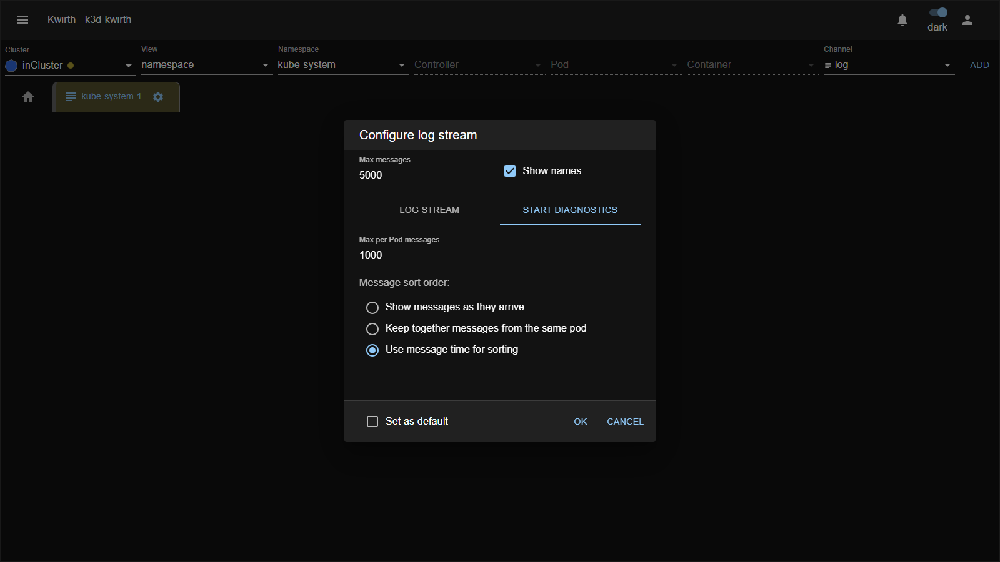

# 📄 Log (plugin)

> **Type:** Plugin (channel) 
> **Package:** `@kwirthmagnify/kwirth-plugin-log` 
> **Icon:** 📄

## Overview

The **Log** channel streams **container logs in real time**. Depending on the [View](../../user/04-selecting-resources) you choose, it aggregates the logs of a whole cluster, one or more namespaces, a controller's pods, specific pods, or a single container — all merged into one live, colour-coded stream.

## When to use it

- Tail what an application is doing **right now**.
- Investigate an incident across **all pods** of a namespace or Deployment at once.
- Follow a **single container** in a multi-container pod.
- Search historical lines from a container's start time.

## User guide

Opening and running a Log channel follows the standard [channel lifecycle](../../user/05-channels):

1. In the [resource selector](../../user/04-selecting-resources) choose your **Cluster → View → …objects**, set **Channel = `log`**, and press **ADD**.
2. On the new tab, click the **gear ⚙ → Start**.

3. Configure the stream (next section) and click **OK**. Lines start flowing:

The running view gives you:

- **Counters** — running totals of **Lines**, **Warning** and **Error**.
- **Filter box** — show only matching lines; the **`.*`** button enables **regular expressions** and **`Aa`** toggles **case sensitivity**.
- **Timestamps and source names** — each line can show *when* and *which pod/container* produced it.

## Configuration

The first time you **Start** the channel, the **Configure log stream** dialog appears:

| Option | What it does |
|---|---|
| **Max messages** | Size of the line buffer kept in memory (e.g. `5000`). |
| **Show names** | Prefix each line with its pod/container name. |
| **Get messages from now on** | Stream only lines produced from this moment. |
| **Get messages from container start time** | Pull history from the given **Start time** (turn on to see *existing* logs, not just new ones). |
| **Get messages of previous container** | Include logs from the container's **previous run** (useful after a crash/restart). |
| **Add timestamp to messages** | Prefix each line with its timestamp. |
| **Follow new messages** | Auto-scroll as new lines arrive. |
| **Set as default** | Remember these options for next time. |

Change the configuration later from the tab's **gear ⚙**.

### Start diagnostics

The dialog has a second tab, **START DIAGNOSTICS**, with advanced options that control **how much** is buffered per pod and **how lines are ordered** — useful when a namespace is very chatty or when interleaving order matters:

| Option | What it does |
|---|---|
| **Max per Pod messages** | Cap on buffered lines **per pod** (independent of the global *Max messages*), so one noisy pod can't crowd out the rest. |
| **Message sort order** | How incoming lines are ordered in the view: |
| &nbsp;&nbsp;• *Show messages as they arrive* | Print each line the moment it reaches Kwirth (lowest latency; order follows arrival, not necessarily production time). |
| &nbsp;&nbsp;• *Keep together messages from the same pod* | Group consecutive lines by pod, so a pod's output stays contiguous. |
| &nbsp;&nbsp;• *Use message time for sorting* | Order lines by their **own timestamp** so multi-pod streams read chronologically (best for correlating events across pods). |

*Max messages* and *Show names* at the top apply to **both** tabs.

## Examples

### Multi-container log stream

Watch **many containers merged into one stream** — e.g. every container in a namespace — and tell them apart by name.

**How to create it:**

1. Resource selector: **Cluster** `inCluster` · **View** `namespace` · **Namespace** `kube-system` · **Channel** `log` · **ADD**. *(For a single multi-container pod instead, use **View** `container`, drill down to the pod and tick its containers.)*
2. Tab **gear ⚙ → Start**.
3. In *Configure log stream* turn **Show names** on (so each line is tagged with its source) and **Follow new messages** on. **OK**.

**What you see:**

- Lines from **all containers** are interleaved into a single live stream, each **colour-coded and prefixed** with its pod/container so you can tell who emitted what.
- The **Lines / Warning / Error** counters aggregate across *every* source in scope.
- Type a term in the **Filter** (enable **`.*`** for regex) to focus on one component across all containers at once.

### Using Start diagnostics

When a namespace is very chatty and you need lines to read **chronologically across pods** (not just in arrival order), use the **START DIAGNOSTICS** tab:

1. Open the tab's **gear ⚙ → Start**, then switch to **START DIAGNOSTICS**.
2. Set **Max per Pod messages** (e.g. `1000`) so one noisy pod can't crowd out the others' buffers.
3. Choose a **Message sort order**:
   - *Show messages as they arrive* — lowest latency, order = arrival.
   - *Keep together messages from the same pod* — group each pod's output.
   - **Use message time for sorting** — order by each line's own timestamp, so a multi-pod stream reads in true chronological order (best for correlating an incident across pods).
4. **OK**. The stream now respects your chosen ordering and per-pod cap.

## Admin guide

- **Install / remove:** **☰ → Manage extensions → Plugins**. Install the **Log** plugin to make the `log` channel appear in the resource selector; remove it to hide it. See [Extending Kwirth](../../admin/08-extending-kwirth) for the manager.
- **Permissions:** a user needs streaming scopes on the target objects — typically **`view`** and **`stream`** (and **`filter`** to use the filter box). Restrict *which* logs a user can read with the object filters on their [resources](../../admin/04-security-and-permissions).

## Notes

- What you can stream is bounded by your scopes; if a namespace or container is missing, it's usually a permissions matter.
- Very large `Max messages` values use more browser memory; keep it reasonable for busy namespaces.

---

← Back to [Extension manuals](../index)
