# 🔍 Magnify (plugin)

> **Type:** Channel — **built-in** (ships with the Kwirth core) 
> **Package:** built-in (no install needed) 
> **Icon:** 🔍

## Overview

**Magnify** is not just a channel — it's a **complete Kubernetes management tool** built *inside* Kwirth, in the spirit of **Lens / K9s / Headlamp**. Where other channels stream one kind of data, Magnify streams **everything happening in your cluster** — all **Kubernetes artifacts** and all **events** — in real time, and lets you **act** on them.

On top of that live stream it adds:

- An **upward command stream** to send changes back to Kubernetes (create / edit / delete / restart / evict…).
- The ability to **open other Kwirth channels from within Magnify** — Logs, Metrics, Trivy, Fileman, and shells (Ops) — as **windows**.
- **Editors** for Kubernetes objects, **full-text search** across artifacts, **cluster validation**, and **CRD** management.
- **LogSearch** — full-text search across pod logs without opening individual log streams.
- **Multi-cluster**: manage all your clusters from one place.

> Magnify is **built-in** — there's nothing to install. It's the closest thing to "a whole cluster IDE" inside Kwirth, which is why it's the crown jewel.

## When to use it

- As your **primary cluster console** — browse, inspect, edit and operate every kind of object.
- To **jump between tools** on one object (see its logs, then its metrics, then shell in) without leaving the page.
- To **search logs across many pods** at once, validate the cluster, or manage CRDs.

## Starting Magnify

It needs **no configuration**. Put **any** resource in the selector (it doesn't matter which), set **Channel = `magnify`**, **ADD**, then **gear ⚙ → Start**. The cluster overview appears and fills in within milliseconds.

## The cluster overview

The landing screen (a header with **cluster name, Kubernetes version, platform and node count**) has **three sections**:

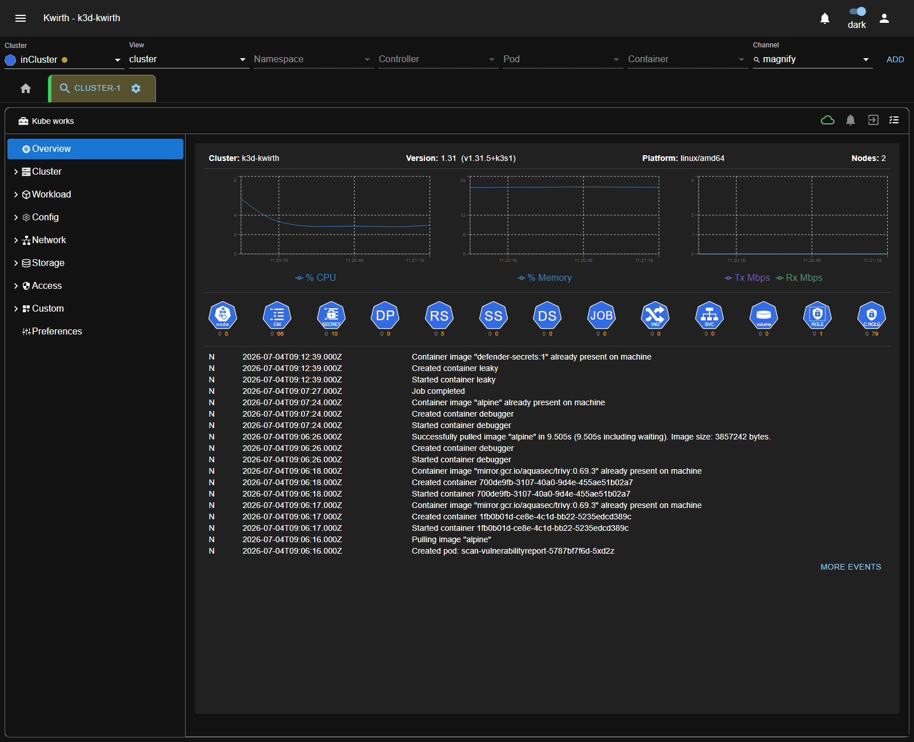

**1 · Consumption charts.** Real-time cluster consumption — **% CPU**, **% Memory** and network **Tx / Rx Mbps** — drawn live (no Prometheus needed).

**2 · Validations.** The row of hexagon **badges**, one per resource kind (node, ConfigMap, Secret, Deployment, ReplicaSet, StatefulSet, DaemonSet, Job, Ingress, Service, volume, Role, ClusterRole…). Each badge carries **two counters — errors and warnings** — from Magnify's cluster validation, so you can spot at a glance which kinds of objects have problems (e.g. a red count on *Deployments* tells you a workload needs attention).

**3 · Recent cluster events.** A live feed of the latest Kubernetes **events** (container created/started, image pulled, job completed, pod created…), each timestamped, with **MORE EVENTS** to open the full stream.

## The navigation pane

The left pane groups everything the cluster contains. Click a category to expand it:

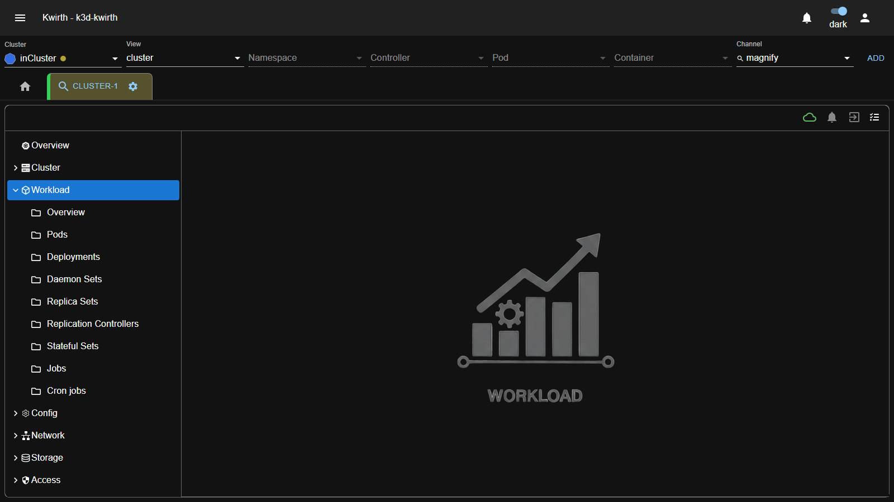

| Category | Contains |
|---|---|
| **Overview** | The cluster dashboard above. |
| **Cluster** | Nodes, namespaces and cluster-scoped info. |
| **Workload** | Pods, Deployments, Daemon Sets, Replica Sets, Replication Controllers, Stateful Sets, Jobs, Cron jobs. |
| **Config** | ConfigMaps, Secrets and other configuration objects. |
| **Network** | Services, Ingresses and networking objects. |
| **Storage** | Volumes, claims, CSI drivers, volume attachments. |
| **Access** | RBAC — Roles, ClusterRoles, bindings, service accounts. |
| **Custom** | Your **CRDs** and their instances. |
| **Preferences** | Magnify's own settings (see below). |

## Browsing resources

Each list is a rich, live table. For example, **Workload → Pods**:

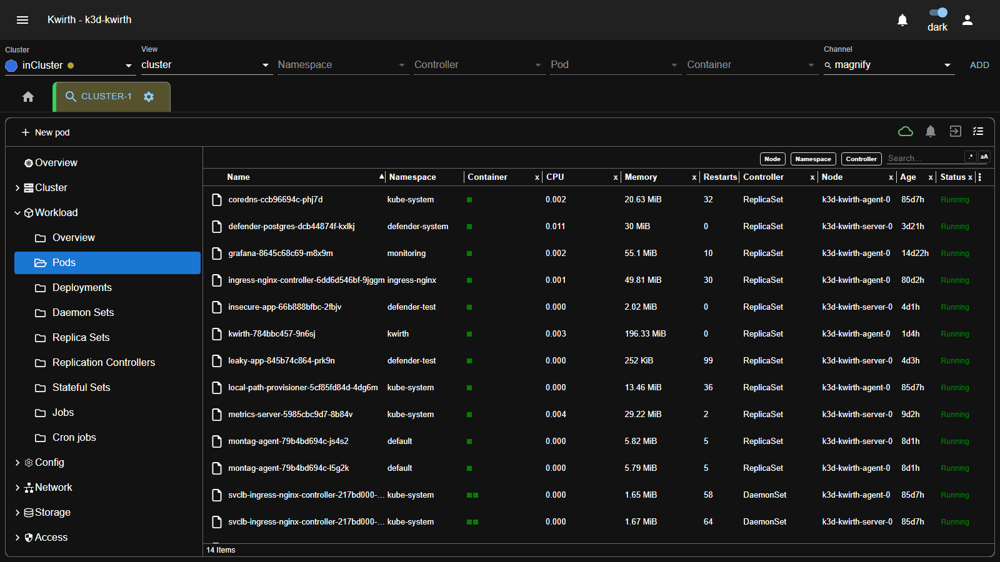

- Columns include **Name, Namespace, Container, live CPU, live Memory, Restarts, Controller, Node, Age, Status**.
- **Filter** by column (Node / Namespace / Controller) or free-text **Search**.
- Create objects directly (**+ New pod**, etc.).
- Everything updates in real time as the cluster changes.

## View options

The **last icon** in the Magnify window's top bar (the ☰ **list** icon, top-right) opens a **View options** menu that controls how the current artifact list/overview is rendered:

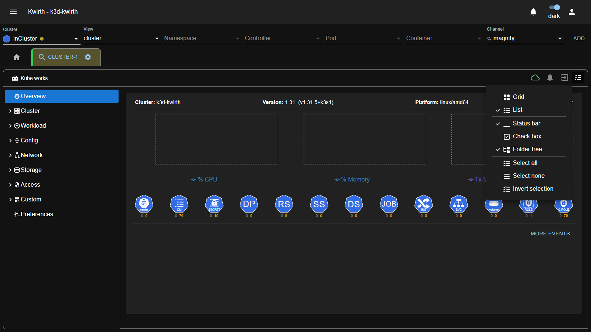

| Option | What it does |
|---|---|
| **Grid** | Show artifacts as a **grid of cards** (icon tiles). |
| **List** | Show artifacts as a **dense list/table** (the default). |
| **Status bar** | Toggle the bottom **status bar** (counts / selection summary). |
| **Check box** | Show a **selection checkbox** on each row, for multi-select. |
| **Folder tree** | Toggle the left **folder tree** navigation pane. |
| **Select all** | Select **every** artifact currently listed. |
| **Select none** | Clear the current selection. |
| **Invert selection** | Select the unselected and vice-versa. |

Ticks (✓) mark the currently-active view toggles. **Grid/List** are mutually exclusive; **Status bar / Check box / Folder tree** are independent on/off toggles; the three **Select** actions operate on the current list.

## Acting on objects

Select an object (or several) and an **action toolbar** appears — this is where Magnify **integrates the other channels**:

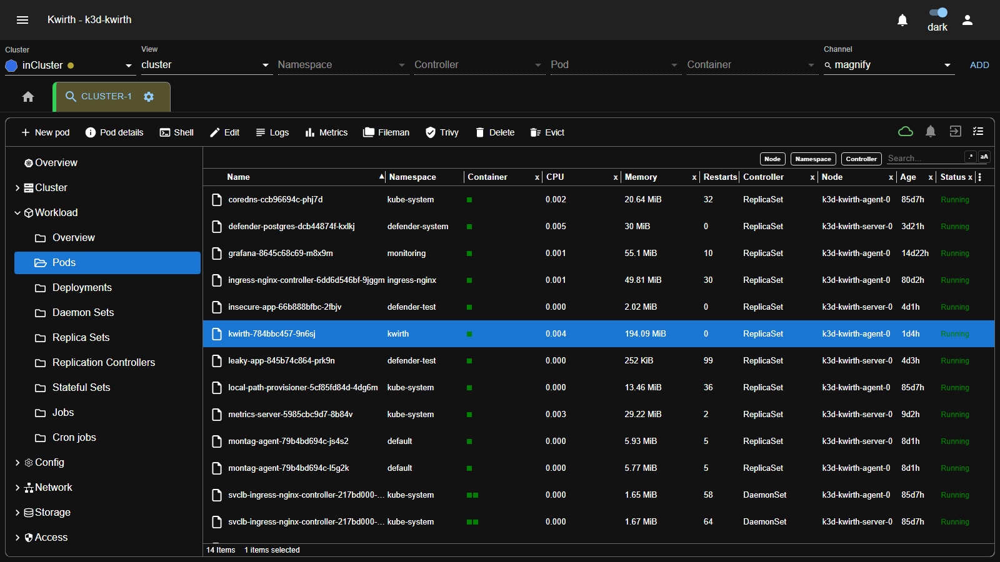

| Action | What it does |
|---|---|
| **Pod details** | Full details of the object. |
| **Shell** | Open a shell into a container (the [Ops](ops) channel). |
| **Edit** | Edit the object's manifest in an editor and apply. |
| **Logs** | Open a [Log](log) window for the object. |
| **Metrics** | Open a [Metrics](metrics) window. |
| **Fileman** | Browse the container filesystem ([Fileman](fileman)). |
| **Trivy** | Scan it for vulnerabilities ([Trivy](trivy)) — Magnify can even deploy the Trivy Operator if it isn't installed. |
| **Delete / Evict** | Remove or evict the object. |

## Object details & editing

**Pod details** (and the equivalent for every other kind) opens a **detail window** with the object's **Properties** (created, namespace, labels, annotations, owner, status, node, IPs, service account, QoS…) and, for pods, its **Conditions** — plus the same per-object toolbar (copy, edit, logs, metrics, fileman, trivy, topology, delete, evict):

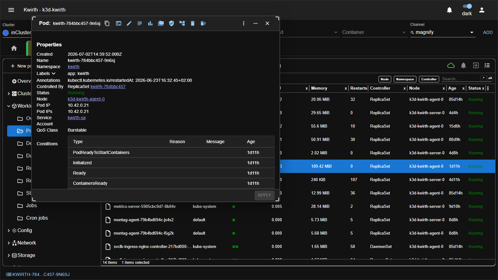

- Cross-references are **links** — click the namespace, owner controller, node or service account to jump to that object.
- The same pattern gives every kind its own detail window: **Secret** details, **Node** details (and a **shell into a node**), **image** details, and so on.

**Editing manifests.** The **✏️ Edit** action opens the object's **manifest in a YAML editor**; change it and **OK/Apply** to push it to Kubernetes. For example, editing the `coredns` ConfigMap:

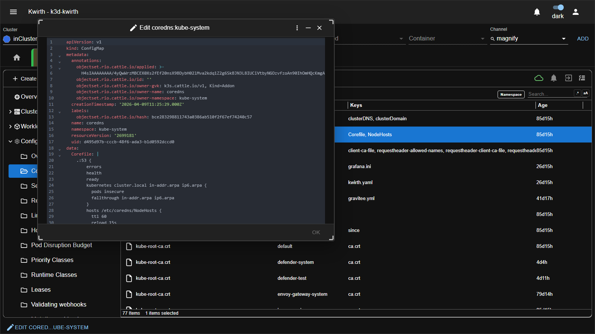

**Secrets** get a detail view that lists their **Data** keys (values shown behind a lock; here masked for the docs):

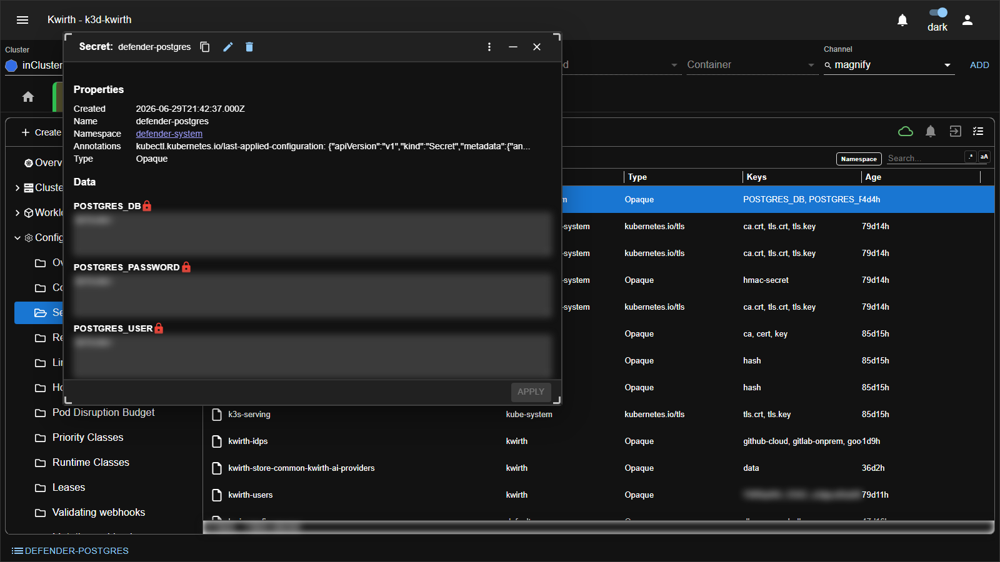

## Nodes, node shells & images

**Cluster → Nodes** lists your nodes with live **CPU / Memory** usage, **taints**, **roles** and Kubernetes **version**. Select a node and you can open a **shell on the node itself** — Magnify launches a small helper pod to bridge you in:

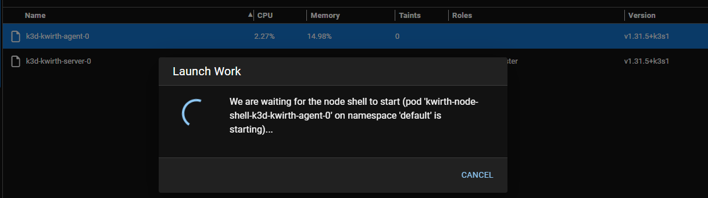

Once it's up you get a full TTY **on the node**, where you can inspect node-level processes — the k3s/kubelet agent, containerd, the CNI, ingress, etc.:

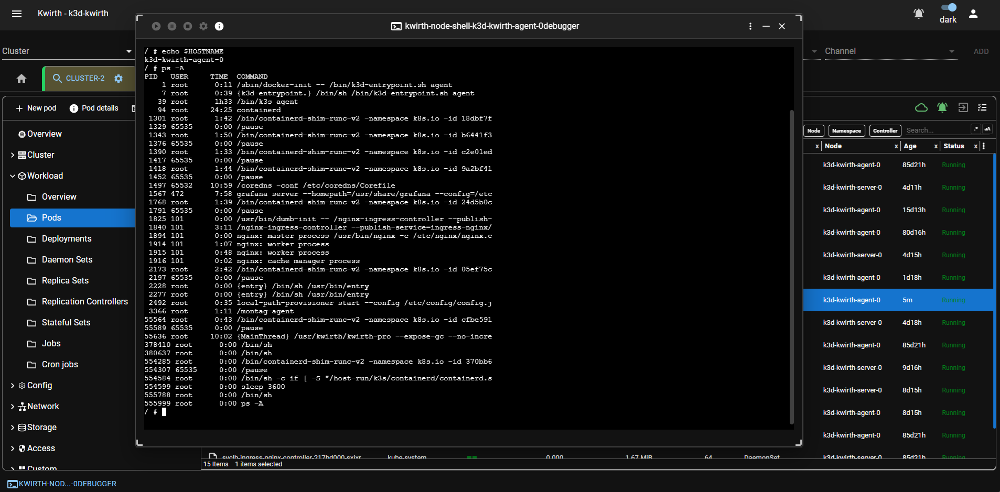

**Cluster → Images** inventories every container **image** across the cluster (name, tag, size). Each image's detail shows its **registry**, **tag**, **digest (SHA)**, full reference names, and the **nodes that have it pulled**:

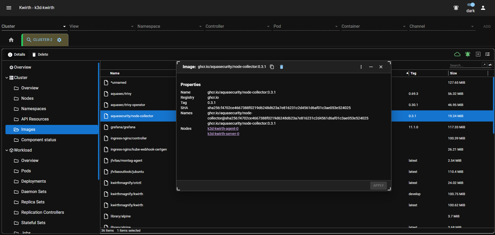

## The windowed system

Magnify is a **windowed** tool. Each action opens a **floating window** you manage like a desktop app — **move, resize, minimize, maximize, pin, close** — with a **taskbar** at the bottom. So you can watch a pod's **Logs** in one window while its **Metrics** update in another, side by side:

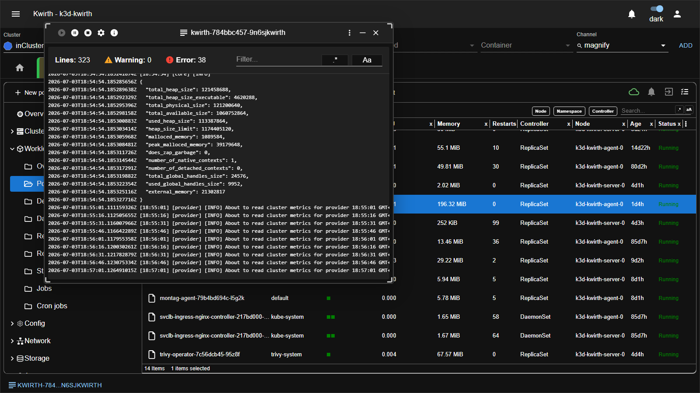

## Searching: artifacts vs. logs

Magnify has **two different full-text searches**, both launched from the **Cluster → Overview** toolbar (the same toolbar that hosts *Kube works* and *Topology*). They look alike but search very different things — it's worth knowing which one you want:

- **🔎 Search** — searches across **every Kubernetes artifact** in scope: the objects themselves (their manifests — names, labels, annotations, spec fields, …). Answers *"which **objects** mention X?"*.
- **🔎 Log search** — searches across the **logs of all pods** in scope (their logstreams), without opening a Log window per pod. Answers *"which **pods logged** X?"*.

### Log search

**Log search** fans a query across the logs of **many pods/containers at once** and returns results **grouped by container** — then click a hit to open that container's [Log](log) window:

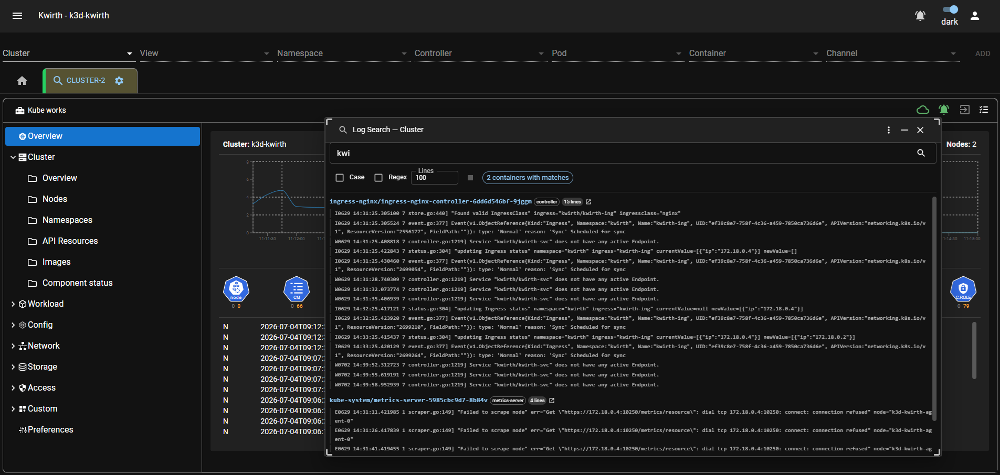

| Option | Default | Notes |
|---|---|---|
| **Search term** | — | Plain text or JavaScript regex. |
| **Lines per container** | **100** | Maximum **500** (the cap keeps memory/latency sane). |
| **Scope** | all containers in view | Narrow to namespace / group / pod / container. |

- A **Stop** button (red) cancels an in-flight search immediately, on both frontend and backend.
- Searches are **concurrent** — each gets a unique id, so multiple log-search panels run and stop independently. Closing a panel auto-stops its search.

### Search (artifacts)

**Search** runs over the **artifacts** (Kubernetes object definitions) in scope — opened from the **Cluster → Overview** toolbar it covers the **whole cluster** (the window title reads *"Search — All cluster"*). Type at least **3 characters** and it lists every matching object, showing for each hit **which field matched** (a `metadata.labels…`, `annotations…`, spec path, …) and a running **Results** count; click a result to jump straight to that object's detail:

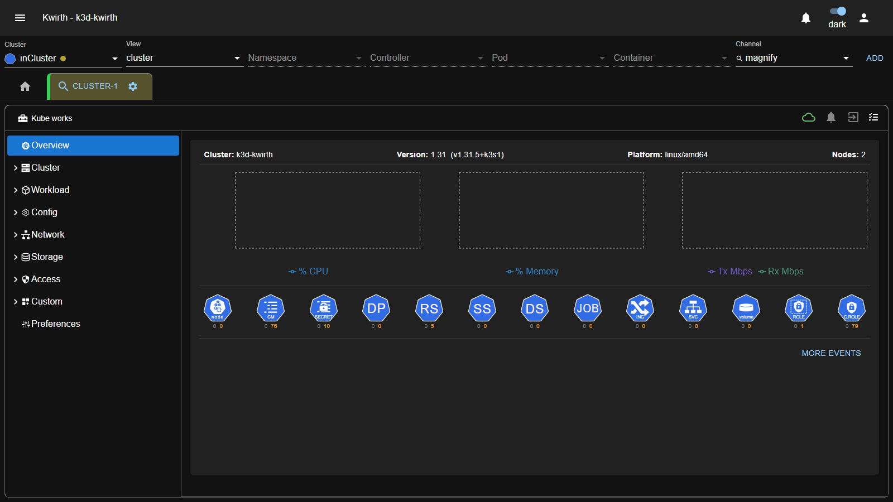

Refine the query with:

| Option | What it does |
|---|---|
| **Include status** | Also search each object's **live status**, not just its spec/manifest. |
| **Match case** | Make the search **case-sensitive**. |
| **Merge repeated results** | Collapse multiple field-hits on the **same object** into one entry. |

Use it to find, say, every object carrying a given label or referencing a given ConfigMap.

## Kube works — custom actions

The **Cluster → Overview** toolbar has a **Kube works** menu (the 🧰 toolbox at the top-left of the Magnify window). It lists your **custom actions** — one-click operations you define once and reuse:

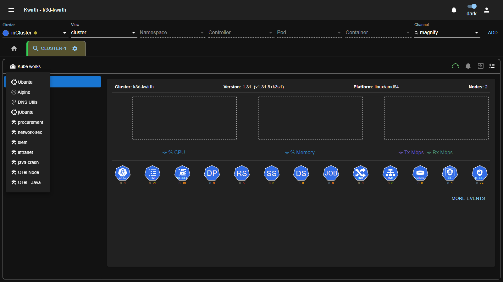

A **custom action** launches a **utility/debug pod from a YAML manifest** you provide, optionally doing something **when it's ready** (e.g. dropping you into a shell). Typical examples: an `Ubuntu` or `Alpine` debug box, a `DNS Utils` pod to test cluster DNS, or purpose-built `network-sec` / `siem` / `OTel` helpers. Think of it as a personal library of `kubectl debug`-style shortcuts, right in the overview.

*(A companion **Kwirth works** menu appears when you define **Kwirth-type** custom actions.)*

You create and manage these under **Preferences → Custom actions** (below).

## User Preferences

Magnify has its **own Preferences** panel (left nav **Preferences**). It's an accordion; expanded, every section:

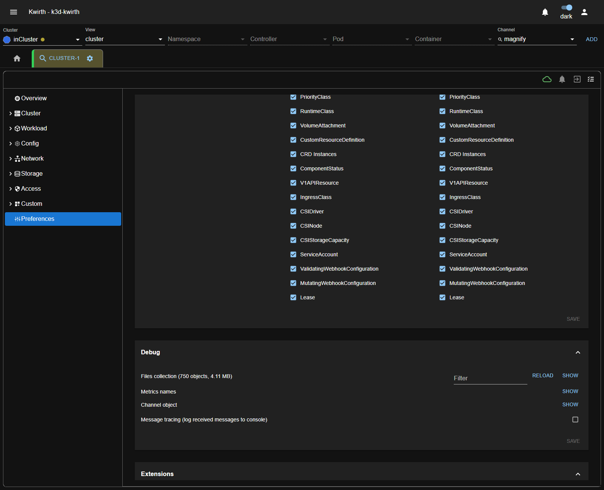

| Section | What it holds |
|---|---|
| **Display** | **Palette mode** (light/dark) and an **About** shortcut. |
| **Custom actions** | Your library of one-click **[Kube works](#kube-works--custom-actions)** operations. Each has a **Type** (**Kube**), a **Name** (what shows in the menu), a **pod YAML** (the manifest to launch) and an **on-ready** behaviour (what to do once the pod is up — e.g. *nothing*, or open a shell). **Add** / **Remove** them here; they then appear in the **Kube works** menu on the Cluster Overview. |
| **External content** | **Max messages** kept for embedded external content. |
| **Data management** | Choose **what Magnify streams and keeps**: toggles **Keep Helm data** and **Keep managed fields**, plus a per-**resource-kind** checklist (Node, Namespace, Pod, Deployment, DaemonSet, ReplicaSet, StatefulSet, Job, CronJob, ConfigMap, Secret, Service, Ingress, PV/PVC, Roles & bindings, metrics, Endpoints, PriorityClass, RuntimeClass, VolumeAttachment, CRDs & instances, CSI objects, ServiceAccount, webhooks, Lease…). Untick a kind to stop streaming it — useful to cut noise/load on big clusters. |
| **Debug** | Inspect the client: **Files collection** (object cache size), **Metrics names**, **Channel object**, and **Message tracing** (log received messages to console), with **RELOAD** / **SHOW**. |
| **Extensions** | A **MANAGE** shortcut that opens the **Plugins / Providers / Senders** managers — so you can manage extensions **without leaving Magnify**. |

## Editors, validation, search & CRDs

- **Editors** — open any object's manifest, edit, and apply changes online.
- **Cluster validation** — Magnify surfaces inconsistencies/errors/warnings detected across your artifacts (a validation ribbon on the overview).
- **Full-text search** — search across all Kubernetes artifacts, not just logs.
- **CRDs** — browse and manage your Custom Resource Definitions and their instances under **Custom**.

## Desktop (Kwirth Magnify)

The **desktop** app is built for local work like Lens/K9s/Headlamp: instead of connecting to one cluster, it lists **all contexts in your local `kubeconfig`** (refreshing availability automatically) and lets you add **remote** clusters (Docker/External/Kubernetes Kwirth servers). See [Deployment → Desktop](../../admin/01-deployment).

## Admin guide

- **Built-in:** ships with the core; enable/disable at deploy (Helm `channelMagnify`, External `--channelmagnify`). Nothing to install in *Manage extensions*.
- **Permissions:** because Magnify can do *everything*, it honours the full scope model — browsing needs read/streaming scopes; restarting/deleting needs `ops$restart`, and cluster-level mutations need `cluster` on the target objects. Grant Magnify power deliberately (see [Security & permissions](../../admin/04-security-and-permissions)).
- **Trivy Operator:** Magnify can deploy the Trivy Operator to a cluster that doesn't have it, enabling vulnerability scans.

## Notes

- Magnify streams **live** — lists and metrics reflect the cluster as it changes, no refresh needed.
- It's a superset console: most things you'd do across several channels, you can do from Magnify's windows.

---

← Back to [Plugins (channels)](index)
