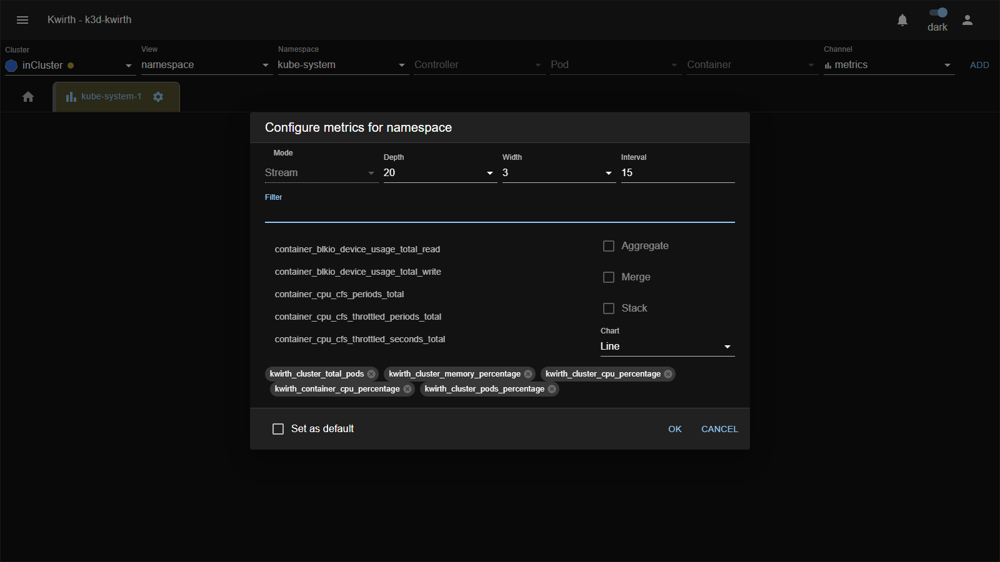
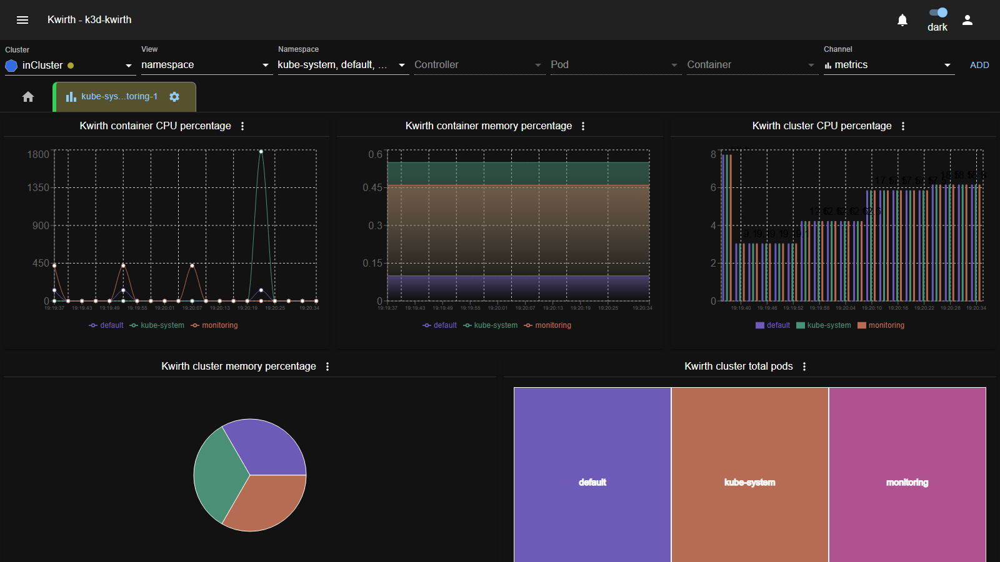
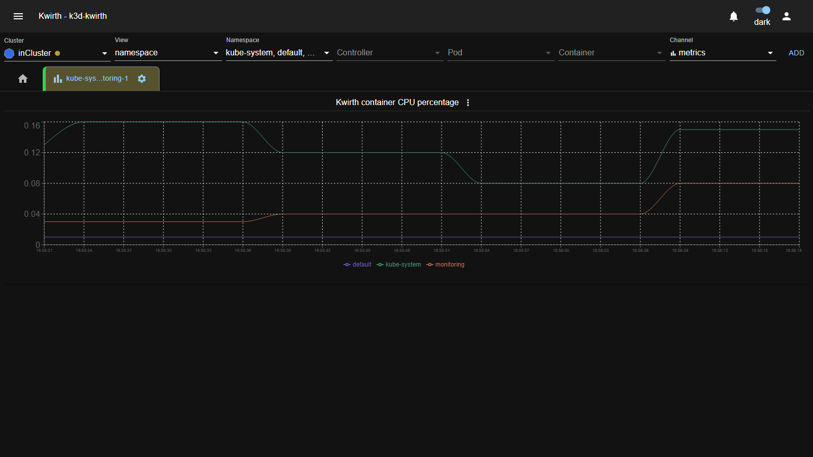
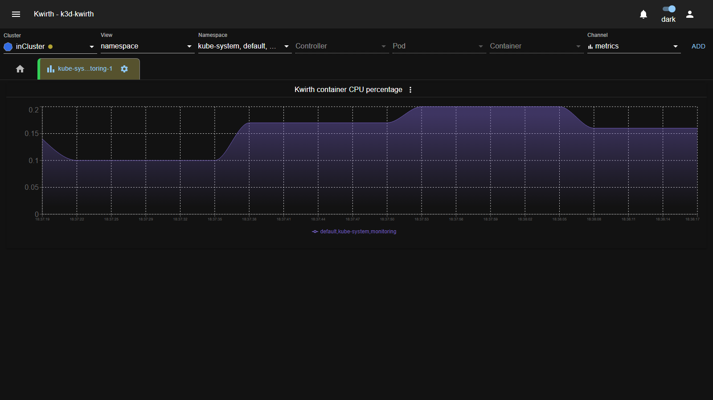
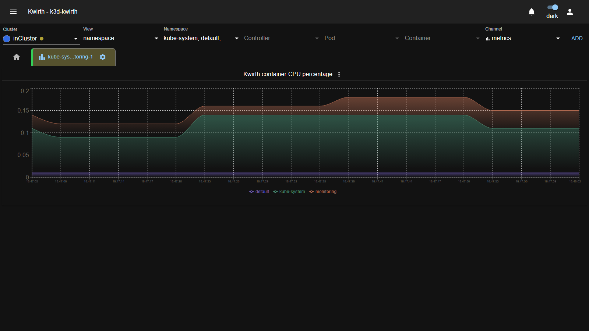
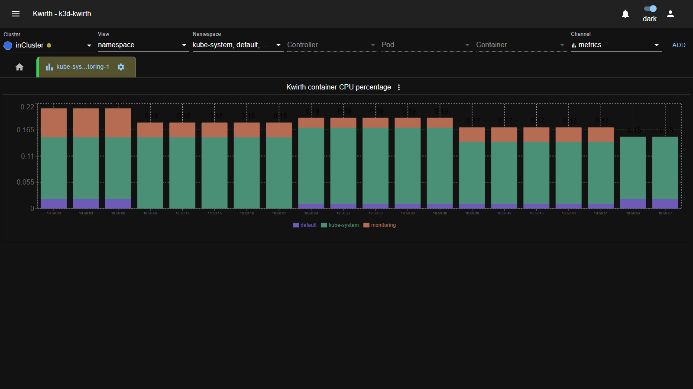
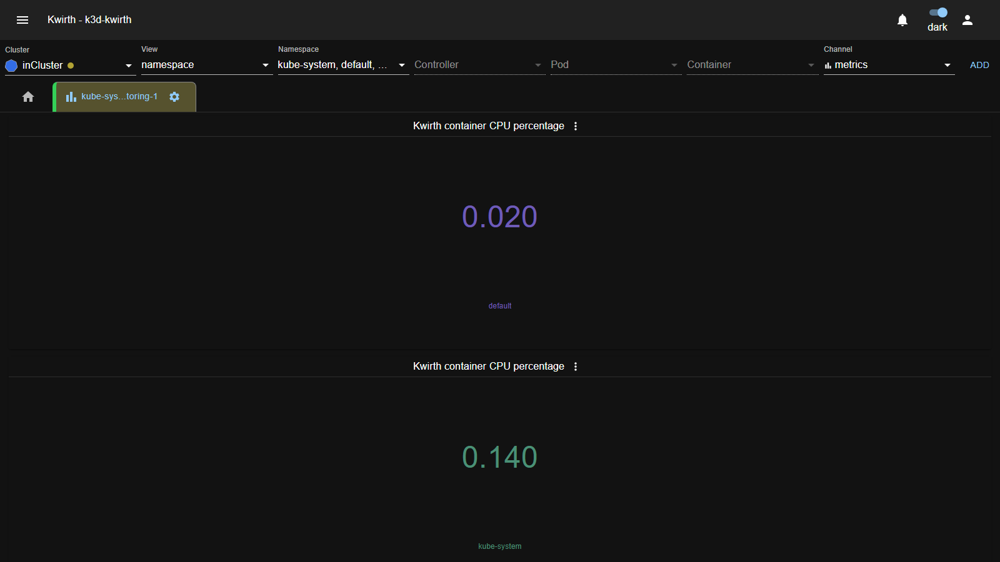
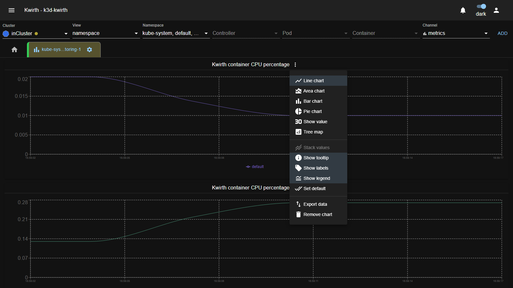

# 📊 Metrics (plugin)

> **Type:** Channel — **built-in** (ships with the Kwirth core) 
> **Package:** built-in (no install needed) 
> **Icon:** 📊

## Overview

The **Metrics** channel streams **real-time resource metrics** — CPU, memory, network, I/O — for any set of Kubernetes objects, drawn as live charts. It gathers data **directly from cAdvisor/kubelet on your nodes**, so **no Prometheus** (or any scraping stack) is required.

As with every channel, you can build a scope by mixing objects (pods from different namespaces, whole namespaces, or a single container) and Kwirth will chart them together.

## When to use it

- Watch **CPU/memory/network** of a workload in real time.
- Compare several namespaces or pods **side by side** (merge) or as a **single total** (aggregate).
- Get an at-a-glance **current value** without a full chart.

## User guide

1. Resource selector: pick **Cluster → View → objects**, set **Channel = `metrics`**, press **ADD**.
2. Tab **gear ⚙ → Start** to open the configuration.
3. **Select at least one metric** (you can't start without one), choose your drawing options, and **OK**.

## Configuration

| Option | What it does |
|---|---|
| **Mode** | Streaming mode. Currently fixed to **Stream** (real-time). |
| **Depth** | How many values each chart keeps; when full, the oldest drop off (the chart scrolls). |
| **Width** | How many charts to place per row. |
| **Interval** | Refresh interval in **seconds** — Kwirth sends new values every *interval*. Lower it for denser, faster-moving charts. |
| **Filter** | Filter the metric list to find metrics quickly. |
| **Metrics list** | Click a metric name to add/remove it. Pick **one or more**. |
| **Aggregate** | With several objects in scope, **sum** their values into a single series. |
| **Merge** | Instead of aggregating, show each object's value for the same metric **in the same chart**. |
| **Stack** | When merging, **stack** the series (otherwise they overlay). |
| **Chart** | Chart type: **Line**, **Area**, **Bar** or **Value**. |
| **Set as default** | Remember these options for next time. |

### The `kwirth_*` convenience metrics

Besides the raw cAdvisor metrics, Kwirth adds ready-made ones. They come in two families: **container-scope** (computed over **all objects in scope**) and **cluster-scope** (whole-cluster figures).

**Container-scope** (`kwirth_container_*`):

| Metric | Meaning |
|---|---|
| `kwirth_container_cpu_percentage` | % CPU used by objects in scope |
| `kwirth_container_memory_percentage` | % memory used |
| `kwirth_container_transmit_percentage` | % network sent |
| `kwirth_container_receive_percentage` | % network received |
| `kwirth_container_transmit_mbps` | network **sent**, Mbps |
| `kwirth_container_receive_mbps` | network **received**, Mbps |
| `kwirth_container_write_mbps` | disk **write**, Mbps |
| `kwirth_container_read_mbps` | disk **read**, Mbps |
| `kwirth_container_random_counter` / `_random_gauge` | test values only |

**Cluster-scope** (`kwirth_cluster_*`):

| Metric | Meaning |
|---|---|
| `kwirth_cluster_total_pods` | total number of pods in the cluster |
| `kwirth_cluster_pods_percentage` | % of pod capacity in use |
| `kwirth_cluster_memory_percentage` | % of cluster memory in use |
| `kwirth_cluster_cpu_percentage` | % of cluster CPU in use |

## Drawing options — Aggregate vs Merge vs Stack

These three decide how **multiple objects** are drawn for the **same** metric:

- **Aggregate** → one series = the **sum** of all objects.
- **Merge (overlay)** → one chart, **one series per object**, drawn on top of each other.
- **Merge + Stack** → one chart, one series per object, **stacked** so the top edge is the total.

## Visualization examples

A single Metrics tab can mix **different chart types at once** — build a real dashboard where each metric is drawn the way that suits it best:

*One tab, five metrics, five chart types: **Line** (container CPU), **Area** (container memory), **Bar** (cluster CPU), **Pie** (cluster memory) and **Tree map** (cluster total pods). Change any chart's type from its ⋮ menu — see [Per-chart options](#per-chart-options-menu).*

The individual chart types and drawing modes, one by one. All examples below chart `kwirth_container_cpu_percentage` across three namespaces (`default`, `kube-system`, `monitoring`).

**Line — merged (overlay).** One line per namespace:

**Area — aggregated.** The three namespaces summed into a single area:

**Area — merged + stacked.** One area per namespace, stacked to show the total:

**Bar — merged + stacked.** Same data as stacked bars per interval:

**Value.** No chart — just the current number per object:

> **Tip:** to see a full moving chart quickly, lower the **Interval** (e.g. `3`) so the **Depth** fills in seconds instead of minutes.

## Per-chart options (⋮ menu)

The options in the setup dialog apply to **all** charts. But **each chart also has its own ⋮ menu**, next to its title, so you can tweak one chart without touching the rest:

| Option | What it does |
|---|---|
| **Line / Area / Bar / Pie / Show value / Tree map** | Change **this chart's** type only (note there are more types here than in the setup dialog — e.g. **Pie** and **Tree map**). |
| **Stack values** | Stack this chart's series (available when the chart has several series). |
| **Show tooltip** | Toggle the hover tooltip. |
| **Show labels** | Toggle value labels on the chart. |
| **Show legend** | Toggle the series legend. |
| **Set default** | Save this chart's look as the default for new charts. |
| **Export data** | Download this chart's data. |
| **Remove chart** | Remove just this chart from the tab. |

So you can, for example, keep most metrics as lines but switch one to a **Pie** or **Tree map**, or export a single chart's data without affecting the others.

## Admin guide

- **Built-in:** Metrics ships with the core — there is nothing to install in *Manage extensions*. It can be enabled/disabled at deploy time (Helm `channelMetrics`, External `--channelmetrics`).
- **Sampling rate:** the cluster-wide metrics read interval is set at deploy (`--metricsinterval`) and can be adjusted per cluster in **☰ → Cluster Settings** (see [Initial configuration](../../admin/02-initial-config)). The per-tab **Interval** above is how often the client refreshes its charts.
- **Permissions:** users need streaming scopes (**`view`**, **`stream`**, or **`snapshot`** for one-off values) on the target objects — see [Security & permissions](../../admin/04-security-and-permissions).

## Notes

- Metrics come straight from cAdvisor/kubelet — **no Prometheus needed**.
- A large **Depth** × many charts uses more browser memory; keep it sensible for big scopes.

---

← Back to [Plugins (channels)](index)
