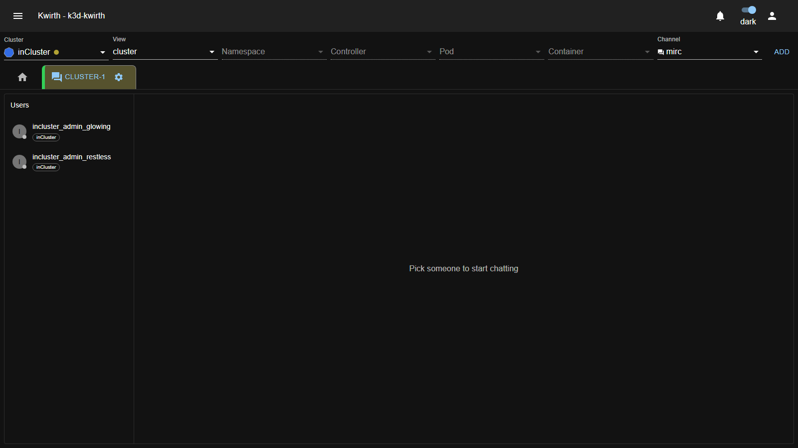
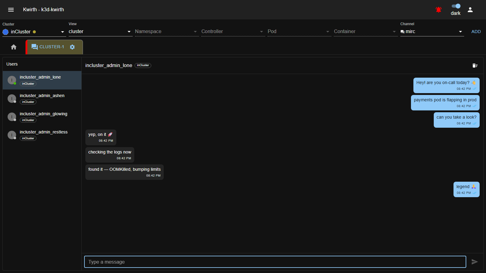

# 💬 mIRC (plugin)

> **Type:** Plugin (channel) 
> **Package:** `@kwirthmagnify/kwirth-plugin-mirc` 
> **Icon:** 💬

## Overview

**mIRC** is a **direct-messaging / chat** channel: it lets the people currently using Kwirth **talk to each other**, WhatsApp-style, without leaving the tool. It works **across clusters** — you can message someone connected to another cluster you can reach — and it has an **offline mailbox**, so a message to someone who's away is held and delivered when they come back.

Every connection gets an automatic **nickname** (e.g. `incluster_admin_lone`), tagged with the cluster it's on.

## When to use it

- Coordinate with a teammate while you're both firefighting in Kwirth ("payments pod is flapping — can you look?").
- Reach someone working on **another cluster** without switching context.
- Leave a message for someone who's offline; they'll get it on reconnect.

## User guide

1. Set **Channel = `mirc`** (any view — it's not tied to a workload), **ADD**, then **gear ⚙ → Start**.
2. The channel opens with the **Users** roster on the left. Until you pick someone you'll see *"Pick someone to start chatting"*.

3. **Click a user** in the roster to open the conversation, type in **Type a message**, and press **Enter** (or the send button).

### The roster (Users)

Each entry shows the person's **nickname**, a **cluster chip** (which cluster they're connected to), and an **online dot** — **green** = online, **grey** = offline. Click one to chat.

### The conversation

- **Your messages** are on the right (coloured), **theirs** on the left.
- Each bubble shows the **time** and a **delivery tick**:

| Ticks | State |
|---|---|
| ✓ (single) | **sent** — left your browser |
| ✓✓ (grey) | **delivered** — reached their client |
| ✓✓ (blue) | **read** — they've seen it |
| ⚠ | **failed** — couldn't be sent |

- The **🧹 (clear)** button in the conversation header wipes that conversation's local history.

## Cross-cluster & offline

- **Cross-cluster:** your Kwirth front talks to **all the mirc backends you can reach** (from your [cluster list](../../admin/06-cluster-management)). The cluster chip next to each user tells you where they are, so you can chat with people on other clusters as easily as your own.
- **Offline mailbox:** if you message someone who is offline, the backend **holds it** and delivers it when they reconnect (the tick advances from *sent* to *delivered* then). Conversation history is also cached locally in your browser.

## Worked example — coordinate an incident

Two on-call engineers, each with a Kwirth tab open:

1. Both open a `mirc` tab and **Start**. Each appears in the other's roster with a green online dot.
2. Engineer A clicks B and sends *"payments pod is flapping in prod — can you take a look?"*.
3. B sees the message (ticks turn blue when read), replies *"on it 🚀 … found it — OOMKilled, bumping limits"*.
4. A confirms *"legend 🙏"*. All without leaving Kwirth or switching clusters.

*(The screenshot above is exactly this exchange between two connected sessions, with two more users online in the roster.)*

## Admin guide

- **Install / remove:** **☰ → Manage extensions → Plugins** → install **mIRC**.
- **Cross-cluster reach** depends on the user's [cluster list](../../admin/06-cluster-management): they can chat with users on any cluster they have registered and can reach.
- **Permissions:** as with other channels, access is governed by the user's scopes; mIRC is a communication channel and does not expose workload data.

## Notes

- Nicknames are assigned per **connection**, so the same person opening two tabs appears twice.
- History lives in the browser (localStorage) plus the backend mailbox for offline delivery.

---

← Back to [Plugins (channels)](index)
