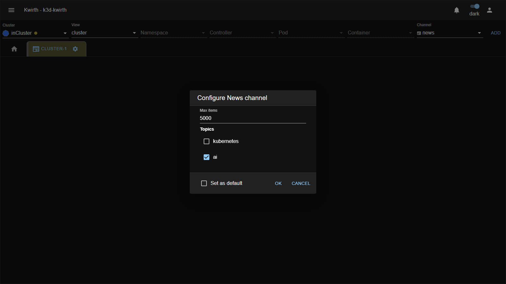
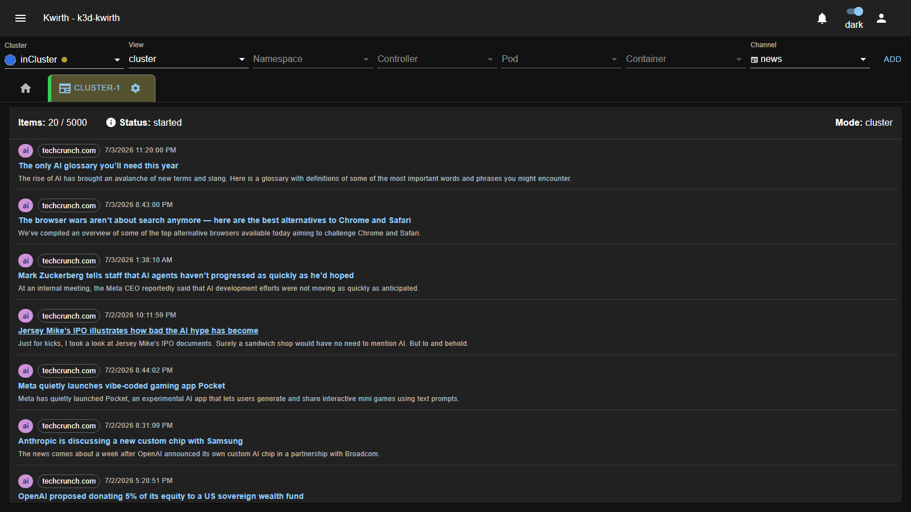

# 📰 News (plugin)

> **Type:** Plugin (channel) 
> **Package:** `@kwirthmagnify/kwirth-plugin-news` 
> **Icon:** 📰

## Overview

The **News** channel brings a **curated tech news feed** into Kwirth. It pulls items from public RSS sources on a couple of **topics** — **Kubernetes** and **AI** — and shows them as a clean, chronological list right next to your clusters, so you can keep an eye on the ecosystem without leaving the console.

It's the lightest channel in Kwirth: no cluster data, no permissions to worry about — just headlines.

## When to use it

- **Stay current** on Kubernetes and AI news while you work.
- Keep a **dashboard tab** with the latest ecosystem headlines on a shared screen.
- A friendly **demo/first channel** to show how Kwirth tabs and channels work.

## Getting started

1. Pick your **Cluster** (News works at **cluster** level or resourced), choose the **news** channel and click **ADD**.
2. Open the tab's **⚙️ → Start** and set it up (below).

## Configuration

| Control | What it does |
|---|---|
| **Max items** | How many items to keep in the feed. |
| **Topics** | Which feeds to pull: **kubernetes**, **ai** (tick the ones you want). |
| **Set as default** | Remember this configuration for next time. |

## The feed

Once started, News shows the latest items newest-first:

The header shows the **item count / max** and the **Status**. Each entry has a **category** chip (kubernetes / ai), the **source**, the **publish date**, a **title that links to the original article** (opens in a new tab), and a short description.

## Admin guide

- **Install / remove:** **☰ → Manage extensions → Plugins** → install **News**.
- **Permissions:** none special — any user who can open the channel can use it.
- **Network:** the channel fetches **public RSS feeds over the internet**, so the Kwirth backend needs outbound access to those sources.
- **Sources:** Kubernetes and Docker.

## Notes

- Items are **read-only** links out to the original articles — News never sends anything from your cluster.
- If the feed is empty, check the backend's **outbound internet access** and that at least one **topic** is selected.

---

← Back to [Plugins (channels)](index)
