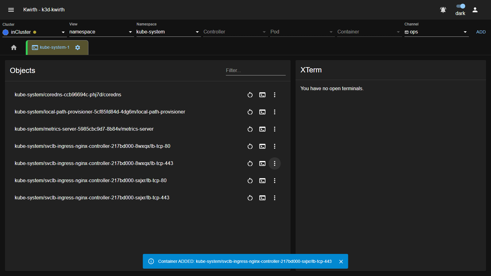
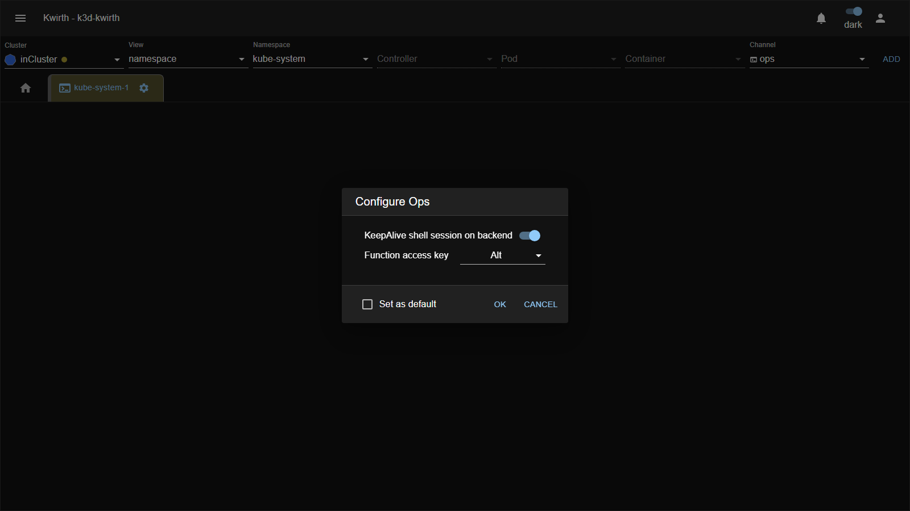
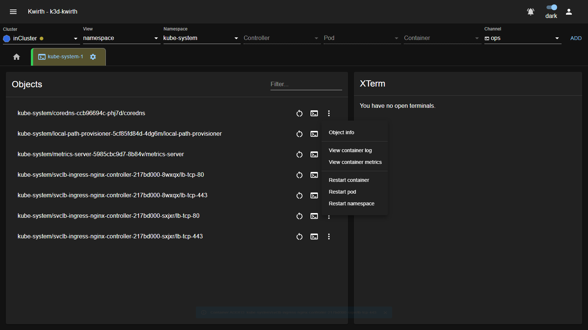
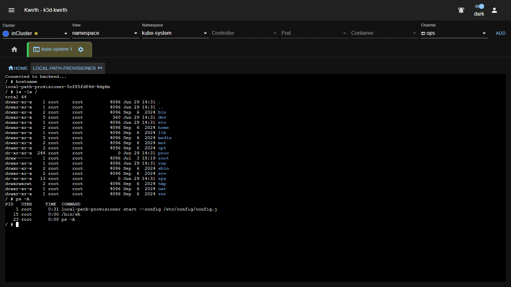
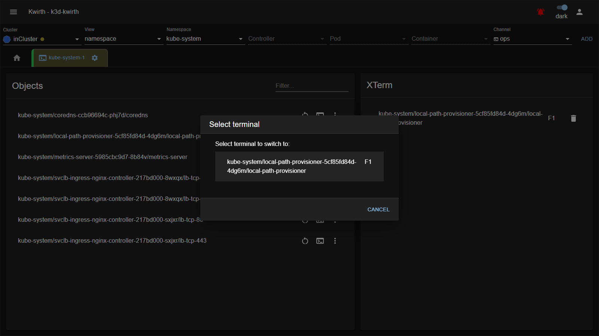
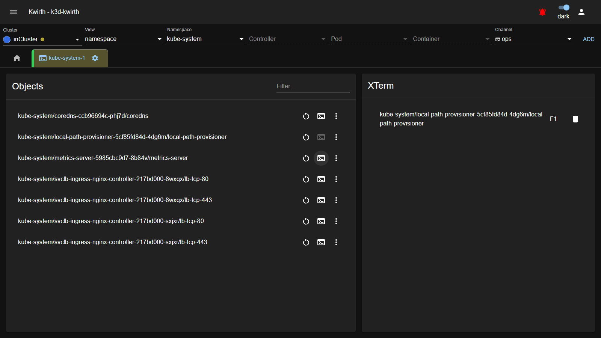

# 🖥️ Ops (plugin)

> **Type:** Plugin (channel) 
> **Package:** `@kwirthmagnify/kwirth-plugin-ops` 
> **Icon:** 🖥️

## Overview

The **Ops** channel is Kwirth's **day-to-day operations** console. Instead of leaving Kwirth for `kubectl`, you operate your workloads right here: **open a shell** into a container, **restart** a container / pod / namespace, **inspect** objects, and **jump straight to a container's logs or metrics** — all from a point-and-click UI.

The channel has two panes:

- **Objects** (left) — the containers in your scope, each with quick actions.
- **XTerm** (right) — your live shell sessions.

## When to use it

- **Debug** a running container with an interactive shell.
- **Restart** a stuck container, pod, or a whole namespace without a terminal.
- **Inspect** an object, or hop from it to its **logs** / **metrics**.

## User guide

1. Select your scope, set **Channel = `ops`**, **ADD**.
2. Tab **gear ⚙ → Start**, confirm the setup (below), **OK**.
3. Use the **Objects** pane to act on containers; shells you open appear in **XTerm**.

### Configuration

| Option | What it does |
|---|---|
| **KeepAlive shell session on backend** | Kwirth keeps your shell sessions alive on the server even when idle, and — combined with Kwirth's **reconnect** — lets you **resume a shell after losing your connection**. |
| **Function access key** | The modifier key (e.g. **Alt**) used with the function keys to switch between shell sessions (see [Shells](#shells)). |
| **Set as default** | Remember this setup. |

## The Objects pane

Every container in scope is listed (use **Filter** to find one). Each row has:

| Action | Icon | What it does |
|---|---|---|
| **Restart** | ↻ | Restart this container. |
| **Open terminal** | ▷_ | Start an interactive shell to this container (appears in XTerm). |
| **More** | ⋮ | The per-object menu below. |

The **⋮ menu**:

| Item | What it does |
|---|---|
| **Object info** | Show details about the object. |
| **View container log** | Jump to this container's logs ([Log](log) channel). |
| **View container metrics** | Jump to this container's metrics ([Metrics](metrics) channel). |
| **Restart container** | Restart just this container. |
| **Restart pod** | Restart the whole pod. |
| **Restart namespace** | Restart every workload in the namespace. |

> If a pod is **not** owned by a controller, restarting/deleting it makes it disappear (there's nothing to recreate it) — with a controller, it is recreated automatically.

## Shells

Click a container's **▷_** to open a shell (a `/bin/sh` TTY). It opens as a session in the **XTerm** pane, with a tab bar at the top: **HOME** (back to the Objects pane) and one tab per session labelled with its **function key** (e.g. `F1`):

### Hot keys

You can open **many** shells at once and move between them using the **function keys** together with your **Function access key** modifier (set in the config — default **Alt**):

| Key | Action |
|---|---|
| *(modifier)* + **F1–F10** | Jump **directly** to shell session 1–10. |
| *(modifier)* + **F12** | Open the **session menu** to pick any session (see below). |
| **HOME** tab | Return to the **Objects** pane (sessions stay open). |
| **Ctrl-D** / `exit` | End the current session. |

### The session menu

Pressing *(modifier)* + **F12** opens the **Select terminal** dialog — the list of all open shells, so you can switch to any of them:

The **XTerm** pane also lists your open sessions while you're on the Objects pane — each with its function key and a **🗑 close** button:

With **KeepAlive** on, sessions survive idle time and you can **reconnect** to them after a network drop.

## Worked examples

**1) Debug a container**

1. `ops` tab on your namespace → **Start** → **OK**.
2. Find the pod in **Objects**, click **▷_** to open a shell.
3. Run your commands (`ls`, `cat`, `env`, `ps`…). Press *modifier*+**F12** to pop back to Ops, *modifier*+**F1** to return to the shell.

**2) Restart a crashing pod**

1. In **Objects**, locate the pod, open **⋮ → Restart pod** (or **↻** on the row to restart just the container).

**3) From an alert to a shell**

1. An [Alert](alert) fires for `checkout`. Open an `ops` tab on that Deployment, use **⋮ → View container log** to confirm, then **▷_** to shell in and fix it — without ever leaving Kwirth.

## Admin guide

- **Install / remove:** **☰ → Manage extensions → Plugins** → install **Ops**.
- **Permissions (important):** Ops actions map to specific **`ops$*` scopes** — grant only what each user needs (see [Security & permissions](../../admin/04-security-and-permissions)):

  | Action | Required scope |
  |---|---|
  | Object info / view (GET, DESCRIBE, LIST) | `ops$get` |
  | Restart container / pod / namespace, delete | `ops$restart` |

  For example, a read-only operator gets `ops$get`; add `ops$restart` for someone who may also restart or delete workloads.

  > **Shells & command execution** are **not** behind their own scope in the current version — there is no `ops$xterm` / `ops$execute`. Any user who can open an Ops tab can use the terminal; the two enforced scopes are `ops$get` (inspect) and `ops$restart` (restart/delete). Gate who can reach Ops at all with the object filters and the channel's streaming scopes.

## Notes

- Shells are `/bin/sh` inside the target container — the tools available depend on the container image.
- **KeepAlive + reconnect** make Ops resilient to flaky networks; disable KeepAlive if you prefer sessions to end when you disconnect.

---

← Back to [Plugins (channels)](index)
