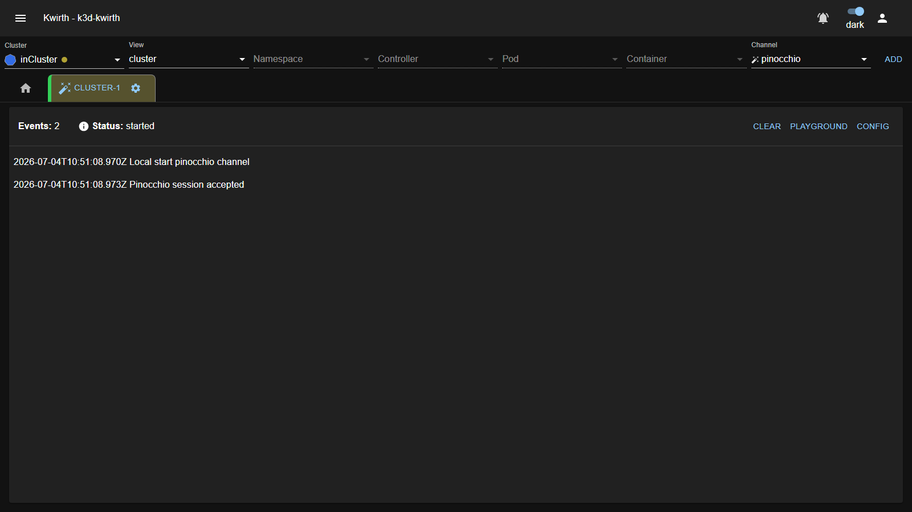
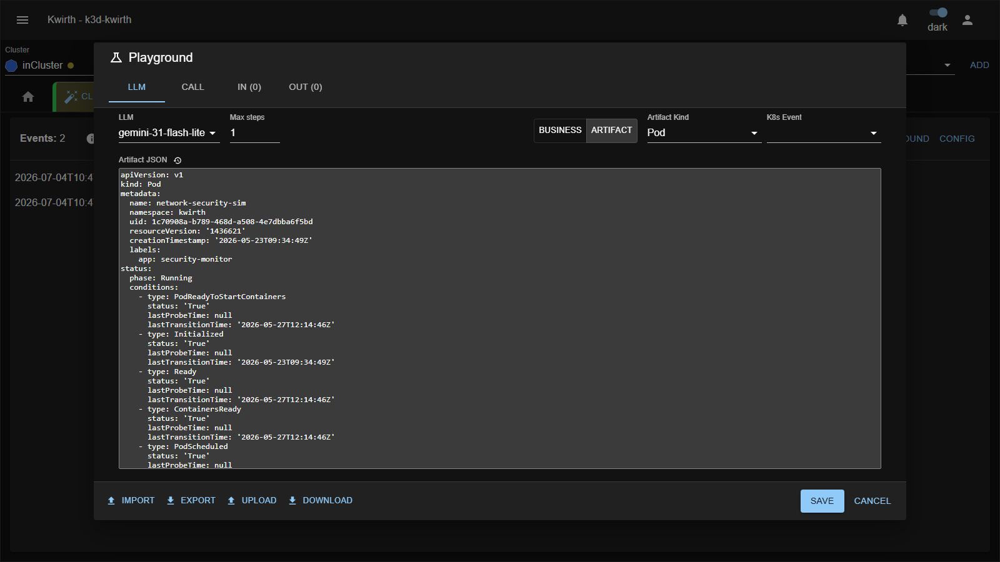
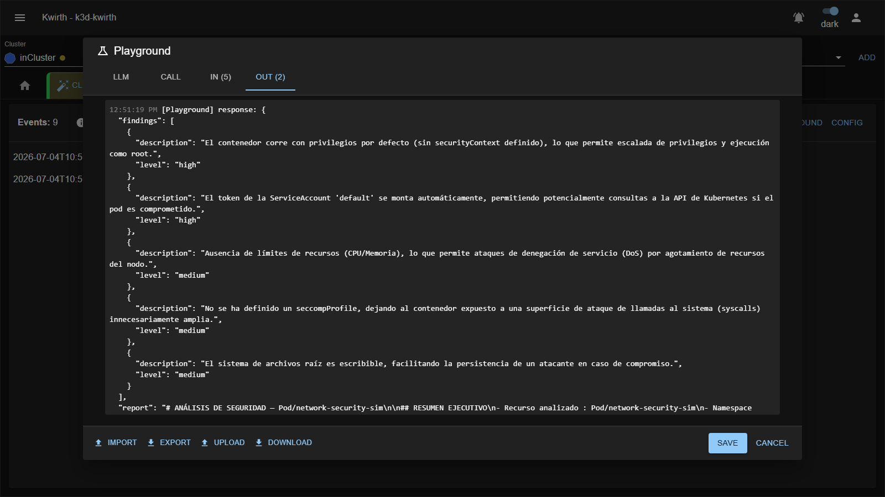
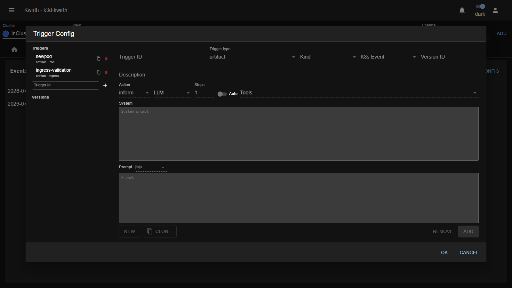

# 🪄 Pinocchio (plugin)

> **Type:** Plugin (channel) 
> **Package:** `@kwirthmagnify/kwirth-plugin-pinocchio` 
> **Icon:** 🪄

## Overview

**Pinocchio** is an **agentic AI analyst** for your cluster. It watches **events** — Kubernetes object changes (a Pod/Deployment/Ingress being **added, modified or deleted**) and **business** events — and, when a **trigger** matches, runs a **multi-step LLM analysis** of the object. The result is a structured verdict: a list of **findings** (each with a severity and remediation), a **Pod Security Standard (PSS)** assessment, a **risk score summary**, an overall **global risk**, and a full Markdown **report**.

Think of it as an on-demand security/posture reviewer: point it at "every new Pod" or "every Ingress change" and let the model flag privilege issues, missing limits, exposed secrets, supply-chain risks and more — with concrete remediation.

> Pinocchio uses the **LLM providers configured in Kwirth**, and can run the model **agentically** (multiple **steps** with **tools**) to gather context before it concludes.

## When to use it

- **Automated security review** of new or changed workloads (PSS compliance, misconfigurations).
- **Event-driven analysis** — react to a business event or a K8s change with an LLM assessment.
- **Prototype prompts** safely in the **Playground** before wiring them to a live trigger.
- **Generate remediation** guidance and a shareable report for a given resource.

## Getting started

1. In the resource selector pick your **Cluster**, set **View = cluster** (Pinocchio is a cluster-level channel), choose the **pinocchio** channel and click **ADD**.
2. Open the tab's **⚙️ → Start**.
3. Set up your model and rules: use **Config** to add a **Provider/LLM** and define **Triggers**, or jump into the **Playground** to experiment first.

## The analysis view

Once started, the tab is a live feed of analyses:

The header shows **Events** (how many entries in the feed) and **Status** (started / paused / stopped), plus three actions:

| Button | What it does |
|---|---|
| **Clear** | Clear **my view** (local) or **Clear back** (delete stored analyses for everyone). |
| **Playground** | Open the interactive prompt/trigger workbench (below). |
| **Config** | Open the config menu: **Provider**, **LLM**, **Trigger**, **Import/Export**. |

Each analysis in the feed lists its **findings**, colour-coded by level (**low / medium / high / critical**). Click a finding for its full detail — **control id & name, category** (privileges, identity, network, filesystem, supply-chain, resources, secrets, …), **confidence, risk score, description, evidence, impact, remediation** and **references**. A summary chip under each analysis shows the **PSS** (current → target), the **score summary** (critical/high/medium/low counts) and the **global risk**; click it for the analysis detail (resource, images, controls passed, next steps). A **Report** button opens the full Markdown write-up.

## The Playground

The **Playground** is where you design and test an analysis before turning it into a trigger. You give it an **event** and a **prompt**, **fire** it against the LLM, and inspect the result:

- **LLM tab** — choose the **model**, **Max steps** (agentic iterations), **tools** (and **Auto** tool selection), the **trigger type** (**Business** or **Artifact**), and for artifacts the **Kind** + **K8s Event**; paste the **artifact JSON** (or a business event) and the **system**/**prompt** (Jinja or artifact template).
- **Call tab** — **Apply config**, then **Fire** to run it.
- **IN / OUT tabs** — the exact input sent and the model's output.

The **OUT** tab shows the structured result — here, a live security analysis of a Pod with several findings and a full report:

*(The finding text is generated by the LLM, so wording will vary with the model and prompt.)*

Use **Import / Export / Upload / Download** to move configs around, and **Save** to persist the current setup as a **trigger**.

## Triggers

Triggers decide **when** Pinocchio runs and **what** it does. Manage them in **Config → Trigger**:

Each trigger has an **ID**, a **type** (**artifact** or **business**), and for artifacts a **Kind** (Pod, Deployment, Service, Ingress, …) and a **K8s Event** (**ADDED / MODIFIED / DELETED**). A trigger holds one or more **versions**, each with:

| Field | Meaning |
|---|---|
| **Action** | What to do with the verdict: **inform**, **cancel** or **repair**. |
| **LLM** | Which model to use. |
| **Steps** | Max agentic steps. |
| **Tools** / **Auto** | Which tools the agent may use (or let it pick automatically). |
| **System** / **Prompt** | The system prompt and the analysis prompt (**Jinja** or **artifact** template). |

Use **New / Clone / Remove / Add** to manage triggers and their versions.

## Admin guide

- **Install / remove:** **☰ → Manage extensions → Plugins** → install **Pinocchio**.
- **LLM required:** configure a **Provider/LLM** (Config → Provider / LLM). Analyses consume tokens against that provider.
- **Permissions (scopes):** **`none`** and **`cluster`**. As a cluster-level analyst, Pinocchio needs **`cluster`** to observe cluster events. See [Security & permissions](../../admin/04-security-and-permissions).
- **Source:** Kubernetes.

## Notes

- The **cancel** and **repair** actions can **act on the resource**, not just report — treat triggers that use them as privileged automation and review their prompts carefully.
- Findings are **LLM-generated**: use them as expert guidance, and verify critical actions. The **Playground** is the safe place to tune a prompt until its verdicts are reliable.
- **Clear back** deletes stored analyses for **all** connected users — prefer **Clear my view** for a local tidy-up.

---

← Back to [Plugins (channels)](index)
