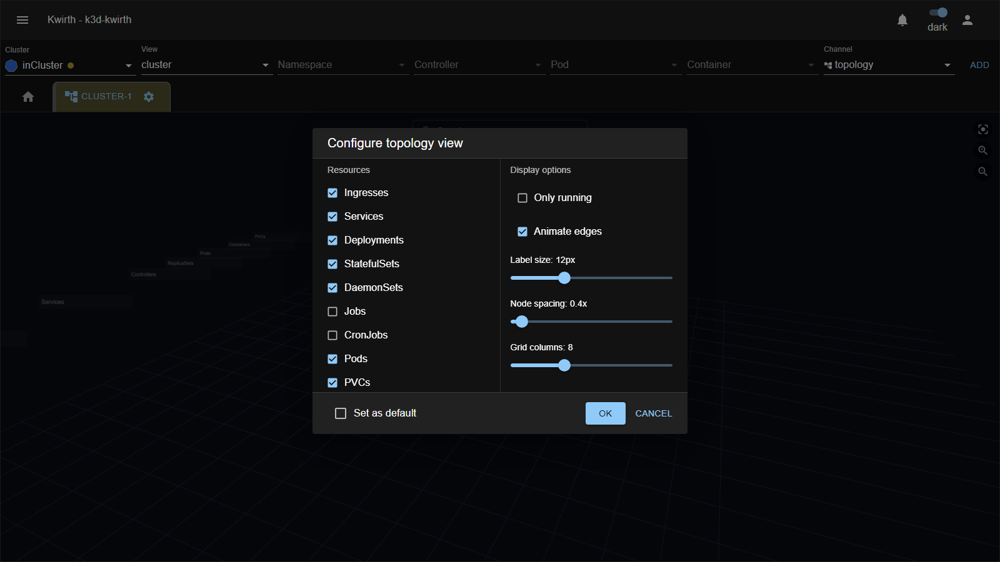
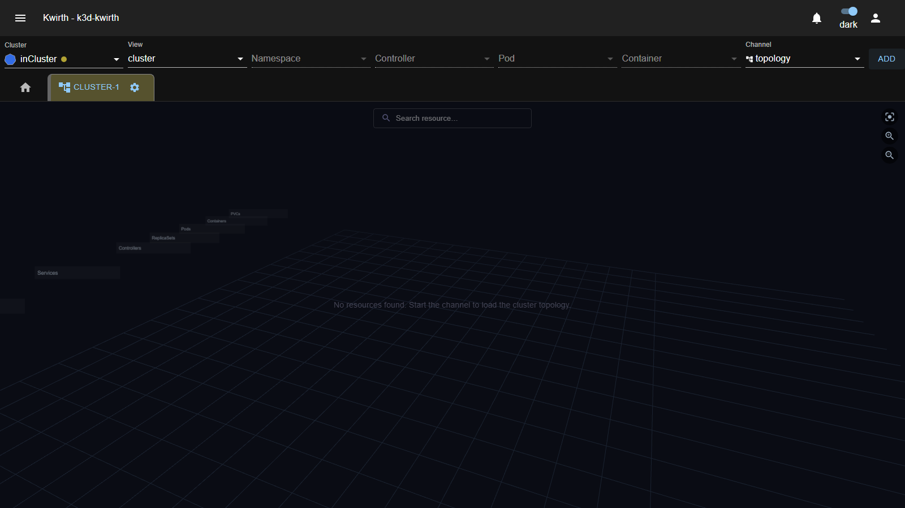
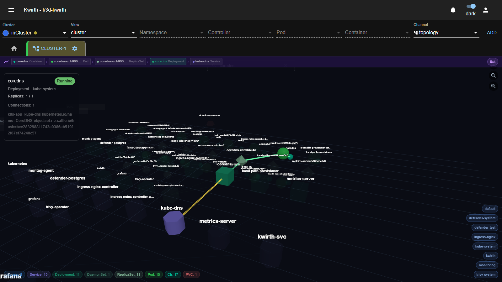
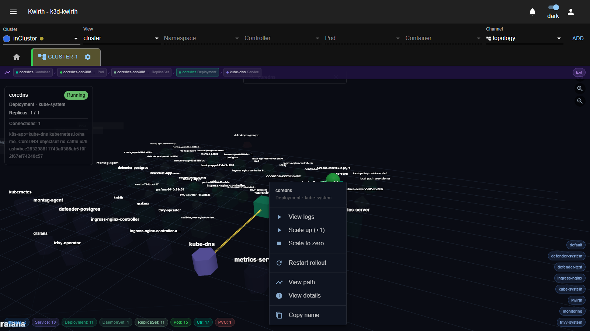

# 🕸️ Topology (plugin)

> **Type:** Plugin (channel) 
> **Package:** `@kwirthmagnify/kwirth-plugin-topology` 
> **Icon:** 🕸️

## Overview

The **Topology** channel draws a **live, interactive 3D map** of your cluster — Ingresses, Services, workloads (Deployments / StatefulSets / DaemonSets / Jobs / CronJobs), ReplicaSets, Pods, Containers and PersistentVolumeClaims — and the **relationships** between them. Resources are laid out in **layers** (Ingress at the top, PVCs at the bottom), colour-coded by **kind** and lit by **status**, so you can see the shape of an application at a glance and trace how traffic flows from an Ingress all the way down to a container.

It's not just a picture: you can **search**, **focus** a resource to highlight its connected subgraph, and **act** on nodes (open a shell, view logs, scale, restart, delete a pod, list endpoints/ingress rules) straight from the map.

## When to use it

- **Understand an unfamiliar namespace** — see every workload and how Services/Ingresses wire up to Pods.
- **Trace a request path** — from an Ingress → Service → Pod → Container, with the exact chain highlighted.
- **Spot trouble** — nodes glow by status, so failing/pending Pods stand out.
- **Operate in context** — scale a Deployment, restart a rollout, delete a stuck Pod, or jump to its logs/shell without leaving the map.

## Getting started

1. In the resource selector pick your **Cluster** and a **View** — choose **cluster** to map the whole cluster, or a **namespace** to focus on one.
2. Choose the **topology** channel and click **ADD**.
3. Open the tab's **⚙️** and choose **Start**. The **Configure topology view** dialog opens (see next section); press **OK** to render the map.

## Configuration

On start you choose **what to show** and **how to draw it**:

| Group | Control | What it does |
|---|---|---|
| **Resources** | Ingresses · Services · Deployments · StatefulSets · DaemonSets · Jobs · CronJobs · Pods · PVCs | Include/exclude each **kind** from the map. *(Jobs and CronJobs are off by default.)* |
| **Display options** | **Only running** | Hide anything not in a `Running` state. |
| | **Animate edges** | Animate the connection lines. |
| | **Label size** | Node label font size (8–20px). |
| | **Node spacing** | Spread nodes apart (0.2×–3.0×). |
| | **Grid columns** | How many nodes per row within a layer (2–20). |
| | **Set as default** | Remember this configuration for next time. |

## Reading the map

**Layers (top → bottom):** `Ingress → Services → Controllers → ReplicaSets → Pods → Containers → PVCs`. Each kind has its own **shape and colour** (e.g. Ingresses and Services are cylinders, workloads are cubes, Pods are spheres, PVCs sit at the bottom). A node's **glow** encodes its **status** (green = running, amber = pending, red = failed, …).

Around the canvas:

| Control | Where | What it does |
|---|---|---|
| **Search resource…** | top centre | Type to find a node; pick a suggestion to focus it. |
| **Reset camera / Zoom in / Zoom out** | top right | Camera controls. You can also **drag to rotate**, **scroll to zoom**, and **middle-drag to pan**. |
| **Kind chips** (e.g. `Pod: 15`, `Service: 10`, `PVC: 1`) | bottom left | Count per kind; **click a chip to show/hide** that kind. |
| **Namespace chips** | bottom right | **Click to show/hide** each namespace. |

### Filtering with the chips

Two rows of chips let you **declutter** the map without restarting the channel — handy on busy clusters:

- **Kind chips** (bottom-left) — one per resource **kind** present, each showing a **live count** (e.g. `Pod: 15`, `Service: 10`, `PVC: 1`, `Ctr: 17`). They're **colour-matched** to the nodes of that kind. **Click a chip to hide** that kind (it greys out with a strike-through); click again to show it. Hide `Container` or `Pod`, for instance, to see just the higher-level workloads and their wiring.
- **Namespace chips** (bottom-right) — one per **namespace** in scope (e.g. `kube-system`, `ingress-nginx`, `monitoring`…). **Click to hide/show** a whole namespace. On a cluster-wide map this is the fastest way to focus on the one or two namespaces you care about.

The two sets **combine**: hide the namespaces you don't need, then hide the kinds you don't need, and what remains is exactly the slice you're investigating. Your show/hide choices are **remembered** while the tab is open, and they also drive what the **search** and **path mode** consider.

## Focusing a resource (path mode)

**Click a node** (or pick it from search) to enter **path mode**: Kwirth highlights the **whole connected subgraph** — everything from the Ingress above it down to the containers/PVCs below — dims everything else, flies the camera in, and shows a **breadcrumb** of the chain at the top. A **node info panel** appears with the resource's details. Click **Exit** (or click empty space) to leave:

The **node info panel** shows what's relevant to the kind: name + **status**, kind · namespace, pod, **replicas** (ready/desired), image, host, ports, storage class / capacity / access modes (for PVCs), connection count and labels.

## Acting on a node

**Right-click any node** for a context menu. Every node offers **View path**, **View details** and **Copy name**; the rest depends on the kind:

| Kind | Actions |
|---|---|
| **Container** | **Open shell**, **View logs** |
| **Pod** | **View logs**, **Delete pod** |
| **Deployment / StatefulSet** | **View logs**, **Scale up (+1)**, **Scale to zero**, **Restart rollout** |
| **DaemonSet** | **View logs**, **Restart rollout** |
| **ReplicaSet** | **View logs** |
| **Service** | **Show endpoints** |
| **Ingress** | **Show rules** |

These tie the map into the rest of Kwirth: **Open shell** launches an **[Ops](ops)** session on that container, and **View logs** opens a **[Log](log)** tab scoped to the resource. **Show endpoints** / **Show rules** open a small side panel listing the Service's endpoints (IP:port) or the Ingress's host/path → service routing.

## Admin guide

- **Install / remove:** **☰ → Manage extensions → Plugins** → install **Topology**.
- **Permissions (scopes):** Topology uses the standard resource scopes — **`view`** (see the map), **`filter`**, and **`cluster`** (full access). See [Security & permissions](../../admin/04-security-and-permissions).
- **Mutating actions** (scale, restart, delete pod) change the cluster — grant them only to users you trust with write access (**`cluster`**).

## Notes

- The map is a **real 3D scene** (WebGL). Camera position and your show/hide choices are **remembered** while the tab is open.
- **Start it at the scope you need:** a single **namespace** gives a clean, focused map; **cluster** view gives the big picture but can get busy — use the kind/namespace chips to declutter.
- **Only running** is handy on noisy clusters to drop completed Jobs and terminating Pods from the view.

---

← Back to [Plugins (channels)](index)
