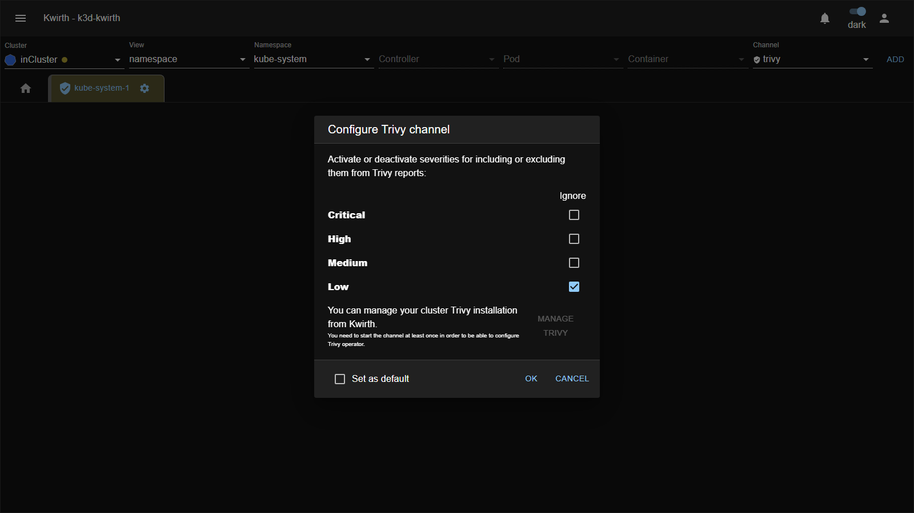
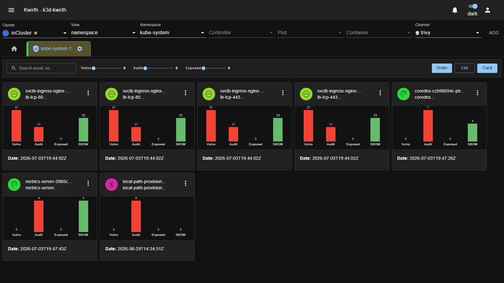
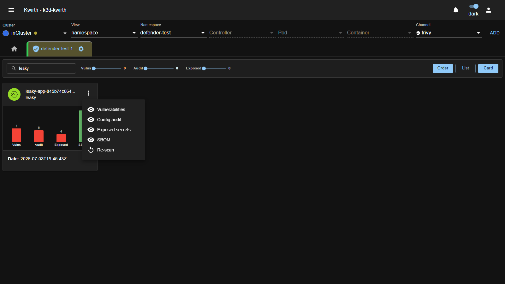
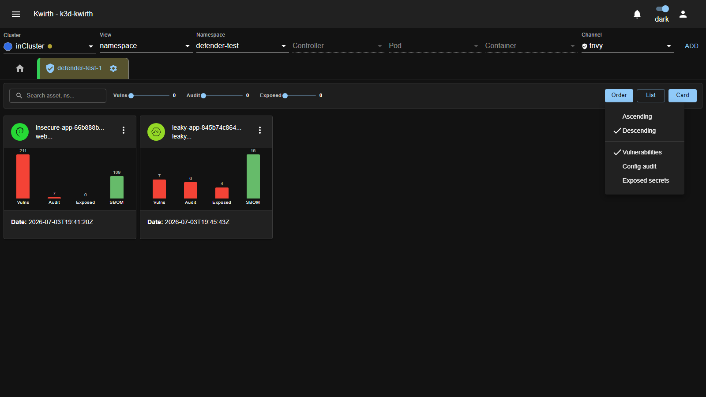
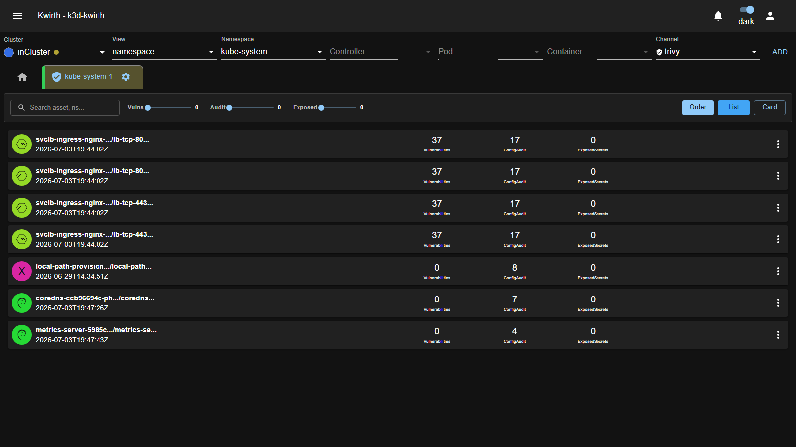
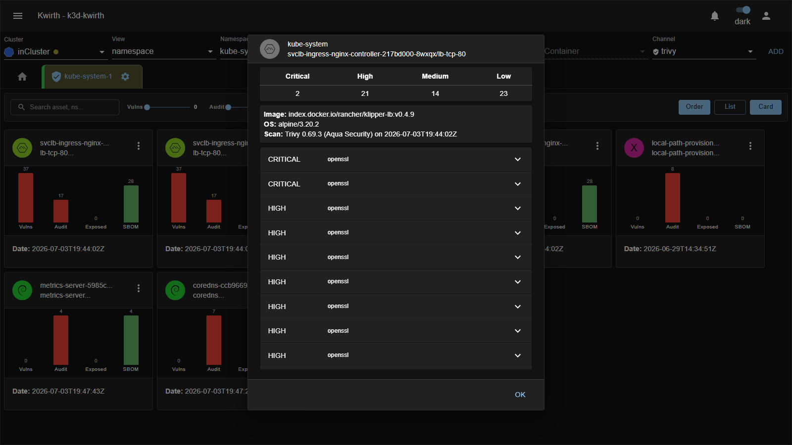
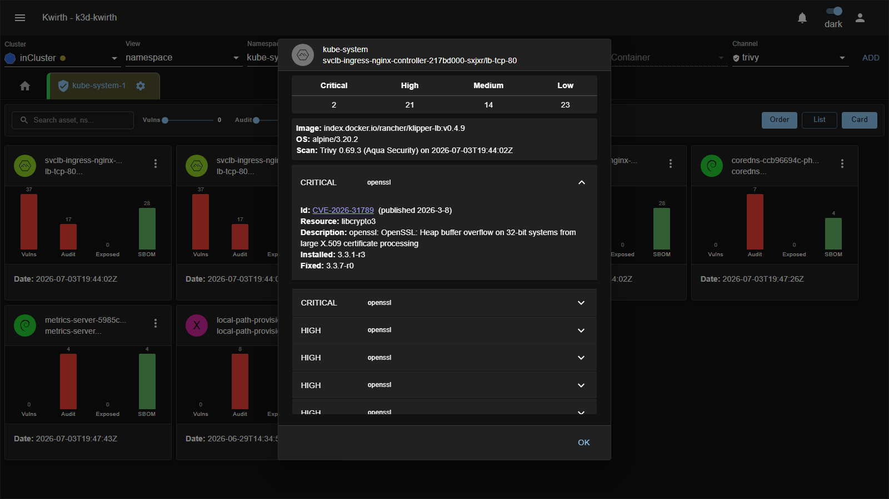
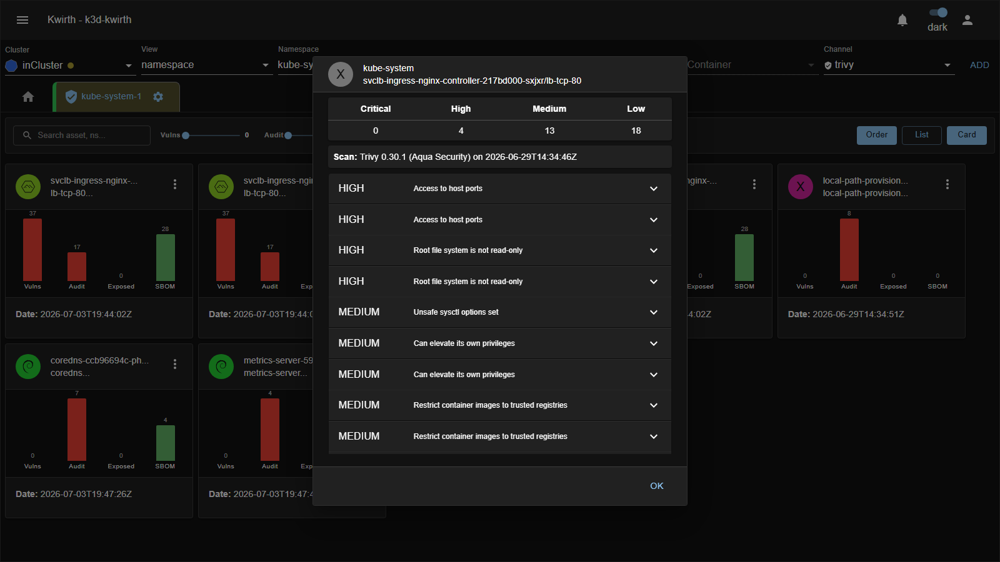
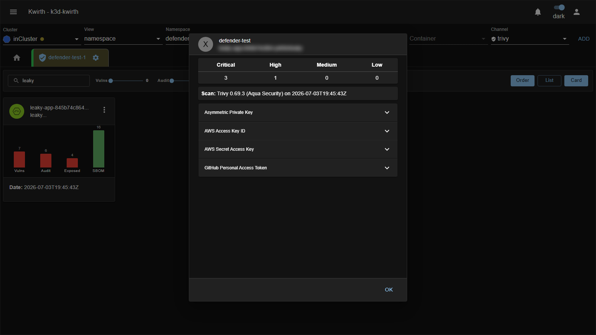
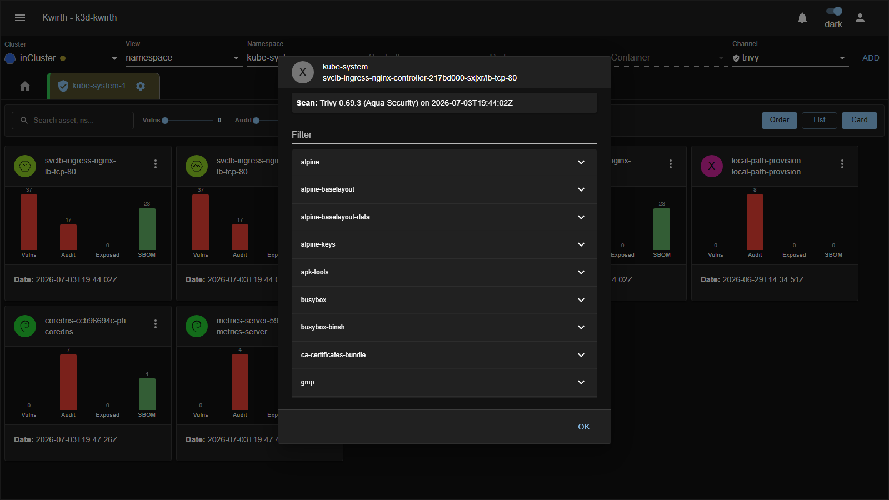

# 🛡️ Trivy (plugin)

> **Type:** Plugin (channel) 
> **Package:** `@kwirthmagnify/kwirth-plugin-trivy` 
> **Icon:** 🛡️

## Overview

The **Trivy** channel brings **security & vulnerability scanning** into Kwirth, powered by [Trivy OSS](https://trivy.io) (Aqua Security). It streams, in real time, the **vulnerabilities, config-audit findings, exposed secrets and SBOM** of the Kubernetes objects in your scope, and rolls them up into a **Kwirth Secure Score** you can tune.

As always, scope is flexible: you can assess the whole security posture of an **application** made of pods/replica sets/containers across namespaces, all at once.

> Trivy relies on the **Trivy Operator** running in the cluster. If it isn't installed, Magnify/Trivy can **deploy it for you** (see *Manage Trivy* below).

## When to use it

- See which **images have CVEs**, how critical, and whether a **fix** exists.
- Track **config-audit** issues and **exposed secrets** per workload.
- Get a single **security score** across a custom set of objects.

## Configuration

On **Start**, the config lets you choose **which severities count** — tick **Ignore** to exclude a severity from the reports/score (e.g. ignore *Low*):

| Control | What it does |
|---|---|
| **Ignore — Critical / High / Medium / Low** | Exclude that severity from reports and from the score. |
| **MANAGE TRIVY** | Install / manage the **Trivy Operator** in the cluster from Kwirth. *(You must start the channel once before you can configure the operator.)* |
| **Set as default** | Remember this configuration. |

## The cards view

Once started you get one **card per object**. Each card shows the object **icon** and **name**, a mini **bar chart** with four bars — **Vulns** (vulnerabilities), **Audit** (config-audit findings), **Exposed** (exposed secrets) and **SBOM** (packages in the software bill of materials) — and the **scan date** at the bottom:

Red bars are **findings** (higher = worse); the green **SBOM** bar is just the package count (informational, not a risk). At a glance you can compare the security posture of every object in your scope side by side.

## Filtering & sorting

The toolbar is where you narrow the view and change the order — this is the part worth mastering:

### Text filter

The **Search asset, ns…** box is a free-text filter. Type any fragment of an **asset name** or **namespace** and the view keeps only the matching cards, live as you type. For example, typing `leaky` leaves just the `leaky-app` object:

### Count filters (sliders)

The three sliders — **Vulns**, **Audit** and **Exposed** — are **minimum-count** filters. Each one hides every card whose count for that dimension is **below** the slider value, so you can zoom in on the objects that actually matter:

| Slider | Keeps cards with… | Typical use |
|---|---|---|
| **Vulns** | at least *N* vulnerabilities | Hide clean images, focus on the vulnerable ones. |
| **Audit** | at least *N* config-audit findings | Surface misconfigured workloads. |
| **Exposed** | at least *N* exposed secrets | Jump straight to objects leaking credentials. |

The sliders **combine** (logical AND) with each other and with the text box: e.g. set **Vulns ≥ 50** *and* type a namespace to see only the heavily-vulnerable objects in it. Leave a slider at **0** to disable that condition.

### Sorting (Order)

**Order** opens a small menu with two groups — a **direction** and a **criterion**:

- **Direction:** **Ascending** or **Descending** (a check marks the active one).
- **Criterion:** sort the cards by **Vulnerabilities**, **Config audit** or **Exposed secrets** count.

So *Descending + Vulnerabilities* (the default) puts the most vulnerable objects first — the usual triage order. Pick *Exposed secrets* to float credential leaks to the top.

### List vs Card layout

The **List / Card** toggle switches the layout. **Card** (the default) is the visual grid above; **List** is a dense, one-row-per-object table with the same **Vulnerabilities / ConfigAudit / ExposedSecrets** counts and scan date — better when you have many objects and want to scan the numbers quickly. The **⋮ menu** is available in both layouts:

## Per-object reports (the ⋮ menu)

Every card (in either layout) has a **⋮ menu** that opens a detailed report for **that object**:

| Item | Opens |
|---|---|
| **Vulnerabilities** | The full CVE report (see below). |
| **Config audit** | Kubernetes misconfiguration checks. |
| **Exposed secrets** | Secrets Trivy detected inside the image. |
| **SBOM** | The software bill of materials (all packages). |
| **Re-scan** | Re-evaluate the object right now. |

*(An item is **greyed out** when there's nothing to show — e.g. **Exposed secrets** is disabled on objects with 0 exposed secrets.)*

### Vulnerabilities

Opening **Vulnerabilities** shows a **severity summary** (Critical / High / Medium / Low counts), the **image**, **OS** and **scan** info (Trivy version + timestamp), and the **list of CVEs** grouped by severity, each expandable:

Expand a CVE to see its specifics — **CVE id** (linked to its advisory), the affected **resource/package**, a **description**, the **installed** version and the **fixed** version so you know exactly what to upgrade to:

### Config audit

**Config audit** lists the **Kubernetes misconfiguration** checks Trivy ran against the object — each row is a finding with its **severity** (HIGH / MEDIUM / LOW) and a short title (e.g. *Access to host ports*, *Root file system is not read-only*, *Can elevate its own privileges*). The header keeps the same Critical/High/Medium/Low summary and scan info. Expand a row for the full explanation and remediation:

### Exposed secrets

**Exposed secrets** reports **credentials Trivy found baked into the image** — a serious finding, since anything here ships inside the container. Each row names the **kind** of secret detected (e.g. *AWS Access Key ID*, *AWS Secret Access Key*, *GitHub Personal Access Token*, *Asymmetric Private Key*) and expands to the location and the matched value:

> **Handle with care.** The report shows the **actual secret material**. Treat any hit as a **compromised credential**: rotate it, remove it from the image (use build secrets / mounted secrets instead of baking them in), and re-scan. *(The screenshot above is intentionally blurred.)*

### SBOM

**SBOM** (Software Bill of Materials) lists **every package** Trivy inventoried in the image — OS packages and language dependencies alike (e.g. `alpine`, `busybox`, `ca-certificates-bundle`, …). Use the **Filter** box at the top to find a specific package, and expand any entry for its version details. The SBOM is the raw inventory the vulnerability scan is built on:

### Re-scan

**Re-scan** asks the Trivy Operator to **re-evaluate the object immediately**, instead of waiting for the next scheduled scan. The card is briefly **cleared** while the fresh scan runs and reappears with an updated **scan date** and counts. Use it after you've pushed a fixed image or rotated a leaked secret to confirm the finding is gone.

## Admin guide

- **Install / remove:** **☰ → Manage extensions → Plugins** → install **Trivy**.
- **Trivy Operator:** the channel needs the **Trivy Operator** in the target cluster. Use **MANAGE TRIVY** in the config (after starting once) to deploy/manage it — no manual Helm needed.
- **Permissions:** grant the Trivy scopes on the target objects — **`trivy$workload`** (scan workloads) and/or **`trivy$kubernetes`** (scan cluster objects). See [Security & permissions](../../admin/04-security-and-permissions).

## Notes

- Findings come from the **Trivy Operator**'s reports, streamed live — as scans refresh, the cards update.
- The **score** reflects your **Ignore** choices: ignoring a severity removes it from the calculation, so tune it to your risk appetite.

---

← Back to [Plugins (channels)](index)
