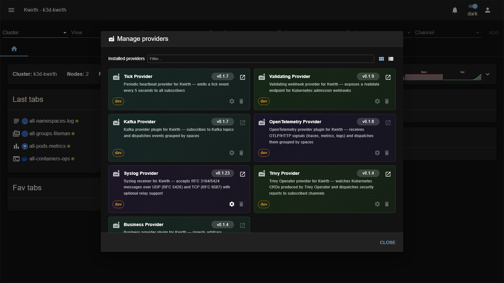

# Providers (data sources)

> **Type:** Providers · **Managed from:** ☰ → Manage extensions → Providers

## What a provider is

A **provider** is a **data source**. It sits between an external system (the Kubernetes API, a Kafka broker, an OTLP exporter, a business app…) and Kwirth's **channels**, and streams events into the platform. Channels **subscribe** to providers; a single provider instance can feed many channels at once.

You rarely interact with a provider directly — instead you pick a **channel** (Log, Metrics, Alert, Censor, Pinocchio…) and it consumes the provider it needs behind the scenes. Providers matter to **admins** who want to bring **new kinds of data** into Kwirth or tune how existing data is collected.

Why the indirection?

- **Isolation** — channels aren't coupled to the Kubernetes API or any external system.
- **Efficiency** — one stream per provider is fanned out to all subscribers, so load on the source (e.g. the API server) stays low.
- **Enrichment** — custom providers can inject **external** data (business events, IoT, third-party feeds) into the Kwirth ecosystem.

*(For the architecture diagram and the developer API, see the reference [Providers](../../providers/index) section.)*

## Built-in providers

These ship with the Kwirth core — nothing to install:

| Provider | What it streams | Consumed by |
|---|---|---|
| **Events** | A Kwirth event whenever a **Kubernetes cluster event** occurs (Pod created, Deployment scaled, node pressure…). | Alert, Censor, Pinocchio, Topology… |
| **Metrics** | Cluster-wide **resource metrics** polled from the kubelet/cAdvisor API on a configurable interval. | Metrics, Magnify |
| **Business** | External **business data** ingested via HTTP `POST`, routed to channels by **space / type**. | Alert, Censor, Pinocchio |

## Installable provider plugins

Add these from **☰ → Manage extensions → Providers**:

| Provider | What it does | Notes / key config |
|---|---|---|
| **[Tick](tick)** | Fires a **heartbeat** every few seconds. | Great for testing channel subscriptions; no real config. |
| **[Validating](validating)** | Emits an event whenever the Kubernetes API calls a **Validating webhook** — lets Kwirth observe admission decisions. | Register it as a validating webhook target. |
| **[Kafka](kafka)** | Connects to one or more **Kafka** broker sets and distributes topic messages to channels using the same **space/type** routing as Business. | Broker list, topics, credentials. |
| **[OpenTelemetry](otel)** | Turns Kwirth into an **OTLP/HTTP receiver** — any OTel-instrumented service can push **traces, metrics and logs** straight to Kwirth. | OTLP endpoint/port. |
| **[Syslog](syslog)** | Receives **syslog** messages and streams them into channels. | Listen protocol/port, framing, relay. |
| **[Trivy](trivy)** | Watches the **Trivy Operator** CRDs and streams vulnerability / config-audit / secret findings. | Backs the **[Trivy](../plugins/trivy)** channel. |
| **[Sample](sample)** | Reference implementation for **provider developers**. | Starting point for custom providers. |

*(Each provider's exhaustive configuration lives in the reference [Provider reference](../../providers/reference/index).)*

## Managing & configuring providers

Open **☰ → Manage extensions → Providers**. Each installed provider is a **card** showing its name, version and description, with a **⚙️ gear** (configure) and a **🗑️ delete** action:

Providers that connect to something external expose their settings behind the **gear**. For example, the **Syslog** provider lets you set the **listen Port**, the **Protocol** (UDP / TCP / both), **TCP framing**, queue/parallelism limits and optional **relay targets**:

Install a new provider from the **Install provider** field at the bottom (paste a package URL or **Browse**).

## Admin guide

- **Install / enable / remove:** all providers are managed from **☰ → Manage extensions → Providers**, using the common flow described in [Extending Kwirth](../../admin/08-extending-kwirth).
- **Configuration:** providers that talk to external systems (**Syslog**, **Kafka**, **OpenTelemetry**, **Business**) expose their connection settings behind the card's **gear**; built-in providers (Events, Metrics) are always available.
- **Security:** a provider can bring **external, untrusted data** into Kwirth — treat provider endpoints (Business `POST`, OTLP, Syslog) like any ingress and protect them accordingly.

## Notes

- Providers have **no channel tab of their own** — you configure them from the **provider manager** and see their data **through the channels** that subscribe to them.
- The **Trivy** provider is what makes the Trivy channel work; installing the channel pulls in the data path via this provider.

---

← Back to [Extension manuals](../index)
