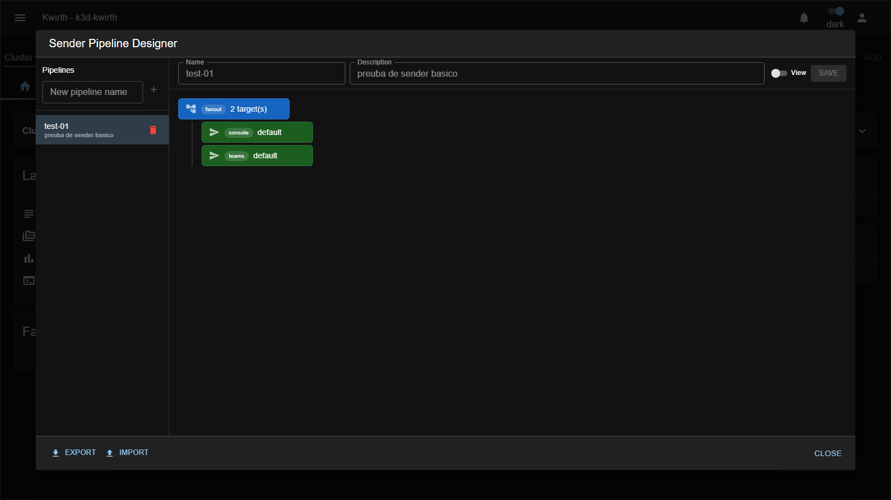

# composite (sender)

> **Type:** Sender (pipeline) · **Package:** `@kwirthmagnify/kwirth-sender-composite`

## What it does

The **composite** sender lets you build a **complete notification flow** — fan-out, filtering and delivery — as a **single pipeline**, using a **visual editor**: the **Sender Pipeline Designer**. Instead of wiring several standalone pipeline senders together and referencing them by hand, you draw the whole flow as a **tree of nodes** and save it as one composite config.

## The Sender Pipeline Designer

Open it from **☰ → Manage extensions → Senders → composite → ⚙️**. On the left is your list of **pipelines** (create with **New pipeline name → ＋**, delete with 🗑️); pick one to edit it on the canvas:

At the top you set the pipeline's **Name** and **Description**, toggle **View**, and **Save**. **Export / Import** (bottom) move pipelines as JSON. The canvas shows the flow as a tree you build from three kinds of node:

| Node | Colour | What it does |
|---|---|---|
| **fanout** (tee) | blue | **Branches** the message to **every child** below it — deliver to several places at once. Shows its child count (*"2 target(s)"*). |
| **filter** (regex) | — | **Routes or drops** by regex rules before passing the message down (a [regex](regex) gate inside the tree). |
| **ref** | green | A **reference to a delivery sender** — an existing `senderId::configName` (e.g. `console default`, `teams default`). This is where the message actually goes out. |

In the example above, a **fanout** branches to two **ref** nodes — `console::default` **and** `teams::default` — so every message is delivered to both the console and a Teams channel from a single composite config.

## Building a flow

1. **New pipeline name → ＋** to create a pipeline (give it a Name/Description).
2. Add nodes to shape the flow: a **fanout** to branch, a **filter** to gate, and **ref** leaves for the actual destinations.
3. Nest freely — e.g. *filter (only errors) → fanout → [email, teams]*, or branch to different destinations under different filters.
4. **Save**. The pipeline is now selectable wherever a channel offers a **Sender config** picker.

## Notes

- Composite is the most powerful sender — think of it as the **whole delivery graph** for a channel, authored visually in one place.
- For simple cases a standalone **[tee](tee)**, **[regex](regex)** or **[timed](timed)** config is enough; reach for `composite` when the flow has multiple branches/filters you want to see and manage together.
- Pipelines are portable via **Export / Import**.

---

← Back to [Senders](index)
