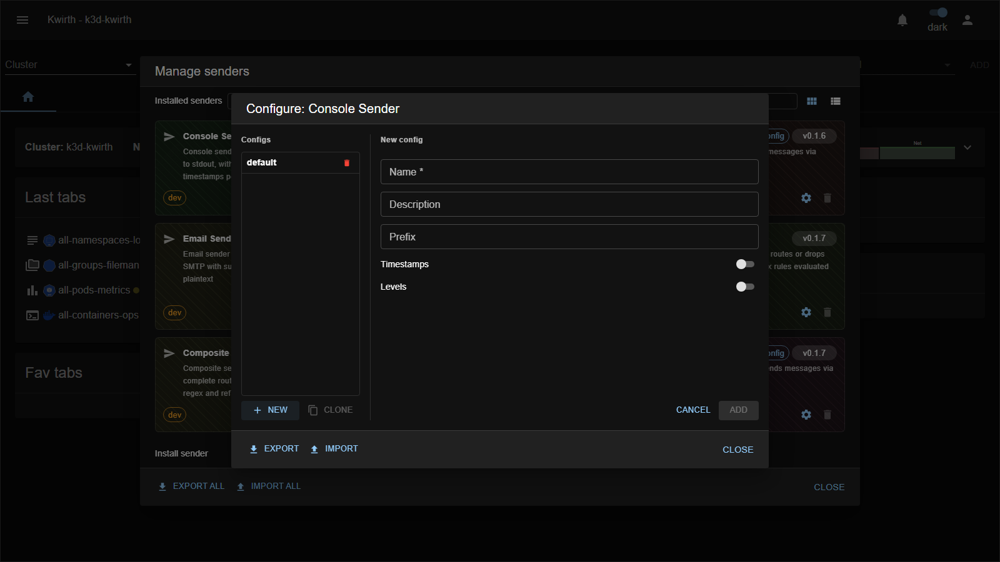

# console (sender)

> **Type:** Sender · **Package:** `@kwirthmagnify/kwirth-sender-console`

## What it does

The **console** sender writes each message to the **Kwirth server's stdout/stderr**. It's the simplest sink — no external system, no credentials — which makes it ideal for **testing** a channel's output or for capturing messages in the pod logs.

## Configuration

Add a named config from **☰ → Manage extensions → Senders → console → ⚙️ → New**:

| Field | Type | What it does |
|---|---|---|
| **Name** * | text | Config name (referenced as `console::<name>`). |
| **Description** | text | Free-text note. |
| **Prefix** | text | Text prepended to every line. |
| **Timestamps** | toggle | Prefix each line with a timestamp. |
| **Levels** | toggle | Include the message **level** (info/warning/error…) and colourise. |

## Notes

- No credentials — safe to enable anywhere; great as the **first sender** to prove the pipeline (e.g. from **[Echo](../plugins/echo)** or **[Alert](../plugins/alert)**).
- Output lands wherever the Kwirth backend's stdout goes (typically the pod logs).

---

← Back to [Senders](index)
