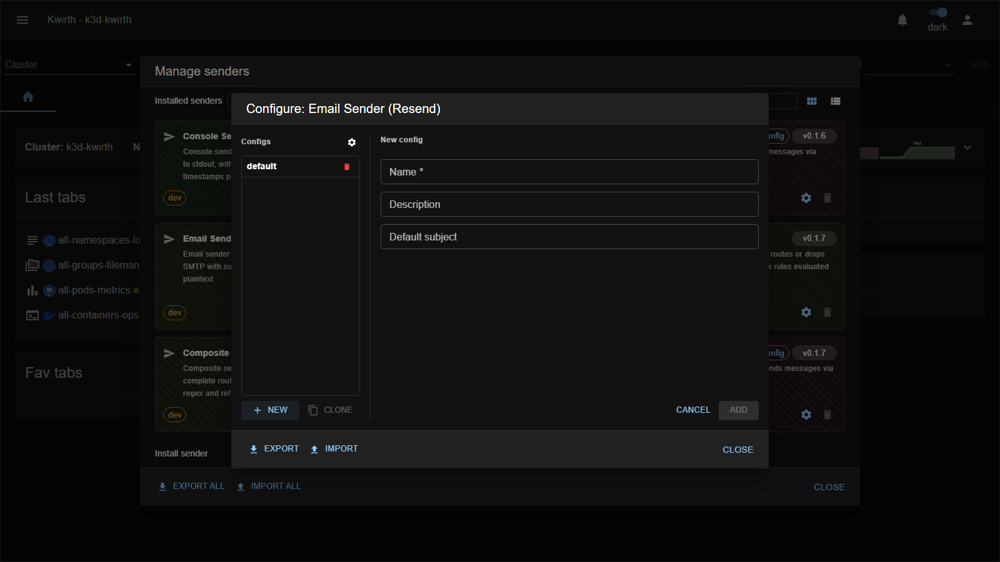

# email-resend (sender)

> **Type:** Sender · **Package:** `@kwirthmagnify/kwirth-sender-email-resend`

## What it does

The **email-resend** sender delivers messages as **email via the [Resend](https://resend.dev) API** — no SMTP server needed, just a Resend API key. A convenient alternative to `email-smtp` when you already use Resend.

## Configuration

The **connection** fields are **shared** across configs (⚙️ gear next to _Configs_); the **subject** is per-config:

**Connection (shared):**

| Field | Type | What it does |
|---|---|---|
| **API key** * | password | Your Resend API key. |
| **From address** | text | Sender address (must be a Resend-verified domain). |
| **To address** * | text | Recipient(s). |

**Per-config:**

| Field | Type | What it does |
|---|---|---|
| **Name** * | text | Config name (`email-resend::<name>`). |
| **Default subject** | text | Subject used when a message has none. |

## Notes

- The **API key** is a credential — treat the sender config as a secret.
- Use `email-smtp` instead if you prefer your own mail relay.

---

← Back to [Senders](index)
