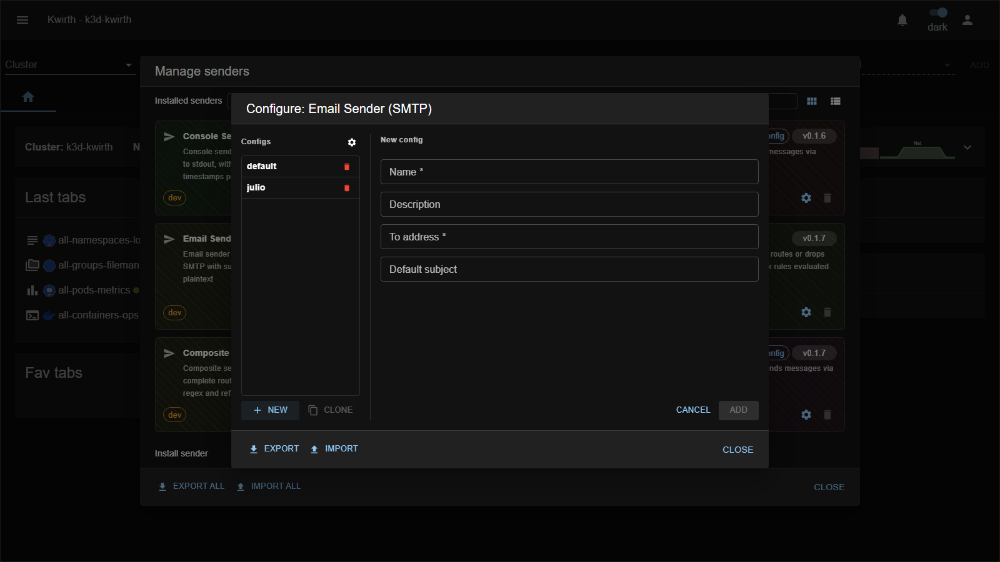
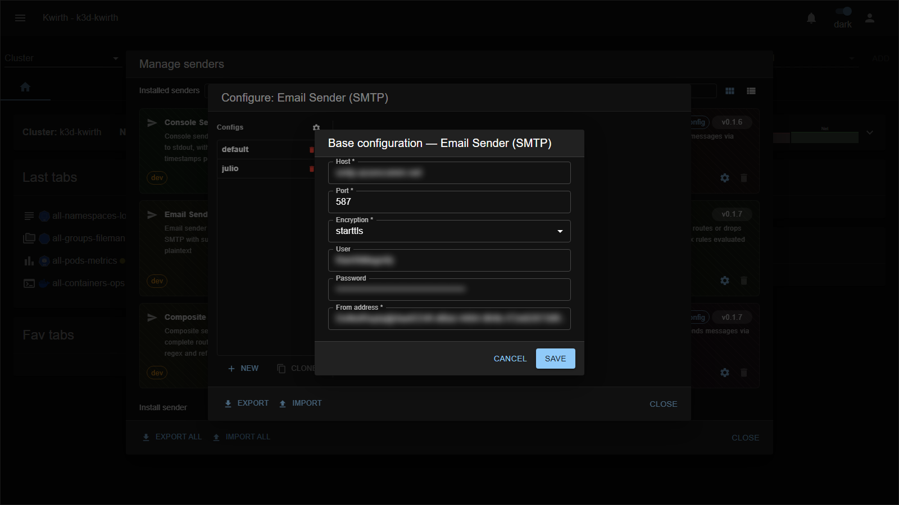

# email-smtp (sender)

> **Type:** Sender · **Package:** `@kwirthmagnify/kwirth-sender-email-smtp`

## What it does

The **email-smtp** sender delivers messages as **email via an SMTP server**, with support for TLS / STARTTLS / plain and optional authentication. Point it at your mail relay to turn alerts into emails.

## Configuration

Its fields split in two groups. The **connection** settings are **shared** across all this sender's configs (set them via the **⚙️ gear next to _Configs_**); the **per-config** fields differ per named config (New form):

**Connection (shared)** — the **Base configuration** dialog (⚙️ gear next to _Configs_):

| Field | Type | What it does |
|---|---|---|
| **Host** * | text | SMTP server hostname. |
| **Port** * | number | SMTP port (e.g. 465, 587, 25). |
| **Encryption** * | select | `tls` · `starttls` · `plain`. |
| **User** | text | SMTP username (omit for unauthenticated relays). |
| **Password** | password | SMTP password. |
| **From address** * | text | Envelope/from address. |

**Per-config:**

| Field | Type | What it does |
|---|---|---|
| **Name** * | text | Config name (`email-smtp::<name>`). |
| **To address** * | text | Recipient(s). |
| **Default subject** | text | Subject used when a message has none. |

## Notes

- Keep **several configs** for different recipients (e.g. `email-smtp::oncall`, `email-smtp::team`) sharing the same connection.
- The **password** is a credential — stored as sender config; protect access to the manager.

---

← Back to [Senders](index)
