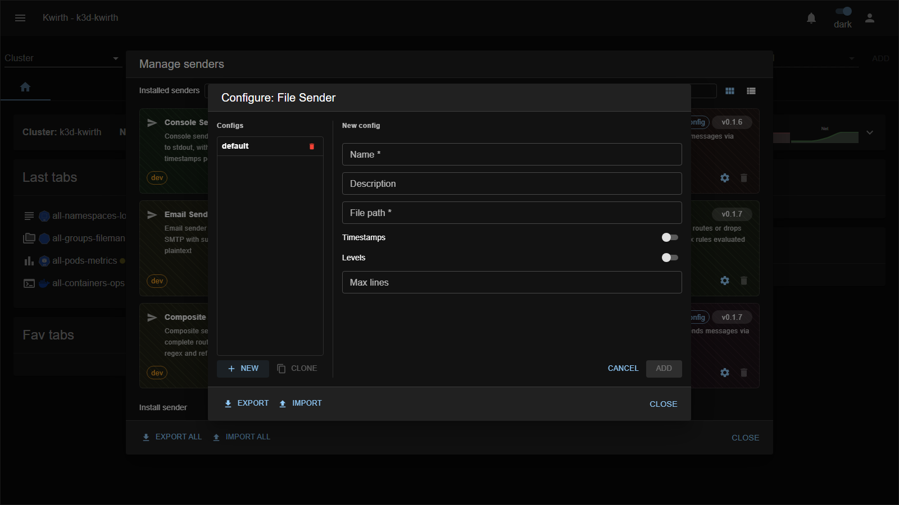

# file (sender)

> **Type:** Sender · **Package:** `@kwirthmagnify/kwirth-sender-file`

## What it does

The **file** sender appends each message to a **file** on the Kwirth server, with optional rotation by line count. Use it to keep a durable local record of alerts/output.

## Configuration

| Field | Type | What it does |
|---|---|---|
| **Name** * | text | Config name (`file::<name>`). |
| **Description** | text | Free-text note. |
| **File path** * | text | Absolute path of the file to append to (inside the Kwirth backend). |
| **Timestamps** | toggle | Prefix each line with a timestamp. |
| **Levels** | toggle | Include the message level. |
| **Max lines** | number | Cap the file size; older lines are rotated out beyond this. |

## Notes

- The path is **on the Kwirth backend** — mount a volume there if you want the file to survive pod restarts.
- Combine with **[tee](tee)** to write to a file **and** notify elsewhere at the same time.

---

← Back to [Senders](index)
