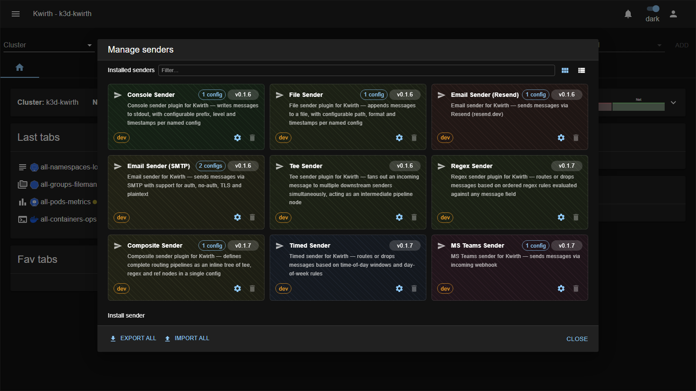
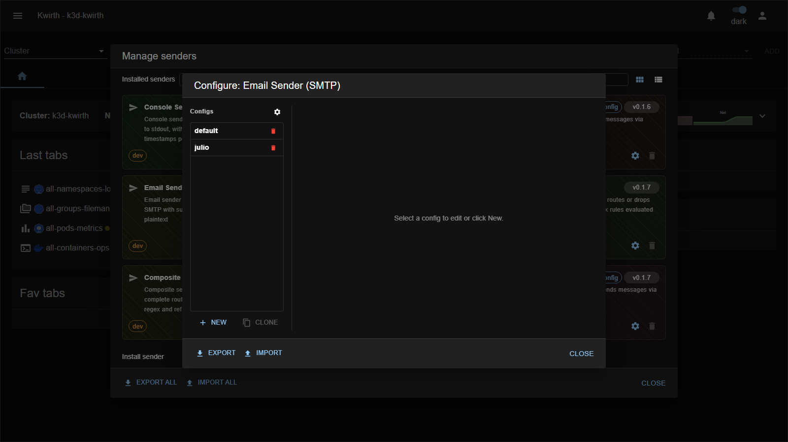

# Senders (output destinations)

> **Type:** Senders · **Managed from:** ☰ → Manage extensions → Senders

## What a sender is

A **sender** is an **output adapter**. When a channel or provider needs to push something out of Kwirth — an alert email, a Teams message, a line to a log file — it hands the message to a sender, which knows how to deliver it to that specific destination. Senders are **fire-and-forget**: they send, they don't receive.

The key ideas:

- Each sender has an **id** (`console`, `email-smtp`, …) and holds one or more **named configurations**. For example, one `email-smtp` sender can carry a `default` config and a `oncall` config pointing at different mailboxes.
- Channels reference a sender by **`senderId` + config name** (you'll see a **"Sender config"** picker in channels like **[Alert](../plugins/alert)**, **[Censor](../plugins/censor)** and **[Echo](../plugins/echo)**).
- Some senders don't deliver anywhere themselves — they **wrap other senders** to add behaviour (fan-out, rate-limiting, batching, filtering). That's the **pipeline** pattern.

## Delivery senders

These deliver a message to a real destination:

| Sender | Delivers to | Key config |
|---|---|---|
| **console** | The Kwirth server's **stdout/stderr**. | *(none — great for testing)* |
| **file** | A **rotating log file** on the server. | File path, rotation. |
| **email-smtp** | **Email** via an SMTP server. | Host, port, user, password, from, to. |
| **email-resend** | **Email** via the **Resend** API. | API key, from, to. |
| **teams** | A **Microsoft Teams** channel. | Incoming webhook URL. |

## Pipeline senders

These don't deliver on their own — they **compose or shape** the flow, then pass it to other senders:

| Sender | What it does | Key config |
|---|---|---|
| **tee** | Fans an incoming message out to **multiple downstream senders** simultaneously. | List of target `sender::config`. |
| **regex** | **Routes or drops** messages by **ordered regex rules** evaluated against any message field. | Ordered rules + downstream targets. |
| **timed** | **Routes or drops** messages by **time-of-day windows** and **day-of-week** rules. | Time windows / days + downstream. |
| **ratelimit** | **Throttles** delivery to a maximum rate to avoid flooding a destination. | Rate/window + downstream sender. |
| **composite** | Defines a **complete routing pipeline** as an inline tree of **tee / regex / ref** nodes in a single config. | Pipeline tree. |

*(Each sender's exhaustive field list lives in the reference [Sender reference](../../senders/reference/index).)*

## Managing & configuring senders

Open **☰ → Manage extensions → Senders**. Each sender is a **card** showing its description, how many **configs** it holds, and a **⚙️ gear** / **🗑️ delete**:

1. Click a sender's **gear** to open its config manager. Each sender keeps a **list of named configs** — pick one to edit, **New** to add, **Clone** to copy, and **Export/Import** to move configs as JSON:

2. Kwirth renders the config form from the **sender's own field schema**, so every field is typed (text / number / password / select) — no guesswork.
3. Once saved, that `senderId::configName` pair is selectable anywhere a channel offers a **Sender config** picker.

You can keep **many configs per sender** (above, `email-smtp` has `default` and `julio`) and reference whichever one you need per channel. The whole set can be moved between clusters with **Export all / Import all** at the bottom of the manager.

## Using senders from a channel

Channels that can emit output expose a **Sender config** selector in their setup/config:

- **[Alert](../plugins/alert)** — deliver an alert when a log line matches.
- **[Censor](../plugins/censor)** — route censored/flagged output onward.
- **[Echo](../plugins/echo)** — the easiest way to **test** a sender end-to-end: start Echo with a sender selected and watch the destination receive its heartbeat.

## Admin guide

- **Install / enable / remove:** from **☰ → Manage extensions → Senders**, using the common flow in [Extending Kwirth](../../admin/08-extending-kwirth).
- **Secrets:** SMTP passwords, Resend API keys and Teams webhook URLs are stored as sender config — treat them as credentials.
- **Testing:** use the **console** sender (no config) or **Echo + a sender** to validate delivery before wiring it into alerts.

## Notes

- Senders are **backend-only** — there's no per-sender channel tab; you configure them centrally and reference them from channels/providers.
- Combine pipeline senders for real workflows: e.g. **ratelimit → composite → (email-smtp + teams)** to notify two places at a capped rate.

---

← Back to [Extension manuals](../index)
