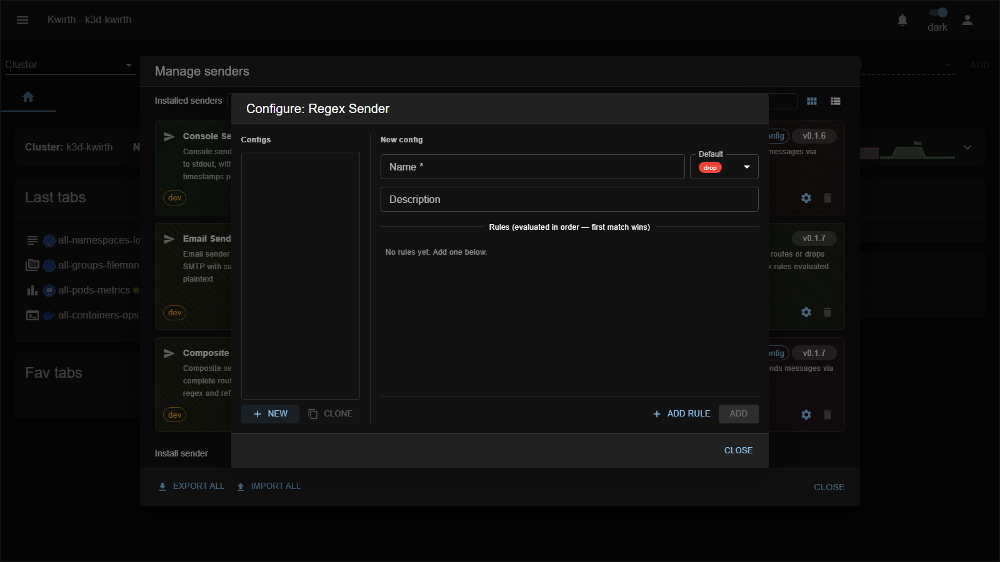

# regex (sender)

> **Type:** Sender (pipeline) · **Package:** `@kwirthmagnify/kwirth-sender-regex`

## What it does

The **regex** sender is a **pipeline gate**: it **routes or drops** each message based on **ordered regular-expression rules** evaluated against any message field. It's how you filter *what* gets delivered — e.g. only forward `error`-level lines, or drop anything matching a noisy pattern.

## Configuration

| Field | Type | What it does |
|---|---|---|
| **Name** * | text | Config name (`regex::<name>`). |
| **Default** | select | What to do when **no rule matches**: **drop** or **send**. |
| **Description** | text | Free-text note. |
| **Rules** | list | Ordered rules — **first match wins**. Each rule matches a **field** against a **pattern** and decides the action (send/drop, forward to a target). Use **Add rule** to append. |

## Notes

- **Order matters** — rules are evaluated top-to-bottom and the **first match wins**; put your most specific rules first.
- Set **Default = drop** for an allow-list (only explicitly-matched messages pass) or **send** for a deny-list (everything passes except matched noise).

---

← Back to [Senders](index)
