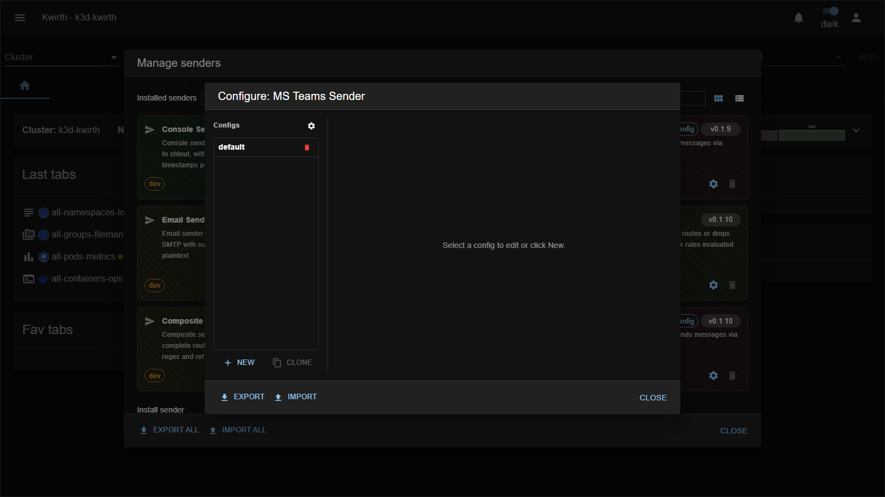
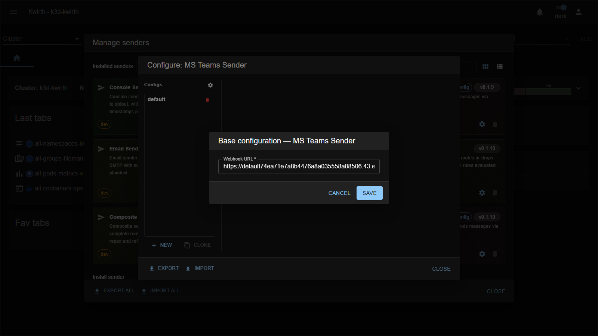

# teams (sender)

> **Type:** Sender 
> **Package:** `@kwirthmagnify/kwirth-sender-teams`

## What it does

The **teams** sender posts messages to a **Microsoft Teams** channel through an **incoming webhook**. Turn Kwirth alerts into Teams notifications.

## Configuration

The **webhook URL** is a **shared** connection setting (⚙️ gear next to _Configs_); the **default title** is per-config:

**Connection (shared)** — the **Base configuration** dialog (⚙️ gear next to _Configs_):

| Field | Type | What it does |
|---|---|---|
| **Webhook URL** * | text | The Teams channel's incoming-webhook URL. |

**Per-config:**

| Field | Type | What it does |
|---|---|---|
| **Name** * | text | Config name (`teams::<name>`). |
| **Default title** | text | Card title used when a message has none. |

## Notes

- Create the incoming webhook in Teams first (channel → connectors), then paste its URL here.
- The webhook URL is effectively a credential — anyone with it can post to the channel.

---

← Back to [Senders](index)
