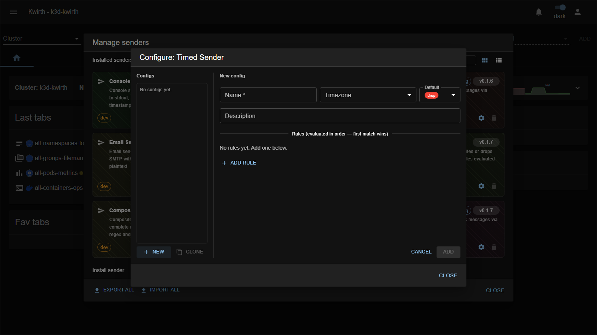

# timed (sender)

> **Type:** Sender (pipeline) 
> **Package:** `@kwirthmagnify/kwirth-sender-timed`

## What it does

The **timed** sender is a **pipeline gate on the clock**: it **routes or drops** messages by **time-of-day windows** and **day-of-week** rules. Use it to send alerts to the on-call address only outside business hours, or to mute a noisy destination overnight.

## Configuration

| Field | Type | What it does |
|---|---|---|
| **Name** * | text | Config name (`timed::<name>`). |
| **Timezone** | select | The timezone the windows are evaluated in. |
| **Default** | select | Action when **no rule matches**: **drop** or **send**. |
| **Description** | text | Free-text note. |
| **Rules** | list | Ordered time rules — **first match wins**. Each defines a **time-of-day window** and **days of the week** and an action/target. **Add rule** to append. |

## Notes

- Pick the right **Timezone** — windows are relative to it, not the server's UTC.
- Chain a `timed` in front of a delivery sender (via **[tee](tee)** / **[composite](composite)**) to make time-aware routing.

---

← Back to [Senders](index)
