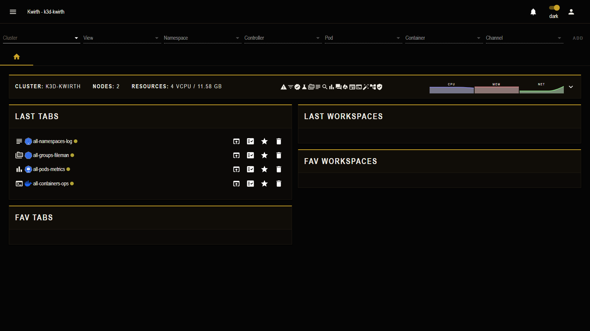

# Avicii (theme)

> **Type:** Theme · **Look:** dark geometric, warm gold

## What it looks like

**Avicii** is a dark, geometric theme: **warm gold accents** on black, sharp edges, triangle motifs and condensed **Oswald** typography. It gives the whole UI a bold, high-contrast identity:

Notice the gold section headers, gold home icon and gold toggles — every accent shifts from the default blue to gold.

## Applying it

**☰ → Manage extensions → Themes → Avicii → Activate.** The UI restyles instantly; activate a different theme (or none) to switch back.

## Notes

- Purely **cosmetic** — no effect on data or behaviour.
- Pairs with the matching **[Avicii homepage](../homepages/index)** for a consistent look.

---

← Back to [Themes](index)
