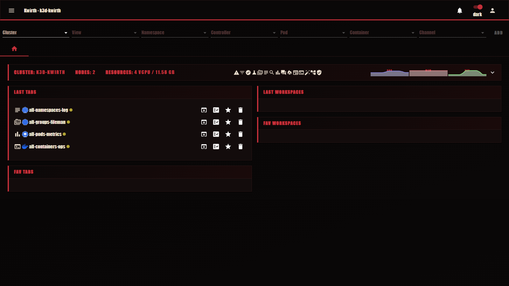
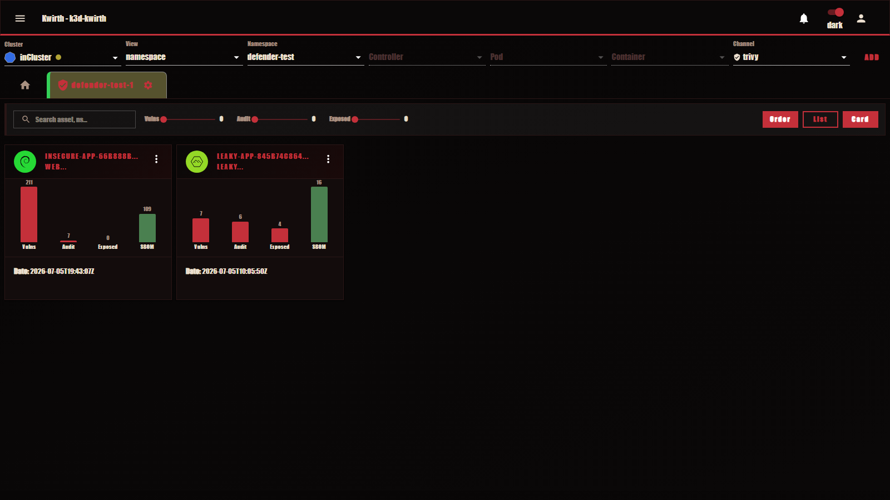
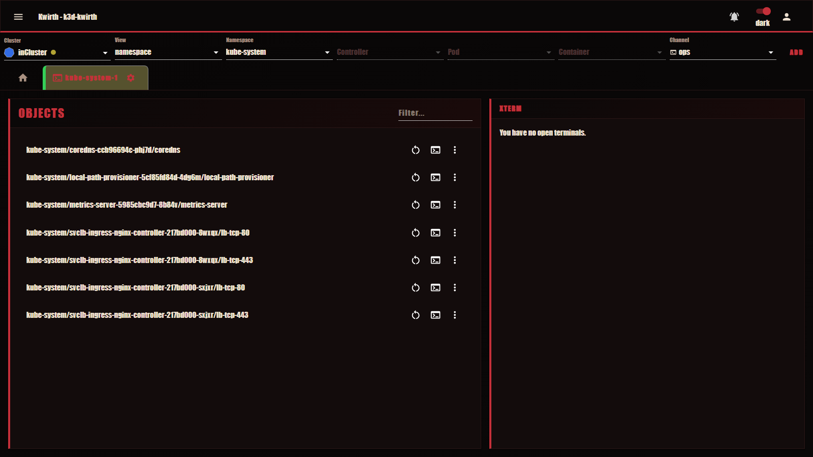

# Depeche Mode (theme)

> **Type:** Theme 
> **Look:** abyss black, blood red, bone

## What it looks like

**Depeche Mode** (*Memento Mori*) is a dramatic theme: **abyss black**, a **blood-red** accent and **bone** parchment text, with condensed bold typography.

The abyss-black / blood-red look applies to every channel — here the **[Trivy](../plugins/trivy)** findings board and the **[Ops](../plugins/ops)** terminal channel:

## Applying it

Install it if needed (**☰ → Manage extensions → Themes → Available → Depeche Mode → download**), then **Activate**.

## Notes

- Cosmetic only.
- Pairs with the matching **[Depeche Mode homepage](../homepages/index)** (abyss-black / blood-red, ASCII metric bars, STRANGELOVE cluster launch).

---

← Back to [Themes](index)
