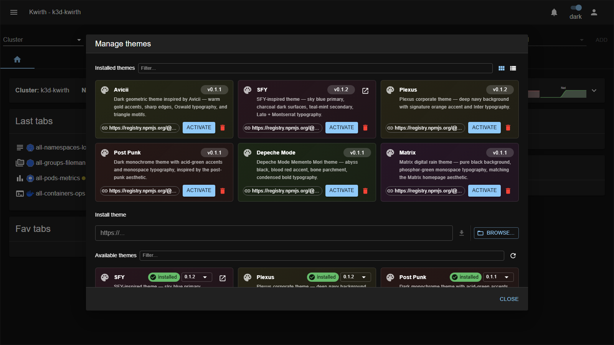

# Themes (appearance)

> **Type:** Themes · **Managed from:** ☰ → Manage extensions → Themes

## What a theme is

A **theme** restyles the whole Kwirth UI — colours, surfaces, typography and accents. Themes are **installable extensions**: install the ones you like and **activate** one to change the look instantly. (When no theme is active, Kwirth uses its built-in **light / dark** palette — that's what every screenshot in this guide uses.)

Each theme is a **card** with a description, its **version**, an **Activate** button and a **🗑️ delete**. Install more from the **Install theme** URL field (or **Browse**); the **Available themes** list below shows what you can pull from the registry (already-installed ones are marked).

## The bundled themes

| Theme | Look |
|---|---|
| **[Avicii](avicii)** | Dark geometric — warm **gold** accents on black, sharp edges, triangle motifs, Oswald typography. |
| **[SFY](sfy)** | **Sky-blue** primary on charcoal-dark surfaces, teal-mint secondary, Lato + Montserrat typography. |
| **[Plexus](plexus)** | Corporate — deep **navy** background with a **coral** accent and Lato typography. |
| **[Post-Punk](post-punk)** | Dark monochrome with **acid-green** accents and monospace typography — post-punk aesthetic. |
| **[Matrix](matrix)** | Deep black with **green** accents and monospace typography — the Matrix look. |
| **[Depeche Mode](depeche-mode)** | *Memento Mori* — abyss black, **blood-red** accent, bone parchment text. |

## Applying a theme

1. Open **☰ → Manage extensions → Themes**.
2. **Install** the theme if it isn't yet (paste its URL or Browse, then download).
3. Click **Activate** on its card. The UI restyles immediately; activate a different one (or none) to switch back.

## Admin guide

- **Install / activate / remove:** all from **☰ → Manage extensions → Themes**, using the common flow in [Extending Kwirth](../../admin/08-extending-kwirth).
- **Scope:** a theme is a **visual** extension only — it never affects data, permissions or behaviour.

## Notes

- Themes are **cosmetic** — safe to try and switch at will.
- Documentation screenshots intentionally use the plain **dark** palette (no theme) so the UI matches what you see out of the box.

---

← Back to [Extension manuals](../index)
