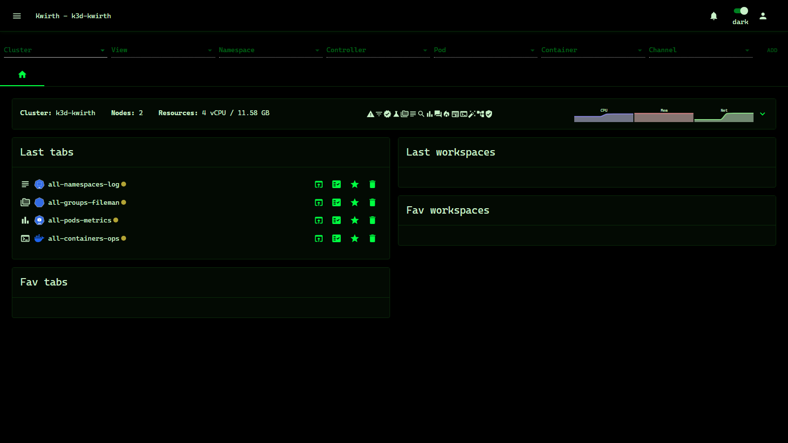

# Matrix (theme)

> **Type:** Theme · **Look:** black + green, monospace

## What it looks like

**Matrix** is the classic look: **deep black** with **green** accents and **monospace** typography — a terminal/hacker aesthetic for the whole UI.

## Applying it

Install it if needed (**☰ → Manage extensions → Themes → Available → Matrix → download**), then **Activate**.

## Notes

- Cosmetic only.
- Pairs with the matching **[Matrix homepage](../homepages/index)**.

---

← Back to [Themes](index)
