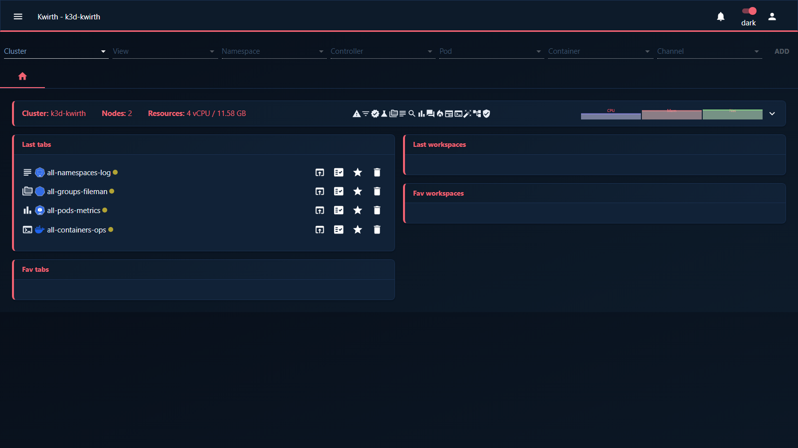

# Plexus (theme)

> **Type:** Theme · **Look:** corporate navy + coral

## What it looks like

**Plexus** is a **corporate** theme: a **deep navy** background with a **coral** accent and **Lato** typography — professional and understated, suited to shared dashboards and demos.

## Applying it

Install it first if needed (**☰ → Manage extensions → Themes → Available → Plexus → download**), then **Activate**. *(Not installed by default in every deployment.)*

## Notes

- Cosmetic only — no effect on data or behaviour.

---

← Back to [Themes](index)
