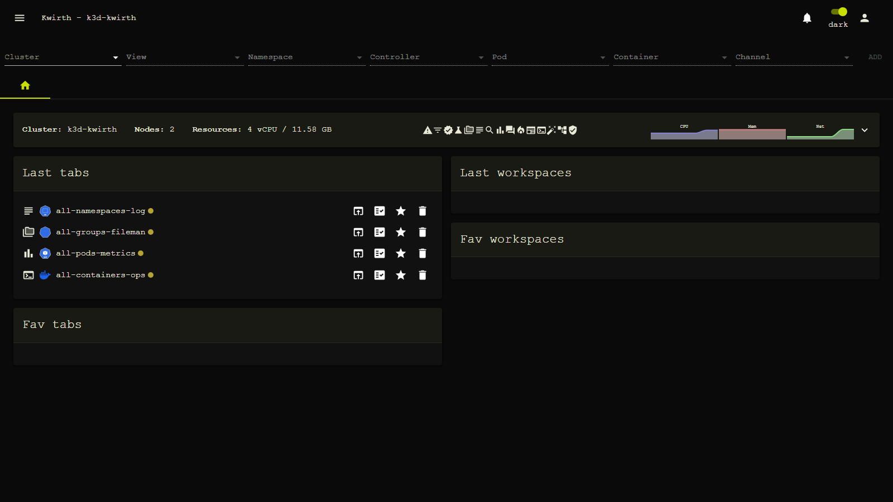
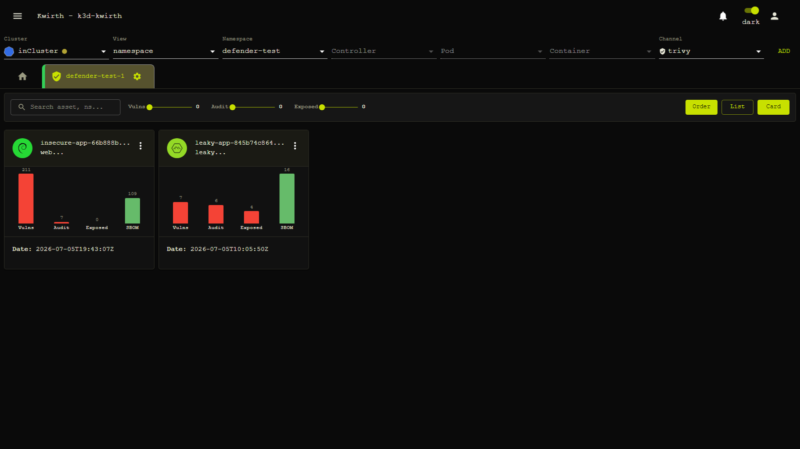
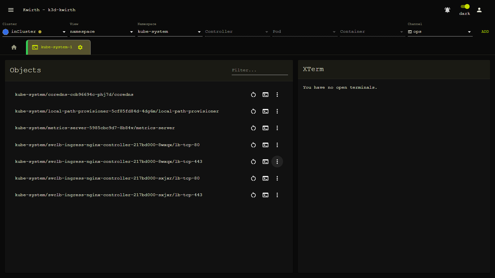

# Post-Punk (theme)

> **Type:** Theme 
> **Look:** dark monochrome, acid-green

## What it looks like

**Post-Punk** is a **dark monochrome** theme with **acid-green** accents and **monospace** typography — a stark, post-punk aesthetic.

The acid-green monochrome carries through every channel — here the **[Trivy](../plugins/trivy)** findings board and the **[Ops](../plugins/ops)** terminal channel:

## Applying it

Install it if needed (**☰ → Manage extensions → Themes → Available → Post Punk → download**), then **Activate**.

## Notes

- Cosmetic only — no effect on data or behaviour.

---

← Back to [Themes](index)
