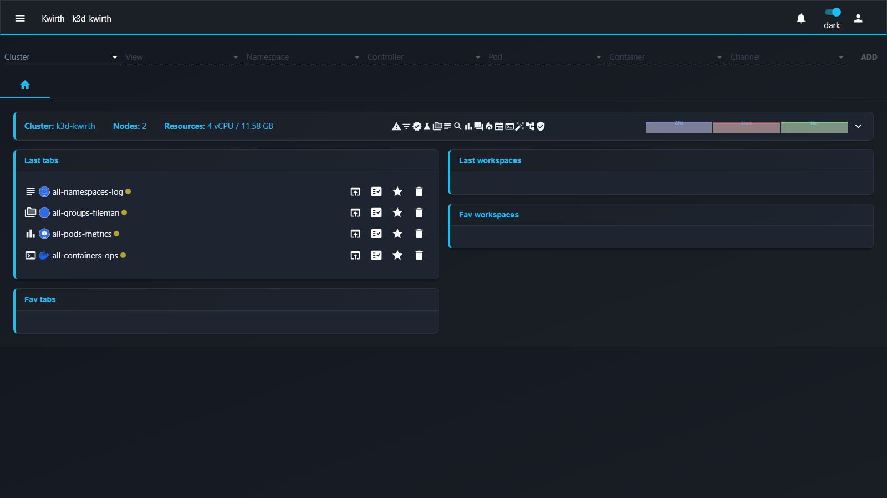

# SFY (theme)

> **Type:** Theme 
> **Look:** sky-blue on charcoal

## What it looks like

**SFY** uses a **sky-blue** primary over **charcoal-dark** surfaces, a **teal-mint** secondary, and **Lato + Montserrat** typography — a clean, calm palette close to the default dark but with its own accent identity:

## Applying it

**☰ → Manage extensions → Themes → SFY → Activate.**

## Notes

- Cosmetic only.
- A good choice if you like the default dark look but want a distinct accent set.

---

← Back to [Themes](index)
