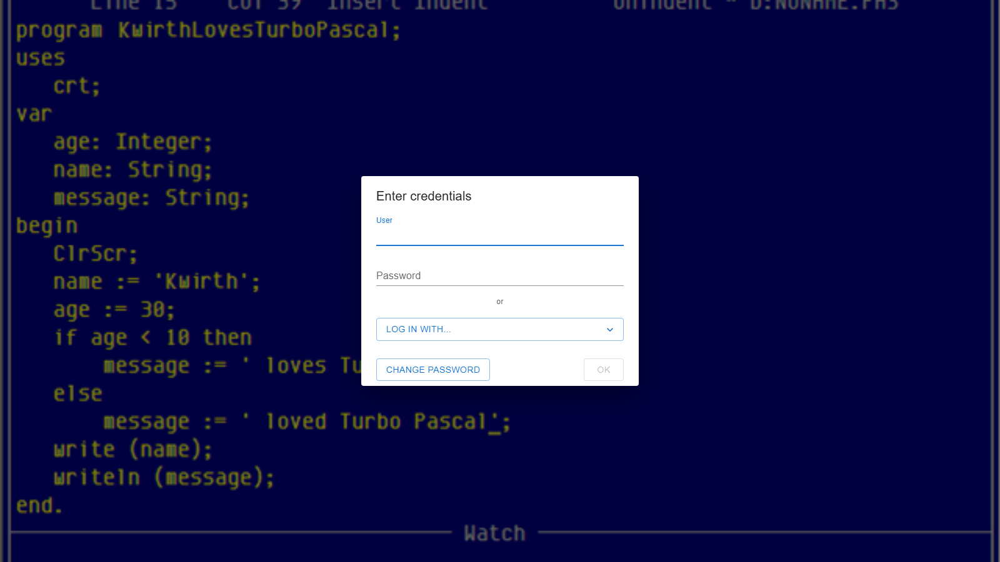

# 2. Accessing Kwirth

Open the Kwirth URL your administrator gave you in a web browser. You are greeted by the **login screen**.

## Logging in with a local account

If your administrator created a **local account** for you:

1. Type your **User** name.
2. Type your **Password**.
3. Click **OK**.

That's it — you land on the [home screen](03-ui-tour).

## Logging in with an Identity Provider (SSO)

If your organization uses an external Identity Provider (Google, GitLab, GitHub…), click **LOG IN WITH…** and pick your provider from the list. You are redirected to that provider, you authenticate there, and you are sent back to Kwirth already logged in.

> You still need an account in Kwirth: signing in with an IdP proves *who you are*, but your administrator decides *what you can do*. If your provider account isn't recognized, ask your administrator to grant you access. See [Identity Provider integration](../admin/07-idp-integration) for the admin side.

## Changing your password

Local accounts can change their own password from the login screen:

1. Click **CHANGE PASSWORD**.
2. Enter your user, your current password and the new one.
3. Confirm.

## Your session

- After login Kwirth keeps you signed in for the duration of your session; if it expires you are returned to this login screen and simply sign in again.
- To sign out, use the **account menu** (the person icon at the top-right of the screen) — covered in the [UI tour](03-ui-tour).

Next: [The Kwirth UI →](03-ui-tour)
